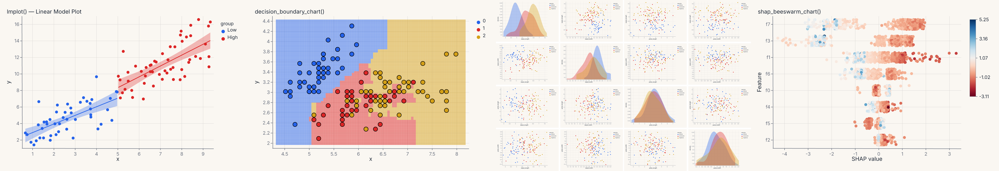
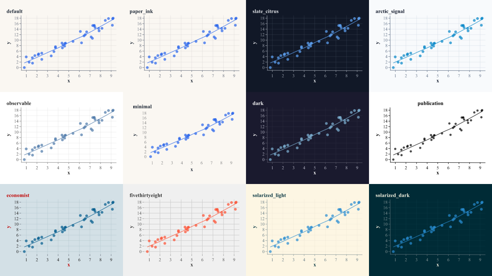

<p align="center">
  
</p>

<h1 align="center">Ferrum</h1>

<p align="center">Grammar-of-graphics statistical visualization for Python, with a Rust core.</p>

Ferrum builds every chart — scatter plot, faceted histogram, ROC curve, SHAP beeswarm — from the same grammar of data, encodings, marks, scales, and statistical transforms. The declaration layer is Python; the computation engine is Rust compiled via PyO3.

## Install

For 'batteries included'-- ML diagnostic plots and interactive Jupyter rendering:

```bash
pip install ferrum-viz[all]   # recommended — optional deps for fitted-model diagnostics (scikit-learn), SHAP, and Jupyter interactive
```

For a lean install without optional extras:

```bash
pip install ferrum-viz
```

## Quickstart

```python
import ferrum as fm
import polars as pl

df = pl.DataFrame({"x": [1, 2, 3, 4], "y": [2, 4, 3, 5], "group": ["a", "a", "b", "b"]})

chart = fm.Chart(df).mark_point().encode(x="x", y="y", color="group:N")
chart.save("scatter.svg")
chart.to_png()  # raster output, no display server needed
```

## Key features

- **One chart model** — scatter plots, statistical graphics, and ML diagnostics share the same grammar and compose with `+`, `|`, `&`.
- **Stat transforms in the pipeline** — KDE, LOESS, bootstrap CIs, binning, and aggregations are declared in the chart spec and computed in Rust.
- **Model diagnostics as charts** — `fm.roc_chart(model, X, y)`, `fm.confusion_matrix_chart(...)`, `fm.shap_chart(...)` return regular `Chart` objects.
- **Zero system dependencies** — no Cairo, no X11, no display server. Renders anywhere `pip install` works.
- **DataFrame pluralism** — polars, pandas, modin, cuDF, dask, ibis, and pyarrow all work through `Chart(data)`.
- **Interactive rendering** — `chart.interactive()` switches to a GPU-backed WASM renderer with selections, zoom/pan, linked views, and tooltips. Backed by `anywidget` for Jupyter.

## Themes

Twelve built-in themes — from warm cream (Paper Ink, the default) to dark, publication, and editorial styles.

<p align="center">
  
</p>

## Performance

**200,000-point scatter benchmark** (median of 3 runs, Apple M-series):

| Metric | Ferrum | plotnine | seaborn | Altair | Plotly |
|---|---|---|---|---|---|
| SVG render | **27 ms** | 7.56 s | 1.95 s | 2.86 s | 2.51 s |
| SVG file size | 590 KB | 137 MB | 32.6 MB | 57.8 MB | 267 KB |
| PNG render | **78 ms** | 2.35 s | 119 ms | — | 2.50 s |
| Interactive HTML | **4.9 MB** | — | — | 14.3 MB | 9.8 MB |

At 1M points, Altair OOMs and plotnine takes 39 s. Ferrum renders in 57 ms. [Full benchmarks →](https://ferrumviz.com/guide/concepts/performance-scale/)

## How Ferrum compares

|  | Ferrum | plotnine | seaborn | Altair | Plotly |
|---|---|---|---|---|---|
| Grammar | Layered, typed encodings, faceting | ggplot2 port, full GoG | Convenience helpers | Vega-Lite declarative | Imperative traces |
| Diagnostics | 44 helpers, 28 visualizers | — | — | — | — |
| Composition | `+` `\|` `&` operators | `+` layers, facets only | Manual subplots | `\|` `&` (Vega-Lite) | `make_subplots` |
| Interactivity | WASM/GPU, selections, linked views | matplotlib backends | matplotlib backends | Vega-Lite selections | Plotly.js |
| Scale ceiling | 10M+ rows | ~100k marks | ~100k marks | ~5k rows | ~500k marks |
| DataFrames | polars, pandas, modin, cuDF, dask, ibis | pandas only | pandas only | pandas, polars | pandas, polars |
| System deps | None | matplotlib | matplotlib | None | None |
| Backend | Rust (SVG, raster, WASM) | matplotlib | matplotlib | Vega-Lite (V8) | Plotly.js (kaleido) |

[Detailed migration guides →](https://ferrumviz.com/comparison/plotnine/) for plotnine, seaborn, yellowbrick, and scikit-plot.

## Examples

```python
# Layer a LOESS trend on a scatter plot
points = fm.Chart(df).mark_point(opacity=0.6).encode(x="x", y="y", color="group:N")
trend = fm.Chart(df).mark_smooth(method="loess").encode(x="x", y="y", color="group:N")
chart = points + trend

# Compose diagnostics into a model report
source = fm.ModelSource(model, X_test, y_test)
report = (fm.roc_chart(source) | fm.confusion_matrix_chart(source)) & fm.importance_chart(source)
report.save("model_report.svg")

# Figure-level helpers
fm.displot(df, x="value", hue="group", kind="kde")
fm.catplot(df, x="species", y="measurement", kind="violin")
fm.pairplot(df, vars=["a", "b", "c"], hue="label")
```

## Architecture

| Layer | Role |
|---|---|
| `src/ferrum/` | Python declaration API — Chart, encodings, marks, themes, plots |
| `crates/ferrum-core/` | Rust computation engine — transforms, scales, rendering |
| Arrow CDI | Zero-copy data transport between Python and Rust via `pyo3-arrow` |

## Development

Requires Python 3.10+, Rust toolchain, and [maturin](https://www.maturin.rs/).

```bash
uv sync
unset CONDA_PREFIX && uv run --no-sync maturin develop   # build Rust extension
uv run pytest                                            # run tests
```

## How this was built

> [!NOTE]
> **Built in 10 days** by one human and an agentic Claude framework.
> 975 commits · 103k lines · 3,829 tests · 12 phases · 13 agents · 16 skills
>
> [Read the retrospective →](design-docs/development-meta-analysis.md)

## Documentation

Full docs at [ferrumviz.com](https://ferrumviz.com).

## License

See [LICENSE](LICENSE) for details.
