# Showcase: What You Can Build

Well-known chart designs from the matplotlib, seaborn, Altair, and D3 traditions — built in Ferrum's Rust engine. Every image below was produced entirely in Python using Ferrum's grammar-of-graphics API; no matplotlib, no browser, no external renderer. These designs lean on Ferrum features like categorical color ranges, temporal axis auto-inference, size and shape legends, stroke routing on line marks, sort specs, annotation date coordinates, X2/Y2 floating geometry, polar coordinates, continuous-color schemes, hue-split density, per-group error extents, and two-way row-by-column faceting.

Where the [Gallery](gallery.md) catalogs each individual mark and helper, the Showcase assembles those primitives into complete, recognizable chart designs. Each card shows the concise API call alongside the rendered output.

---

## Four-encoding charts

Encode x, y, size, and color simultaneously for maximum information density.

-   **Gapminder Bubble**

    ---

    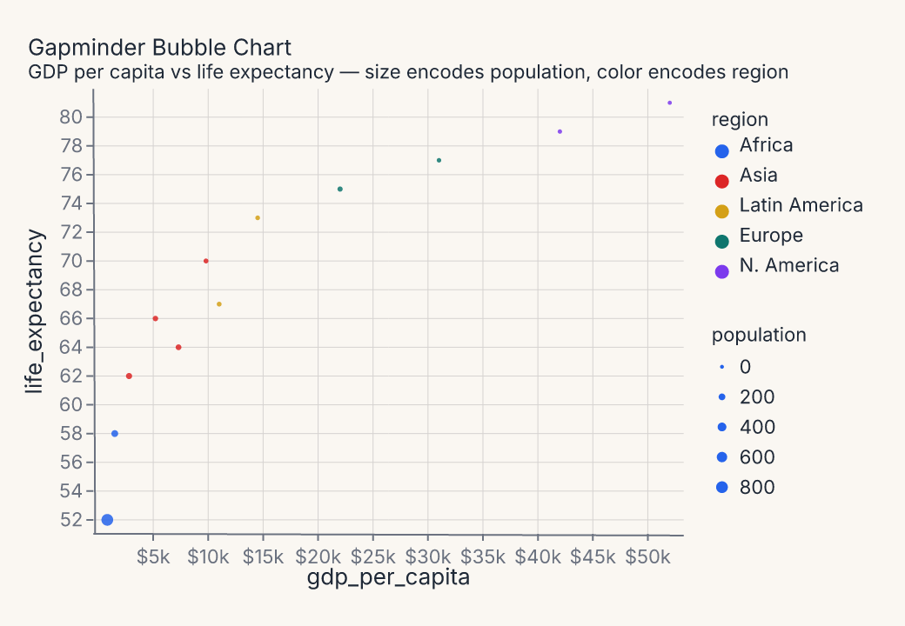

    `fm.Chart(df).mark_point().encode(x="gdp_per_capita", y="life_expectancy", size=fm.Size("population"), color="region")`

    Four simultaneous encodings — position, size, and color — in one readable chart. The size legend uses Ferrum's new multi-legend stacking; both legends render side by side.

---

## Comparison and annotation

Charts built for the "story in the data" — where one series, one event, or one gap is the point.

-   **Highlight Line**

    ---

    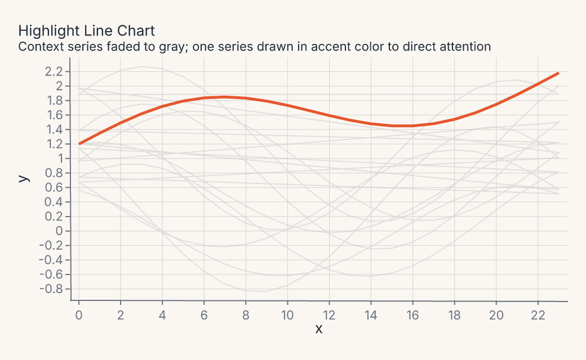

    `ctx = fm.Chart(ctx_df).mark_line(stroke="#cccccc", opacity=0.55).encode(x="x", y="y", detail="series")` + `fm.Chart(hi_df).mark_line(stroke="#e4572e")`

    Nine gray context series recede; one accent series commands attention. `detail=` groups the context lines without adding a color legend.

-   **Dumbbell Chart**

    ---

    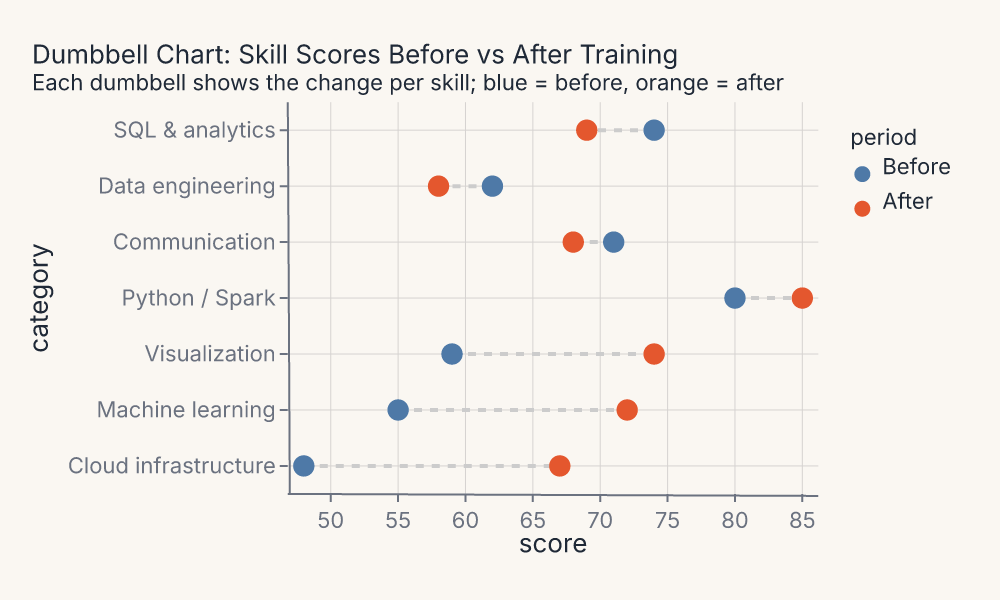

    `rule = fm.Chart(df).mark_rule(stroke="#cccccc").encode(x="score_before", x2=fm.X2("score_after"), y="category")` + `fm.Chart(df_pts).mark_point().encode(x="score", color="period")`

    Before-and-after per category. Connecting rules use `x` + `x2` encoding; a categorical color range pins "Before" and "After" to consistent hues.

-   **Time Series with Events**

    ---

    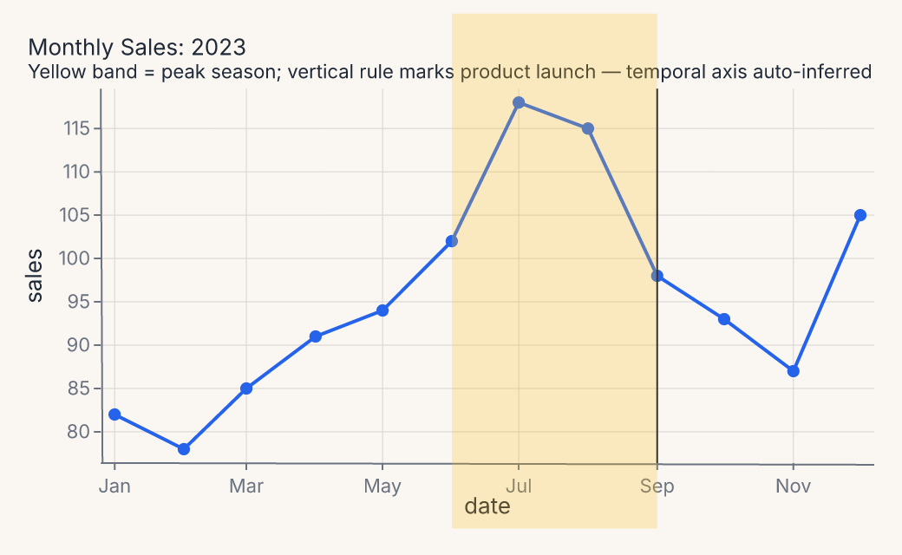

    `fm.annotate_rect(x1="2023-06-01", x2="2023-09-01", y1=70, y2=125, fill="#fbbf24")` + `fm.Chart(df).mark_line().encode(x=fm.X("date", axis=fm.Axis(label_format="%b")))` + `fm.annotate_vline(x="2023-09-01")`

    Temporal columns auto-infer their scale. Annotation coordinates accept ISO date strings. The yellow band is `annotate_rect`; the rule is `annotate_vline`.

---

## Ranked and sorted

Sorted layouts for ranked comparisons — sorted along the axis, not alphabetically.

-   **Cleveland Dot Plot**

    ---

    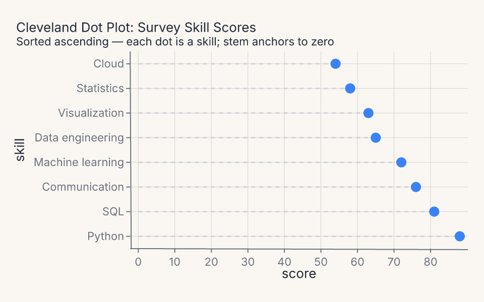

    `stem = fm.Chart(df).mark_rule(stroke="#d1d5db").encode(x=fm.X("score_zero", axis=fm.Axis(title="score")), x2=fm.X2("score"), y=fm.Y("skill", scale=ordinal))` + `fm.Chart(df).mark_point(fill="#3b82f6")`

    Lollipop composition: a `mark_rule` stem anchored to zero plus a `mark_point` dot. Category order is explicit via `OrdinalScale(domain=sorted_domain)`.

---

## Small multiples

Faceted panels with shared scales and consistent encodings across categories.

-   **Faceted Small Multiples**

    ---

    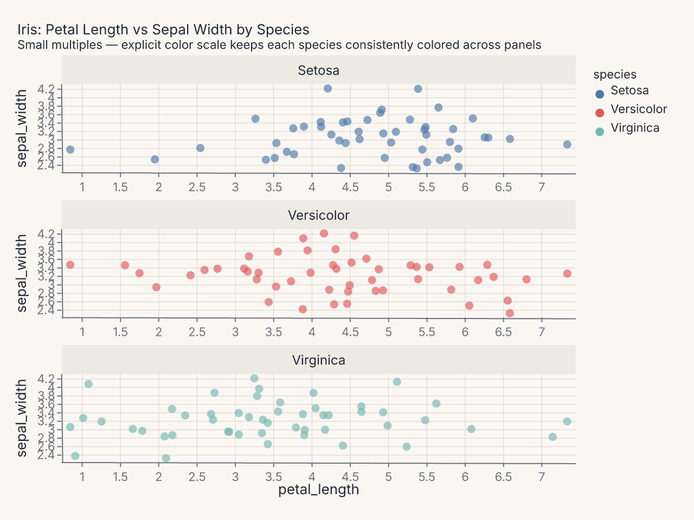

    `fm.Chart(df).mark_point(opacity=0.65).encode(x="petal_length", y="sepal_width", color=fm.Color("species", scale=fm.OrdinalScale(domain=species_order, range=colors))).facet(col="species")`

    Three scatter panels sharing a common axis range. An explicit `OrdinalScale(domain=..., range=...)` keeps each species consistently colored across facet panels.

-   **Two-Way Facet Trellis**

    ---

    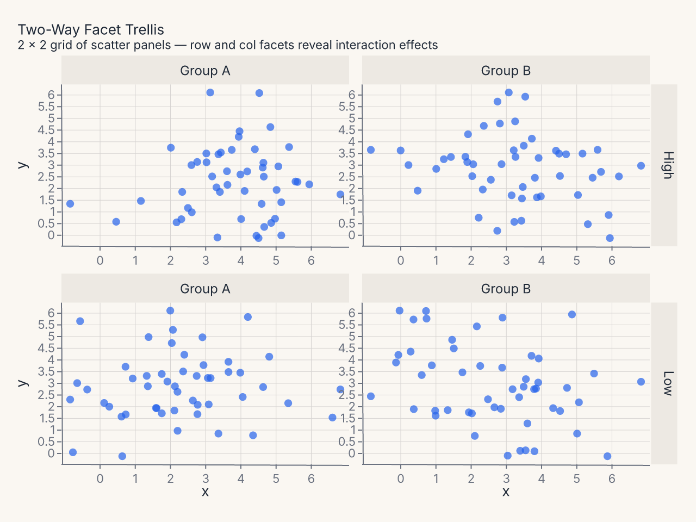

    `fm.Chart(df).mark_point().encode(x="x:Q", y="y:Q").facet(row="row", col="col")`

    A 2 × 2 grid of scatter panels driven by simultaneous `row=` and `col=` facet keys — two-way faceting reveals interaction effects across both dimensions.

---

## Polar and radial

Circular layouts where angle encodes a categorical dimension.

-   **Coxcomb / Wind-Rose**

    ---

    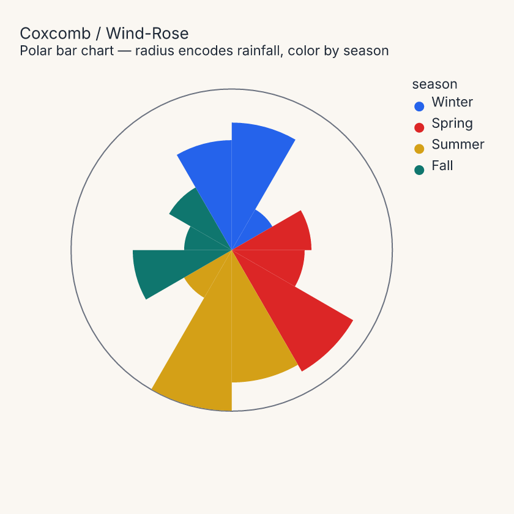

    `fm.Chart(df).mark_bar().encode(x="month:N", y="rainfall:Q", color="season:N").coord(fm.CoordPolar(theta="x"))`

    Equal angular slices whose radius encodes magnitude. `CoordPolar(theta="x")` maps the nominal x channel to arc angle; coloring by 4-category season avoids palette wrapping across 12 months while adding a meaningful grouping.

---

## Financial and categorical geometry

Floating geometry via X2/Y2 encodings plus variable-column-width mosaic layouts.

-   **Candlestick (OHLC)**

    ---

    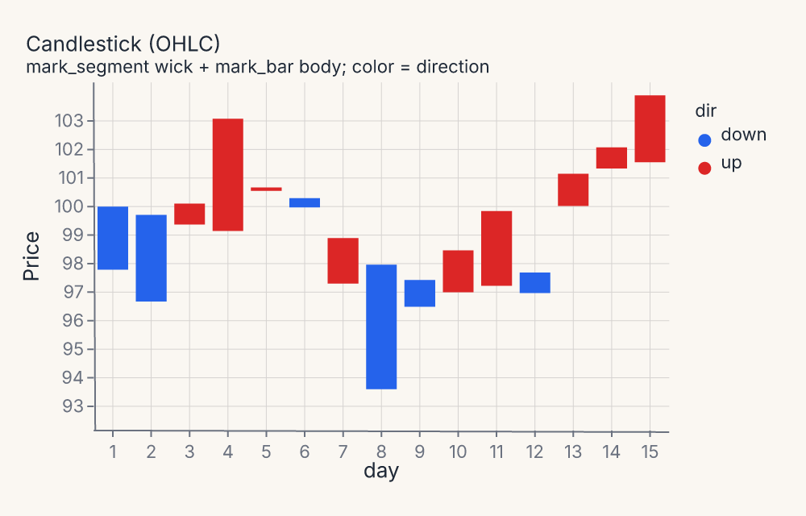

    `body = fm.Chart(df).mark_bar().encode(x="day:O", y=fm.Y("open:Q", axis=fm.Axis(title="Price")), y2="close:Q", color="dir:N")` + `wick = fm.Chart(df).mark_segment(stroke="#333333", stroke_width=1.5).encode(x="day:O", x2="day:O", y=fm.Y("low:Q", axis=fm.Axis(title="Price")), y2="high:Q")` → `(body + wick)`

    Body uses `mark_bar` with `y`/`y2` for the open-close range; wick uses `mark_segment` for the high-low tail. The wick layer renders on top so tails are visible at both ends.

-   **Marimekko / Mosaic**

    ---

    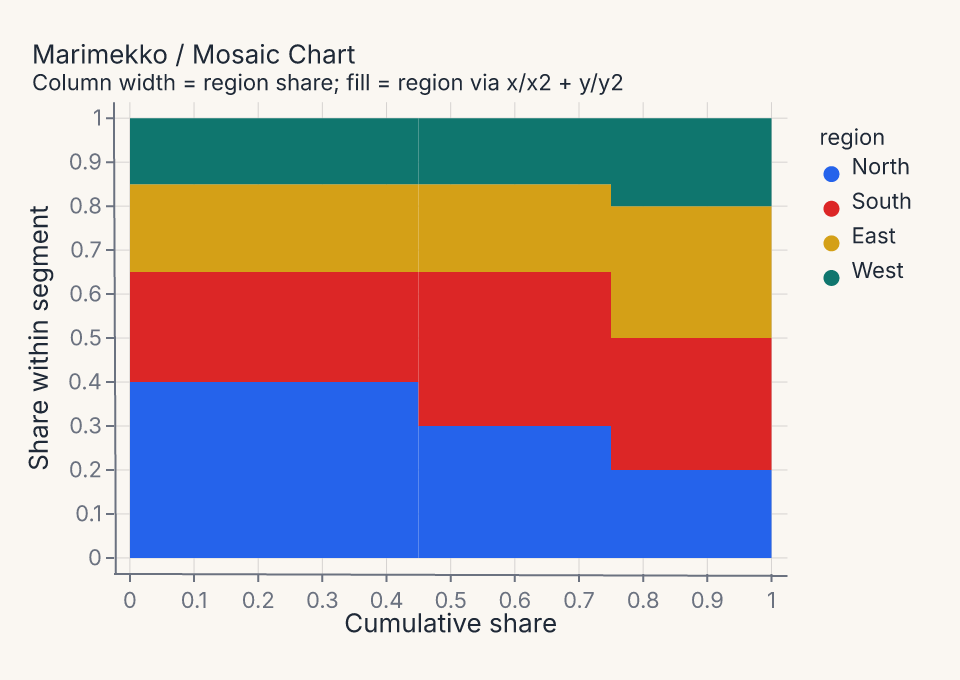

    `fm.Chart(df).mark_rect().encode(x="x0:Q", x2="x1:Q", y="y0:Q", y2="y1:Q", color="region:N")`

    Variable-width stacked columns: precompute `x0`/`x1` per product (column widths proportional to revenue share) and `y0`/`y1` per region (stacked proportions). `mark_rect` with four positional encodings places each tile precisely.

-   **Diverging Likert**

    ---

    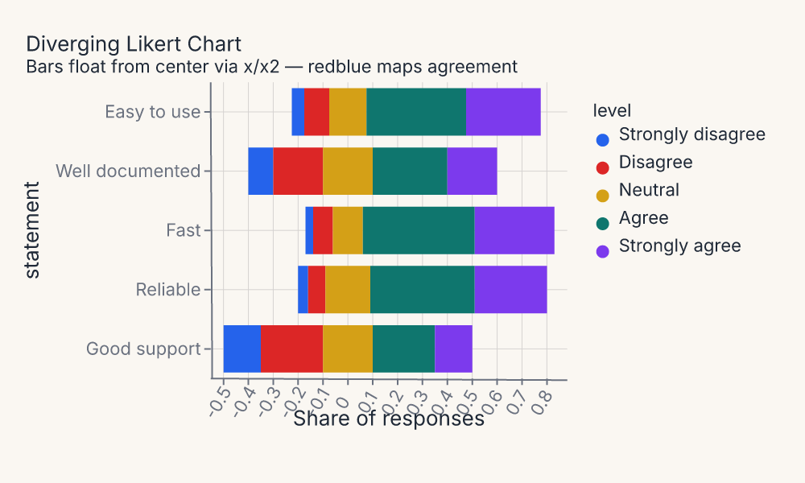

    `fm.Chart(df).mark_bar().encode(x="x0:Q", x2="x1:Q", y="statement:N", color=fm.Color("level:N", scale={"scheme": "redblue"}))`

    Bars float from a center axis by precomputing `x0`/`x1` that straddle zero. The `redblue` scheme maps agreement levels from negative (red) to positive (blue); `x`/`x2` encoding places each segment without any stacking transform.

---

## Continuous color and density

Sequential and diverging continuous-color scales, plus multi-group density layouts.

-   **Continuous-Color Heatmap**

    ---

    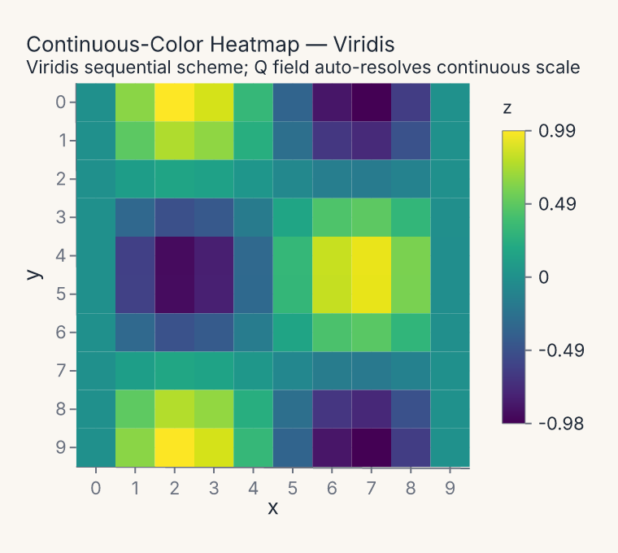

    `fm.Chart(df).mark_rect().encode(x="x:O", y="y:O", color=fm.Color("z:Q", scale={"scheme": "viridis"}))`

    A quantitative color field automatically resolves to a continuous sequential scale. The `viridis` scheme maps the full `[-1, 1]` domain from dark-purple to bright-yellow; a gradient legend replaces the usual categorical swatches.

---

## Distribution comparisons

Violin and error-band marks that split or stratify by a hue variable.

-   **Split Violin by Hue**

    ---

    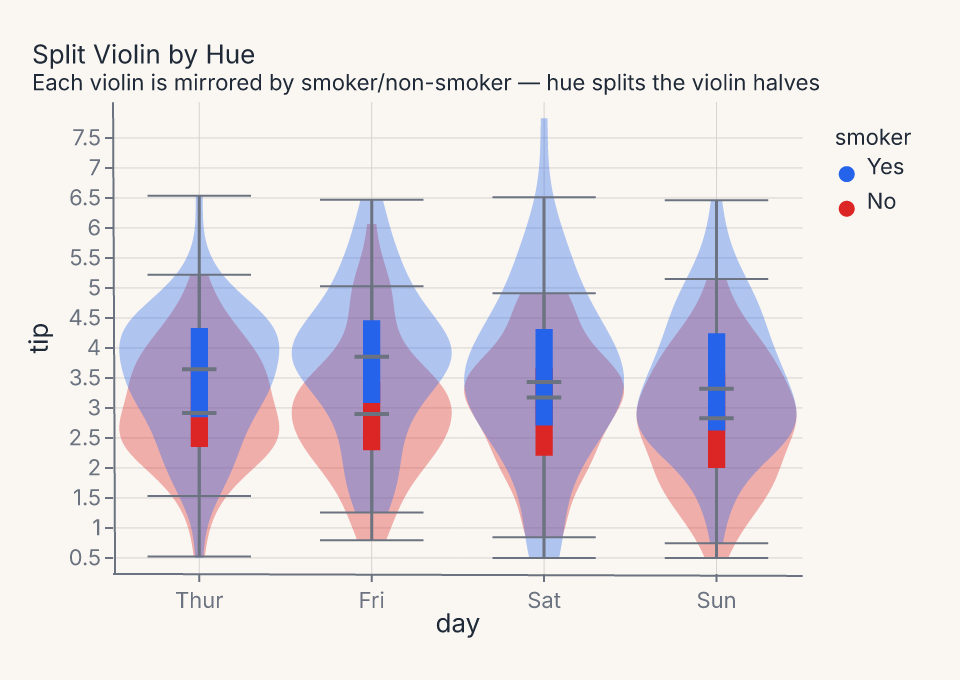

    `fm.Chart(df).mark_violin().encode(x="day:N", y="tip:Q", color="smoker:N")`

    When `color=` maps to a two-level nominal variable, each violin is automatically mirrored — left half for one group, right half for the other. The inner box-plot whiskers remain for both halves.

-   **Per-Hue Error Band**

    ---

    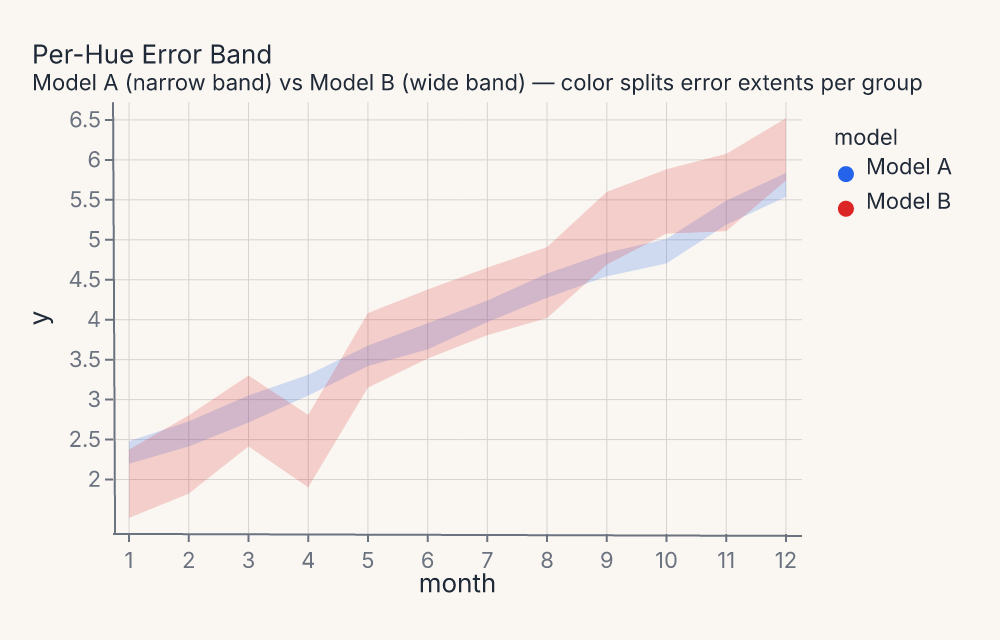

    `fm.Chart(df).mark_errorband().encode(x="month:Q", y="y:Q", color="model:N")`

    `mark_errorband` computes a confidence interval per `(x, color)` group. Two models with different noise levels produce visibly different band widths — Model A narrow, Model B wide — at every x position.

