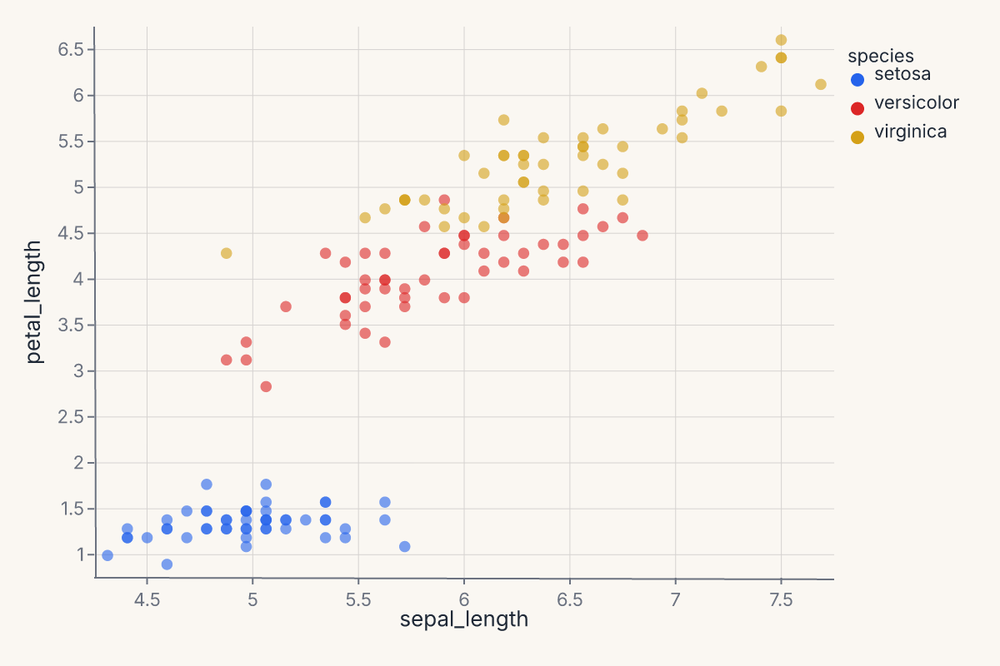
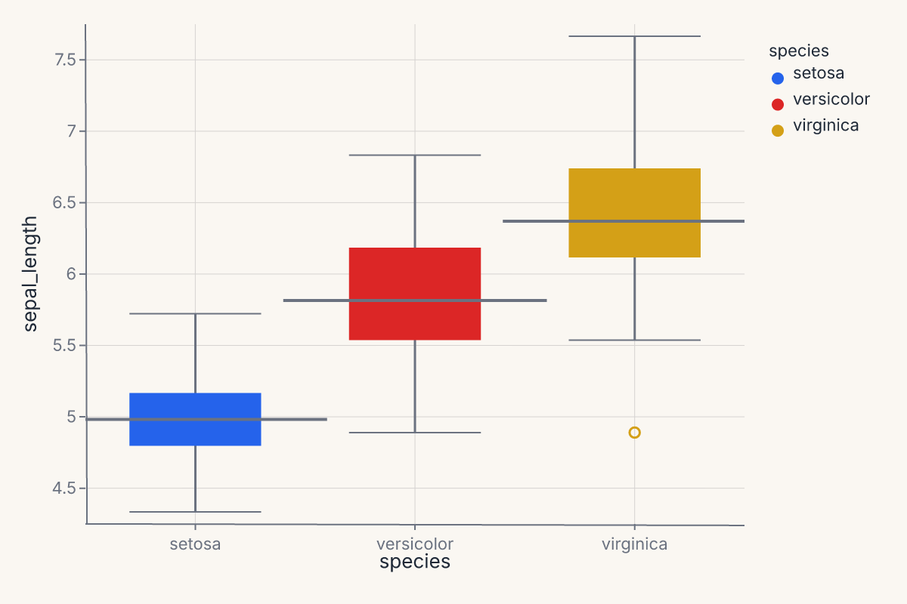
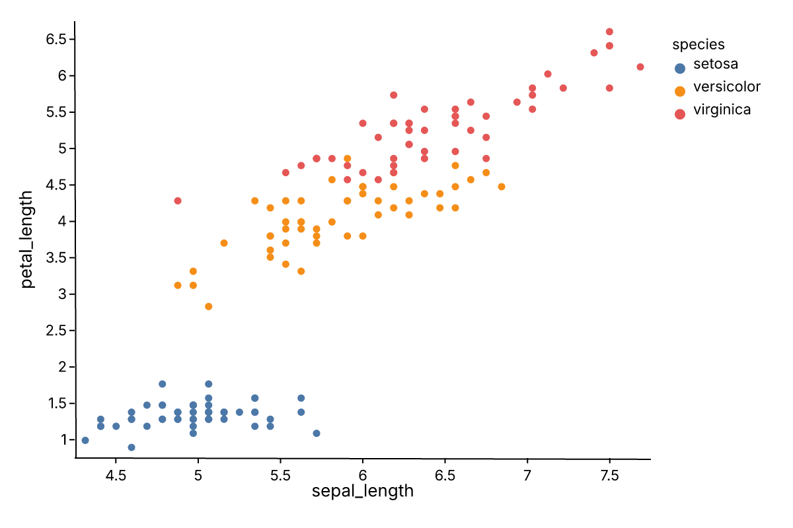

# First plot

This page gets you from zero to a rendered chart in under a minute. By the end you'll have a scatter plot, a layered chart, and a saved SVG — and you'll know the three-piece pattern that every Ferrum chart follows.

!!! note "Prerequisites"
    This tutorial uses scikit-learn for sample datasets. If you followed the
    [recommended install](install.md) (`pip install ferrum-viz[all]`), you
    already have it. If you chose the lean install, run
    `pip install ferrum-viz[models]` first.

## The pattern

Every Ferrum chart is **data + mark + encoding**:

```python
import ferrum as fm
import polars as pl
from sklearn.datasets import load_iris

raw = load_iris()
iris = pl.DataFrame(raw.data, schema=["sepal_length", "sepal_width", "petal_length", "petal_width"]).with_columns(
    species=pl.Series([raw.target_names[t] for t in raw.target])
)
chart = (
    fm.Chart(iris)
    .mark_point()
    .encode(x="sepal_length", y="petal_length", color="species:N")
)
assert chart.to_svg().startswith("<svg")
```


That's the whole thing: `Chart(data)` binds your DataFrame, `.mark_point()` picks the geometry, `.encode(...)` maps columns to visual channels. The result is a [`Chart`][ferrum.Chart] object — call [`.to_svg()`][ferrum.Chart.to_svg] to render it, [`.save()`][ferrum.Chart.save] to write it to disk, or just display it in a Jupyter notebook (where it renders automatically).

## Add a trend line

Want a regression overlay? Layer it with `+`:

```python
import ferrum as fm
import polars as pl
from sklearn.datasets import load_iris

raw = load_iris()
iris = pl.DataFrame(raw.data, schema=["sepal_length", "sepal_width", "petal_length", "petal_width"]).with_columns(
    species=pl.Series([raw.target_names[t] for t in raw.target])
)
points = (
    fm.Chart(iris)
    .mark_point(opacity=0.6)
    .encode(x="sepal_length", y="petal_length", color="species:N")
)
trend = (
    fm.Chart(iris)
    .mark_smooth(method="loess", groupby="species")
    .encode(x="sepal_length", y="petal_length", color="species:N")
)
chart = points + trend
assert chart.to_svg().startswith("<svg")
```

`groupby="species"` tells the smoother to fit a separate curve per group rather than one curve through all points. See the [Marks reference](../api/marks.md) for the full parameter list on each mark.



The `+` operator always layers — both marks share the same axes. The LOESS smooth is computed in Rust; you declared what you wanted, not how to compute it.

## Try a different mark

Different questions call for different marks. The pattern is always the same — data, mark, encoding:

```python
import ferrum as fm
import polars as pl
from sklearn.datasets import load_iris

raw = load_iris()
iris = pl.DataFrame(raw.data, schema=["sepal_length", "sepal_width", "petal_length", "petal_width"]).with_columns(
    species=pl.Series([raw.target_names[t] for t in raw.target])
)
chart = (
    fm.Chart(iris)
    .mark_boxplot()
    .encode(x="species:N", y="sepal_length", color="species:N")
)
assert chart.to_svg().startswith("<svg")
```



## Apply a theme

Themes are one method call:

```python
import ferrum as fm
import polars as pl
from sklearn.datasets import load_iris

raw = load_iris()
iris = pl.DataFrame(raw.data, schema=["sepal_length", "sepal_width", "petal_length", "petal_width"]).with_columns(
    species=pl.Series([raw.target_names[t] for t in raw.target])
)
chart = (
    fm.Chart(iris)
    .mark_point()
    .encode(x="sepal_length", y="petal_length", color="species:N")
    .theme(fm.themes.publication)
)
assert chart.to_svg().startswith("<svg")
```



Ferrum ships [twelve built-in themes](../guide/themes.md) in the [`themes`](../api/themes.md) module — from Paper Ink (the warm default) to dark, publication, and editorial styles.

See [Configuration](../guide/themes.md) and [ferrum.config](../api/config.md) for more on customization.

## Axis labels and limits

You don't have to reach into encoding declarations to set human-readable axis labels. `.labs()` sets them post-hoc:

```python
import ferrum as fm
import polars as pl
from sklearn.datasets import load_iris

raw = load_iris()
iris = pl.DataFrame(raw.data, schema=["sepal_length", "sepal_width", "petal_length", "petal_width"]).with_columns(
    species=pl.Series([raw.target_names[t] for t in raw.target])
)
chart = (
    fm.Chart(iris)
    .mark_point()
    .encode(x="sepal_length", y="petal_length", color="species:N")
    .labs(x="Sepal length (cm)", y="Petal length (cm)", title="Iris — sepal vs. petal")
)
assert chart.to_svg().startswith("<svg")
```

To clip the axis range without modifying the encoding, use `.xlim()` and `.ylim()`:

```python
chart = chart.xlim(4.5, 7.5).ylim(1.0, 6.5)
assert chart.to_svg().startswith("<svg")
```

Both are shortcuts: `.labs()` is equivalent to setting `title=` on each channel object; `.xlim()` / `.ylim()` are equivalent to `scale=fm.LinearScale(domain=[lo, hi])` on the positional channel. They are there for when you want the result quickly without remembering the full API path.

## What just happened

In four snippets you used:

1. **Data binding** — `fm.Chart(iris)` accepts polars, pandas, modin, cuDF, dask, ibis, pyarrow, or dict-of-arrays. One constructor.
2. **Marks** — [`mark_point()`][ferrum.Chart.mark_point], [`mark_smooth()`][ferrum.Chart.mark_smooth], [`mark_boxplot()`][ferrum.Chart.mark_boxplot]. Ferrum has 54 marks covering primitives, statistical transforms, distributions, and model diagnostics.
3. **Encodings** — `x`, `y`, `color`. Shorthand strings like `"species:N"` set the type (Nominal). The `:N` suffix declares the field as Nominal (categorical); Ferrum supports four type codes: `:Q` (quantitative/continuous), `:N` (nominal/categorical), `:O` (ordinal/ranked), and `:T` (temporal/datetime). See [Marks & encodings](../guide/marks-encodings.md#encoding-channels) for details. The full form [`fm.X("field", type="Q", title="...")`][ferrum.X] gives finer control.
4. **Composition** — `+` layers marks on shared axes. `|` and `&` concatenate charts side-by-side or stacked.
5. **Themes** — `.theme(fm.themes.publication)` swaps the entire visual style without touching the data or encoding.

## Where to go next

- [Marks & encodings](../guide/marks-encodings.md) — the full mark and encoding reference.
- [Composition](../guide/composition.md) — layering, concatenation, joint charts, repeat grids.
- [Themes](../guide/themes.md) — the twelve built-in themes, custom themes, and scoped defaults.
- [Figure-level helpers](../guide/figure-helpers.md) — one-line entry points for common chart patterns.
- [Model diagnostics](../guide/model-diagnostics.md) — ROC curves, confusion matrices, SHAP — all as charts.
