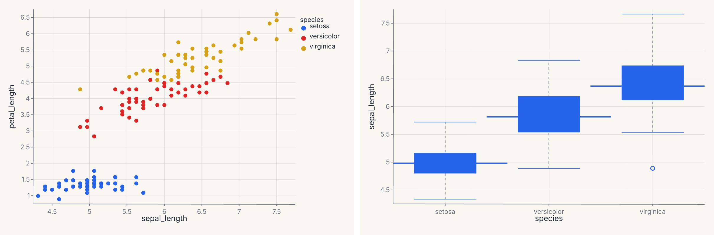
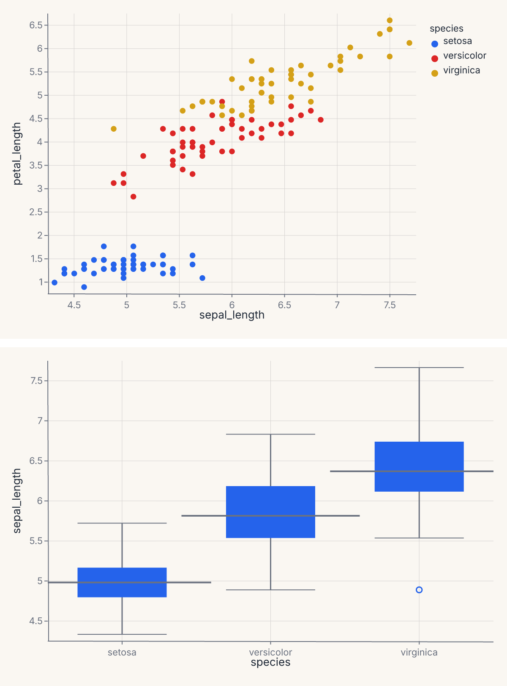
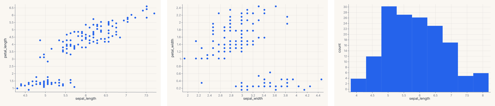
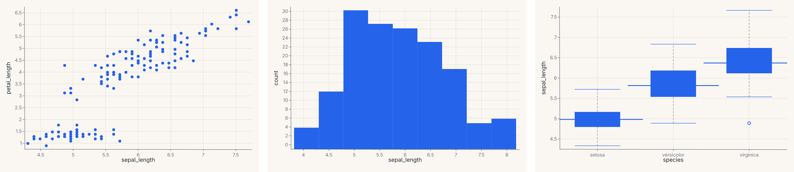
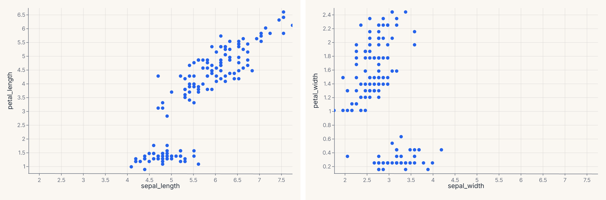
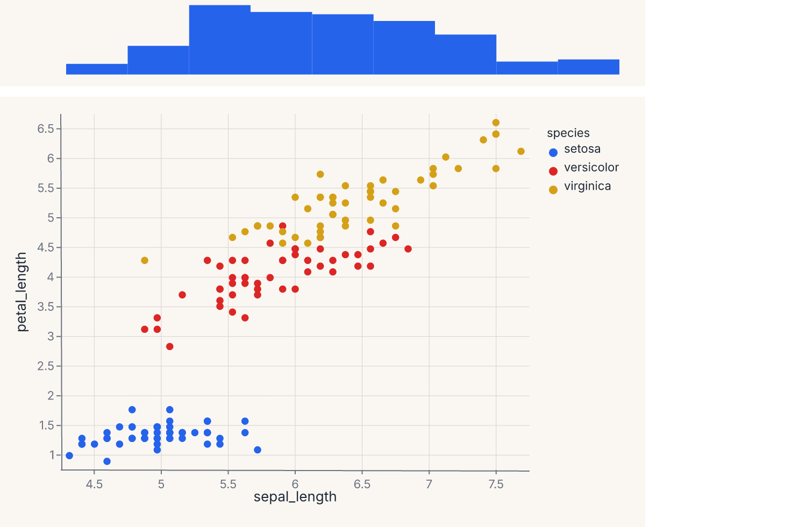
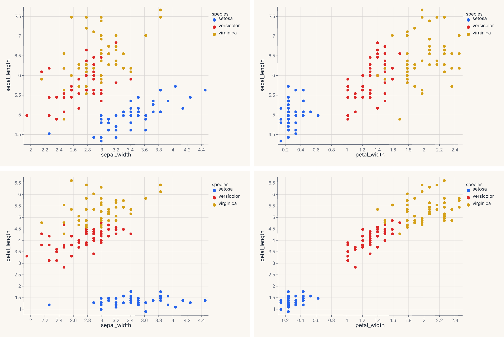
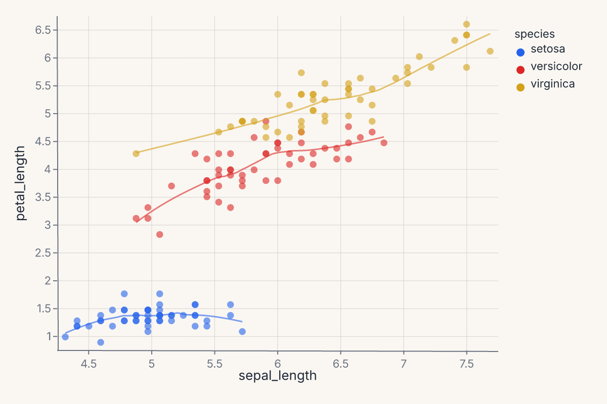
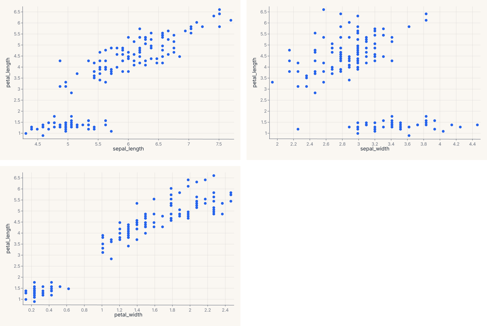

# Composition

Composition is how Ferrum combines multiple charts (or multiple marks against shared axes) into a single output. Where encoding controls what one chart looks like, composition controls how charts relate to each other.

Ferrum ships six composition operators, each producing a different kind of compound view:

| Operator | When to use |
|---|---|
| **`+` (Layer)** | Multiple marks against the same axes — scatter + smooth, line + ribbon, bars + text labels. Always layers; never concatenates. |
| **`|` (HConcat)** | Independent charts laid out left-to-right. |
| **`&` (VConcat)** | Independent charts stacked top-to-bottom. |
| **`fm.hconcat()` / `fm.vconcat()`** | Convenience functions for building concat layouts from more than two charts. |
| **[`JointChart`][ferrum.JointChart]** | Central plot with marginal distributions on the top and right. |
| **[`RepeatChart`][ferrum.RepeatChart]** | Template chart repeated across a grid of field combinations. |
| **[`ClusterMapChart`][ferrum.ClusterMapChart]** | Clustered heatmap with row and column dendrograms. |

The principles that govern these operators are the same as the rest of Ferrum's grammar: composition is structural, declarative, and produces a value that you can theme, save, render statically or interactively, and embed into larger views. Compound views are the same kind of object as base charts — they accept the same theme, the same renderer, and the same composition operators recursively.

## Layering: same axes, multiple marks

Layering is the most common form of composition: you have one set of axes and you want more than one mark on it. Scatter + regression line. Bars + value labels. Line + ribbon for uncertainty.

The `+` operator on `Chart` **always produces a layered view** — it never concatenates. When both charts share the same data, the result reuses the original DataFrame. When data differs, the two DataFrames are merged via null-padded diagonal concatenation; each layer's encoding references only its own columns, so the padding is invisible at render time.

```python
import ferrum as fm
import polars as pl
from sklearn.datasets import load_iris

raw = load_iris()
iris = pl.DataFrame(raw.data, schema=["sepal_length", "sepal_width", "petal_length", "petal_width"]).with_columns(
    species=pl.Series([raw.target_names[t] for t in raw.target])
)
points = (
    fm.Chart(iris)
    .mark_point(opacity=0.6)
    .encode(x="sepal_length", y="petal_length", color="species:N")
)
trend = (
    fm.Chart(iris)
    .mark_smooth(method="loess")
    .encode(x="sepal_length", y="petal_length", color="species:N")
)
layered = points + trend
layered
```


Layered charts share axes by construction: both marks are drawn against the same x/y scales, the same color scale, and the same plot region. Each layer keeps its own mark and any layer-specific encoding overrides, but the shared encodings apply uniformly.

Use layering when:

- You want a regression overlay (`mark_smooth`) on a scatter (`mark_point`).
- You want a confidence band (`mark_ribbon` / `mark_errorband`) under a line.
- You want value labels (`mark_text`) on top of bars.
- You want multiple statistical summaries (mean line + min/max ribbon) on one chart.

Use concatenation (next section) when the charts should *not* share axes.

## Horizontal and vertical concatenation

Concatenation places independent charts next to each other, with each retaining its own scales, axes, and legend. There is no shared x/y; only the visual layout connects them.

The `|` operator produces an [`HConcatChart`][ferrum.HConcatChart]; `&` produces a [`VConcatChart`][ferrum.VConcatChart]:

```python
import ferrum as fm
import polars as pl
from sklearn.datasets import load_iris

raw = load_iris()
iris = pl.DataFrame(raw.data, schema=["sepal_length", "sepal_width", "petal_length", "petal_width"]).with_columns(
    species=pl.Series([raw.target_names[t] for t in raw.target])
)
scatter = (
    fm.Chart(iris)
    .mark_point()
    .encode(x="sepal_length", y="petal_length", color="species:N")
)
distribution = (
    fm.Chart(iris)
    .mark_boxplot()
    .encode(x="species:N", y="sepal_length")
)
side_by_side = scatter | distribution
side_by_side
```



The `&` operator stacks the same two charts vertically:

```python
import ferrum as fm
import polars as pl
from sklearn.datasets import load_iris

raw = load_iris()
iris = pl.DataFrame(raw.data, schema=["sepal_length", "sepal_width", "petal_length", "petal_width"]).with_columns(
    species=pl.Series([raw.target_names[t] for t in raw.target])
)
scatter = fm.Chart(iris).mark_point().encode(x="sepal_length", y="petal_length", color="species:N")
distribution = fm.Chart(iris).mark_boxplot().encode(x="species:N", y="sepal_length")
stacked = scatter & distribution
stacked
```



You can chain operators to compose deeper trees: `(a | b) & (c | d)` produces a 2 × 2 grid where the two rows have different charts and the left and right columns differ within each row. The operators are left-associative and follow normal Python precedence.

[`HConcatChart`][ferrum.HConcatChart] and [`VConcatChart`][ferrum.VConcatChart] also accept explicit list construction with a `spacing` keyword for fine control:

```python
import ferrum as fm
import polars as pl
from sklearn.datasets import load_iris

raw = load_iris()
iris = pl.DataFrame(raw.data, schema=["sepal_length", "sepal_width", "petal_length", "petal_width"]).with_columns(
    species=pl.Series([raw.target_names[t] for t in raw.target])
)
a = fm.Chart(iris).mark_point().encode(x="sepal_length", y="petal_length")
b = fm.Chart(iris).mark_point().encode(x="sepal_width", y="petal_width")
c = fm.Chart(iris).mark_histogram().encode(x="sepal_length")
trio = fm.HConcatChart([a, b, c], spacing=24.0)
trio
```



The explicit form is useful when you want to control spacing or pass more than two charts in one call.

### Top-level convenience functions

[`fm.hconcat()`][ferrum.hconcat] and [`fm.vconcat()`][ferrum.vconcat] are shorthand for building concat layouts from variadic arguments:

```python
import ferrum as fm
import polars as pl
from sklearn.datasets import load_iris

raw = load_iris()
iris = pl.DataFrame(raw.data, schema=["sepal_length", "sepal_width", "petal_length", "petal_width"]).with_columns(
    species=pl.Series([raw.target_names[t] for t in raw.target])
)
a = fm.Chart(iris).mark_point().encode(x="sepal_length", y="petal_length")
b = fm.Chart(iris).mark_histogram().encode(x="sepal_length")
c = fm.Chart(iris).mark_boxplot().encode(x="species:N", y="sepal_length")
row = fm.hconcat(a, b, c, spacing=20.0)
row
```



These are equivalent to [`HConcatChart`][ferrum.HConcatChart]`([a, b, c])` / [`VConcatChart`][ferrum.VConcatChart]`([a, b, c])` but read more naturally at the call site. Use them when you have more than two charts or want explicit `spacing` control; use the `|` / `&` operators for quick two-chart layouts.

## Shared scales

By default, each panel in a concatenation has independent scales — its axes are computed from its own data. When you want panels to share the same domain so values are directly comparable, call [`.share_scale()`][ferrum.Chart.share_scale]:

```python
import ferrum as fm
import polars as pl
from sklearn.datasets import load_iris

raw = load_iris()
iris = pl.DataFrame(raw.data, schema=["sepal_length", "sepal_width", "petal_length", "petal_width"]).with_columns(
    species=pl.Series([raw.target_names[t] for t in raw.target])
)
chart_a = fm.Chart(iris).mark_point().encode(x="sepal_length", y="petal_length")
chart_b = fm.Chart(iris).mark_point().encode(x="sepal_width", y="petal_width")
combined = (chart_a | chart_b).share_scale(x="shared")
combined
```



`.share_scale()` accepts keyword arguments where each key is a channel name and the value is `"shared"` or `"independent"`. Channels not listed default to `"independent"`. When `"shared"`, the union domain across all member charts is computed and injected into every panel, locking their axes to the same range and ticks.

The full channel set (`x`, `y`, `color`, `size`) is supported on composition objects (`HConcatChart`, `VConcatChart`, `JointChart`, `RepeatChart`). The base [`Chart.share_scale`][ferrum.Chart.share_scale] method supports `x` and `y` only; call `.share_scale(color=..., size=...)` on a composition, not on a single `Chart`.

The method returns a new composition of the same type — it works on [`HConcatChart`][ferrum.HConcatChart], [`VConcatChart`][ferrum.VConcatChart], [`JointChart`][ferrum.JointChart], and [`RepeatChart`][ferrum.RepeatChart].

## Joint distribution with marginals

[`JointChart`][ferrum.JointChart] lays out a central chart with optional marginal plots on the top and right. It's the same shape as seaborn's `jointplot` — a scatter with marginal histograms is the canonical example.

```python
import ferrum as fm
import polars as pl
from sklearn.datasets import load_iris

raw = load_iris()
iris = pl.DataFrame(raw.data, schema=["sepal_length", "sepal_width", "petal_length", "petal_width"]).with_columns(
    species=pl.Series([raw.target_names[t] for t in raw.target])
)
center = (
    fm.Chart(iris)
    .mark_point()
    .encode(x="sepal_length", y="petal_length", color="species:N")
)
top = fm.Chart(iris).mark_histogram().encode(x="sepal_length")
joint = fm.JointChart(center, top=top)
joint
```



The center chart shares its x-axis with the top marginal. `JointChart` also accepts a `right=` keyword that places a marginal on the right edge sharing the y-axis. A right marginal must be authored to run vertically: pass `orientation="horizontal"` to the marginal's `mark_density`/`mark_histogram` so its density axis points sideways to match the shared y-axis. The `ratio` parameter (default 5) controls how much vertical space the center chart takes versus the marginal — `ratio=5` means the center is 5× taller than the top marginal. If you would rather not manage the orientation by hand, use [`jointplot`][ferrum.jointplot] (below), which builds both marginals with the correct orientation for you.

If you want a one-line entry point that handles both marginals and the orientation for you, [`jointplot`][ferrum.jointplot] in `ferrum.plots` is the convenience helper that builds a [`JointChart`][ferrum.JointChart] automatically.

## Repeating a template across fields

[`RepeatChart`][ferrum.RepeatChart] takes a template chart and replicates it across a grid of fields. Each cell in the grid is the template with one or both encoding channels replaced by the per-cell field name.

The template uses `Repeat.column`, `Repeat.row`, or `Repeat.layer` sentinels (from `ferrum.Repeat`) to mark which encoding channel receives the substitution:

```python
import ferrum as fm
import polars as pl
from sklearn.datasets import load_iris

raw = load_iris()
iris = pl.DataFrame(raw.data, schema=["sepal_length", "sepal_width", "petal_length", "petal_width"]).with_columns(
    species=pl.Series([raw.target_names[t] for t in raw.target])
)
template = (
    fm.Chart(iris)
    .mark_point()
    .encode(x=fm.Repeat.column, y=fm.Repeat.row, color="species:N")
)
grid = fm.RepeatChart(
    template,
    row=["sepal_length", "petal_length"],
    column=["sepal_width", "petal_width"],
)
grid
```



This produces a 2 × 2 grid of scatter plots, each cell pairing one row field on the y axis with one column field on the x axis. Pass only `column=` (with a fixed `y` in the template) for a single row of plots; pass only `row=` (with a fixed `x`) for a single column.

Use `RepeatChart` when:

- You want to see one variable plotted against many others (a pairs-plot column).
- You want a small-multiples layout where the *encoding channel* changes per cell, not just a filter on the data.

For a small-multiples layout where the data is *partitioned* across cells (one panel per group), use the `facet` encoding channel instead. The difference is structural: faceting splits one chart by a categorical field; `RepeatChart` substitutes a different encoding into a template.

[`ferrum.plots.pairplot`][ferrum.pairplot] is the figure-level helper that uses [`RepeatChart`][ferrum.RepeatChart] internally to produce a full pairs grid.

## Clustered heatmap with dendrograms

[`ClusterMapChart`][ferrum.ClusterMapChart] is a specialized composition: a heatmap with row and column dendrograms attached, computed from a hierarchical clustering of the data. The output is a 2 × 2 grid — heatmap (bottom-right), column dendrogram (top-right), row dendrogram (bottom-left, rotated), empty (top-left).

For most use cases, the figure-level helper [`clustermap`](figure-helpers.md) in `ferrum.plots` is the right entry point. Direct `ClusterMapChart` construction is for when you want fine control over the linkage method, the dendrogram styling, or the heatmap encoding details.

## Quick axis control

Three shortcuts let you adjust axis labels and limits without touching the encoding declaration.

**`.labs()`** sets the x-axis label, y-axis label, and chart title post-hoc — useful for renaming columns to display-friendly strings without modifying the encoding:

```python
chart = (
    fm.Chart(df)
    .mark_point()
    .encode(x="sepal_length", y="petal_length", color="species:N")
    .labs(x="Sepal length (cm)", y="Petal length (cm)", title="Iris measurements")
)
```

**`.xlim(lo, hi)`** and **`.ylim(lo, hi)`** set explicit axis limits — a shortcut for the `domain=` parameter on a scale object:

```python
chart = chart.xlim(4.0, 8.0).ylim(0.0, 7.5)
```

These can be chained with `.labs()` and with each other:

```python
chart = (
    fm.Chart(df)
    .mark_point()
    .encode(x="sepal_length", y="petal_length")
    .labs(x="Sepal length", y="Petal length", title="Filtered view")
    .xlim(4.5, 7.5)
    .ylim(1.0, 6.5)
)
```

All three methods return a new chart object — the original is not modified.

## Picking a composition operator

A decision guide for the common cases:

- **Multiple marks, one set of axes?** Use `+` (layer). Examples: scatter + smooth, line + ribbon, bars + text labels.
- **Multiple charts, no shared axes, side-by-side?** Use `|` (`HConcat`).
- **Multiple charts, no shared axes, stacked vertically?** Use `&` (`VConcat`).
- **Central plot with marginals on top and right?** Use [`JointChart`][ferrum.JointChart] (or the [`jointplot`][ferrum.jointplot] helper).
- **Template chart repeated across a grid of fields?** Use [`RepeatChart`][ferrum.RepeatChart] (or [`pairplot`][ferrum.pairplot] for the canonical pairs case).
- **Heatmap with hierarchical clustering structure?** Use [`ClusterMapChart`][ferrum.ClusterMapChart] (or the [`clustermap`][ferrum.clustermap] helper).
- **Same chart broken into panels by a categorical field?** That is not composition — use the `facet` / `facet_row` / `facet_col` encoding channels (see [Marks & encodings](marks-encodings.md#faceting-channels)).

## Composition is recursive

Compound views are themselves charts (in the structural sense): you can layer a `Layer`, concatenate a `JointChart`, or place a `RepeatChart` inside an `HConcatChart`. The operators compose freely.

That recursive composition is what makes complex dashboards-as-static-images viable. A four-panel model report — one ROC curve, one calibration plot, one confusion matrix, one residuals plot — is `(roc | calibration) & (confusion | residuals)`. Same grammar, same theme, same `.save()`.

## LayerChart and ConcatChart

Ferrum provides [`LayerChart`](../api/composition.md) for shared-axes overlay and [`ConcatChart`](../api/composition.md) for wrapping grid layouts.

In addition to the `+` operator and `|` / `&` operators, ferrum provides two class-based composition primitives for programmatic use: [`LayerChart`][ferrum.LayerChart] and [`ConcatChart`][ferrum.ConcatChart].

### LayerChart

[`LayerChart`][ferrum.LayerChart] overlays multiple pre-built charts on shared axes — the class-based equivalent of chaining `+`. Use it when you have a list of charts and want a composition-level overlay without constructing the `+` chain inline:

```python
import ferrum as fm
import polars as pl
from sklearn.datasets import load_iris

raw = load_iris()
iris = pl.DataFrame(raw.data, schema=["sepal_length", "sepal_width", "petal_length", "petal_width"]).with_columns(
    species=pl.Series([raw.target_names[t] for t in raw.target])
)
scatter = fm.Chart(iris).mark_point(opacity=0.6).encode(x="sepal_length", y="petal_length", color="species:N")
trend = fm.Chart(iris).mark_smooth(groupby="species").encode(x="sepal_length", y="petal_length", color="species:N")
overlay = fm.LayerChart(scatter, trend)
overlay
```



`LayerChart` accepts an optional `resolve=` dict to control per-channel scale sharing (e.g. `resolve={"color": "independent"}` when layers use different color semantics) and a `title=` string applied to the combined output.

### ConcatChart

[`ConcatChart`][ferrum.ConcatChart] arranges charts in a wrapping grid layout — the class-based equivalent of combining `|` and `&` with explicit column control:

```python
import ferrum as fm
import polars as pl
from sklearn.datasets import load_iris

raw = load_iris()
iris = pl.DataFrame(raw.data, schema=["sepal_length", "sepal_width", "petal_length", "petal_width"]).with_columns(
    species=pl.Series([raw.target_names[t] for t in raw.target])
)
charts = [
    fm.Chart(iris).mark_point(opacity=0.6).encode(x=col, y="petal_length", color="species:N")
    for col in ["sepal_length", "sepal_width", "petal_width"]
]
grid = fm.ConcatChart(*charts, columns=2, spacing=15.0)
grid
```



Charts are placed left-to-right, wrapping to the next row after `columns` charts. When `columns` is omitted, all charts go in a single row. Like `LayerChart`, `ConcatChart` accepts an optional `resolve=` dict for shared-scale control across panels.

Both `LayerChart` and `ConcatChart` support `.theme()`, `.properties()`, `.save()`, and `.share_scale()` — the full composition API surface.

## How composition renders

Every composition — `|`, `&`, `ConcatChart`, `LayerChart`, and the grid forms behind `jointplot`/`pairplot`/`clustermap` — lowers to a single composite spec tree that one Rust render call turns into the final document. Scales resolve across panels in that same pass (`resolve=` sharing). A child whose channel carries an explicit `scale=` is excluded from a shared union and keeps its pinned domain — explicit per-chart scales win over composition-level sharing, and the remaining panels still share among themselves, panel geometry is laid out natively, and figure chrome (title, subtitle, caption, padding) is injected at the tree root. There is no public low-level SVG-stitching API: the earlier `compose_svg_*` helpers were removed when composition moved onto this unified path, and the `|`/`&`/class-based APIs are the supported way to combine charts.

## Where to go next

- [Marks & encodings](marks-encodings.md) for what goes into each chart before composition starts.
- [Figure-level helpers](figure-helpers.md) for convenience entry points (`jointplot`, `pairplot`, `clustermap`) that wrap the composition operators.
- [Themes](themes.md) for how to apply consistent styling across composed charts.
- [Model diagnostics](model-diagnostics.md) for the canonical use case: composing multiple diagnostic plots into a model evaluation view.
- [Interactive rendering](interactive.md) for how selections and linked views work across composed charts.
- The [API Reference](../api/ferrum-toc.md) for the full signatures of `HConcatChart`, `VConcatChart`, `JointChart`, `RepeatChart`, and `ClusterMapChart`.
