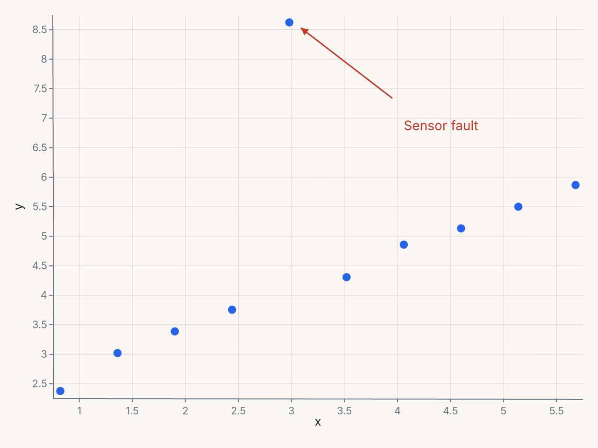
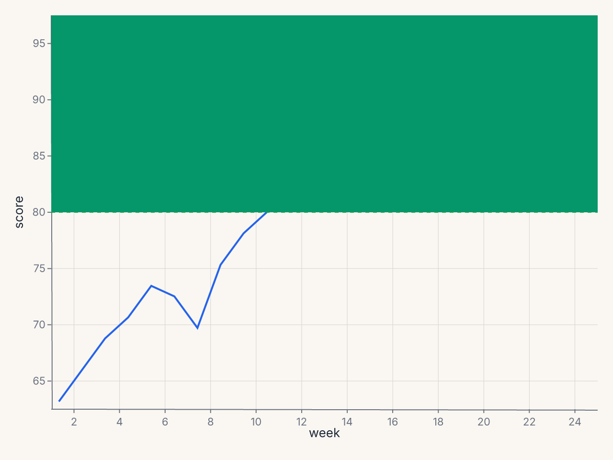

# Annotations

Ferrum's annotation layer lets you add text labels, arrows, shapes, and callouts to a
chart without breaking the declarative model. Every annotation is an immutable value
you compose onto a chart with `+`.

```python
import polars as pl
import ferrum as fm
import ferrum.annotation as ann

df = pl.DataFrame({
    "x": [1.0, 1.5, 2.0, 2.5, 3.0, 3.5, 4.0, 4.5, 5.0, 5.5],
    "y": [2.1, 2.8, 3.2, 3.6, 8.9, 4.2, 4.8, 5.1, 5.5, 5.9],
})

chart = (
    fm.Chart(df)
    .mark_point(size=60)
    .encode(x="x:Q", y="y:Q")
    + ann.text(3.6, 9.2, "Sensor fault", color="#c0392b", font_size=12, anchor="start")
    + ann.arrow(3.5, 9.1, 3.1, 8.95, stroke="#c0392b", stroke_width=1.5, curve="arc")
)
```



---

## Coordinate systems

Every annotation position accepts one of three coordinate types.

### Data coordinates (default)

A plain `float` or `int` is interpreted in data space. Annotations at data coordinates
move with the scale if the domain changes.

```python
ann.text(3.5, 8.2, "label")        # data coordinate (3.5, 8.2)
ann.span("x", 100, 200, fill="#eee")  # data range [100, 200]
```

### Pixel coordinates — `fm.px(n)`

`fm.px(n)` fixes a position in pixels measured from the plot-area origin (top-left
corner of the plot area, not the SVG canvas).

```python
import ferrum as fm

ann.text(fm.px(10), fm.px(20), "Watermark")  # 10px right, 20px down from plot origin
```

### Normalized coordinates — `fm.norm(f)`

`fm.norm(f)` specifies a position as a fraction of the plot area (0.0 = left/top,
1.0 = right/bottom). Useful for placing annotations at a fixed relative position
regardless of the data range.

```python
ann.text(fm.norm(0.98), fm.norm(0.02), "Source: OECD", anchor="end")
```

You can mix coordinate types within a single annotation:

```python
ann.text(fm.norm(0.5), fm.px(10), "Centered title", anchor="middle")
```

---

## Z-order

Annotations render in one of two layers:

- `z="above_marks"` (default): drawn on top of all marks
- `z="below_marks"`: drawn behind marks

```python
ann.rect(0, 0, 50, 100, fill="#fff3cd", z="below_marks")  # highlight behind points
ann.text(25, 50, "Zone A", z="above_marks")               # label on top
```

---

## Using `Annotate` for multiple annotations

When adding many annotations, collect them in an `Annotate` container:

```python
from ferrum.annotation import Annotate
import ferrum.annotation as ann

notes = Annotate([
    ann.text(1.0, 8.0, "Q1 Peak"),
    ann.span("x", 0.8, 1.2, fill="#dbeafe", opacity=0.3),
    ann.arrow(1.0, 7.8, 1.0, 6.5),
])

chart = fm.Chart(df).mark_line().encode(x="t:Q", y="value:Q") + notes
```

---

## The eight annotation primitives

### `annotation.text`

A text label at a fixed position.

```python
ann.text(
    x, y,                   # position (CoordValue)
    text,                   # label string
    *,
    font_size=12,
    color="#333",
    anchor="start",         # "start" | "middle" | "end"
    baseline="middle",      # "top" | "middle" | "bottom"
    angle=0,                # rotation in degrees
    dx=0,                   # horizontal pixel offset
    dy=0,                   # vertical pixel offset
    z="above_marks",        # "above_marks" | "below_marks"
)
```

**Example: source note at bottom-right**

```python
+ ann.text(
    fm.norm(0.98), fm.norm(0.98),
    "Source: Bureau of Labor Statistics",
    font_size=9,
    color="#888",
    anchor="end",
    baseline="bottom",
)
```

---

### `annotation.arrow`

An arrow connecting two positions.

```python
ann.arrow(
    x, y,                   # tail position
    x2, y2,                 # head position
    *,
    stroke="#333",
    stroke_width=1.5,
    head_size=8,
    curve="straight",       # "straight" | "arc" | "elbow"
)
```

**Example: annotate an outlier point**

```python
+ ann.text(4.2, 9.8, "Outlier", dx=10, dy=-5)
+ ann.arrow(4.2, 9.8, 4.2, 8.5, curve="arc")
```

---

### `annotation.rect`

A filled rectangle region, useful for highlighting areas.

```python
ann.rect(
    x1, y1,                 # top-left corner
    x2, y2,                 # bottom-right corner
    *,
    fill,                   # required fill color
    opacity=0.1,
    stroke=None,            # border color; None = no border
    corner_radius=0,
    z="above_marks",
)
```

**Example: highlight an anomalous region**

```python
+ ann.rect(
    "2026-03-01", fm.norm(0.0),
    "2026-04-01", fm.norm(1.0),
    fill="#fef9c3",
    opacity=0.3,
    z="below_marks",
)
```

---

### `annotation.line`

A line segment between two positions.

```python
ann.line(
    x1, y1,                 # start position
    x2, y2,                 # end position
    *,
    stroke="#333",
    stroke_width=1,
    dash=None,              # e.g. [4, 4]
)
```

**Example: reference line**

```python
+ ann.line(
    fm.norm(0.0), 50,       # (left edge, y=50)
    fm.norm(1.0), 50,       # (right edge, y=50)
    stroke="#e74c3c",
    dash=[6, 4],
    stroke_width=1.5,
)
```

---

### `annotation.span`

A shaded band covering the full width or height of the plot along one axis.

```python
ann.span(
    axis,                   # "x" or "y"
    start,                  # band start (CoordValue)
    end,                    # band end (CoordValue)
    *,
    fill,                   # required fill color
    opacity=0.3,
    label=None,             # optional text label in the band
    label_position="top",   # "top" | "middle" | "bottom"
)
```

**Example: highlight a target zone with a reference line**

```python
import polars as pl
import ferrum as fm
import ferrum.annotation as ann

df = pl.DataFrame({
    "week": list(range(1, 25)),
    "score": [
        62, 65, 68, 70, 73, 72, 69, 75, 78, 80,
        82, 85, 84, 86, 88, 87, 90, 91, 89, 93,
        95, 94, 96, 98,
    ],
})

chart = (
    fm.Chart(df)
    .mark_line(stroke_width=2)
    .encode(x="week:Q", y="score:Q")
    .configure(
        axis_y=fm.AxisConfig(domain_min=55, domain_max=105),
        axis_x=fm.AxisConfig(tick_count=12),
    )
    + ann.span("y", 80, 100, fill="#d1fae5", opacity=0.35, label="Target zone")
    + ann.line(
        fm.norm(0.0), 80, fm.norm(1.0), 80,
        stroke="#16a34a", stroke_width=1, dash=[4, 4],
    )
)
```



**Example: highlight an x-axis time range**

```python
+ ann.span("x", "2026-01-01", "2026-03-31", fill="#dbeafe", opacity=0.3, label="Q1")
```

---

### `annotation.bracket`

A bracket with a label, useful for grouping or comparing ranges.

```python
ann.bracket(
    x1, y1,                 # first end of bracket
    x2, y2,                 # second end of bracket
    *,
    label,                  # required label text
    direction="above",      # "above" | "below"
    stroke="#333",
    tip_length=6,           # length of end ticks in pixels
)
```

**Example: group two bars**

```python
+ ann.bracket(
    0.5, 45,                # left bar center, top
    1.5, 45,                # right bar center, top
    label="+12%",
    direction="above",
)
```

---

### `annotation.callout`

A callout bubble with optional connecting arrow. The text box auto-places itself near
the annotated point using a best-effort collision heuristic; override by supplying
`text_x`/`text_y` explicitly.

```python
ann.callout(
    x, y,                   # data point being annotated
    text,                   # callout text
    *,
    text_x=None,            # explicit text bubble position
    text_y=None,
    arrow="curved",         # "curved" | "straight" | "none"
    padding=4,
    background="#fff",
    border_color="#ccc",
    border_radius=3,
)
```

**Example: annotate a notable point**

```python
+ ann.callout(
    3.5, 8.2,
    "Record high\nJan 2026",
    text_x=4.2,
    text_y=9.0,
    arrow="curved",
    border_color="#1a56db",
)
```

---

### `annotation.image`

An image placed at a position.

```python
ann.image(
    x, y,                   # anchor position
    src,                    # URL or base64 data URI
    *,
    width=50,
    height=50,
    anchor="center",        # anchor point on the image
)
```

**Example: company logo at top-right**

```python
+ ann.image(
    fm.norm(0.98), fm.norm(0.02),
    "https://example.com/logo.png",
    width=40,
    height=20,
    anchor="top-right",
)
```

---

## Reusable annotation sets

Since annotations are values, you can define them once and compose onto multiple charts:

```python
import ferrum.annotation as ann
from ferrum.annotation import Annotate

RECESSION_BAND = Annotate([
    ann.span("x", "2008-09-01", "2009-06-30", fill="#fce7f3", opacity=0.3, label="Recession"),
    ann.text("2009-01-01", fm.norm(0.95), "2008–09\nRecession", font_size=9, color="#9d174d"),
])

chart_gdp     = fm.Chart(gdp_df).mark_line().encode(...) + RECESSION_BAND
chart_unemp   = fm.Chart(unemp_df).mark_area().encode(...) + RECESSION_BAND
```

---

## How annotations interact with margins

When `PaddingConfig.auto=True` (the default), ferrum expands plot margins automatically
when a near-edge annotation would otherwise be clipped. To disable this behavior, set
`auto=False` in `configure_padding`.
