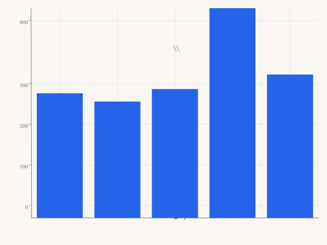
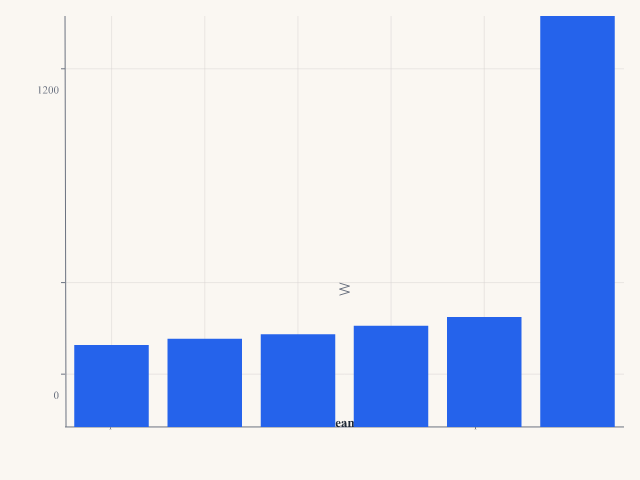
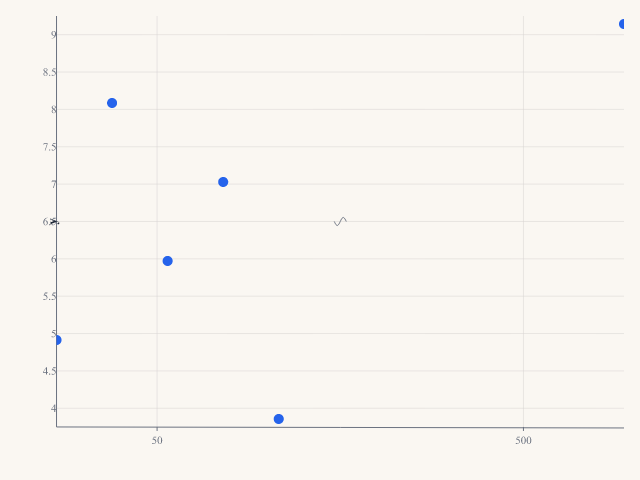
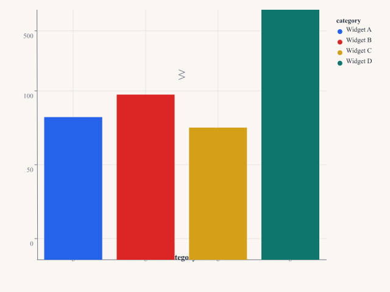

# Break Axes

`BreakAxis` splits a continuous scale into segments, omitting one or more ranges to
prevent outlier values from compressing the rest of the data. A visual break indicator
marks the gap.

---

## The problem it solves

When one data point is far from the rest — a revenue spike, a measurement error, a
special event — the scale adjusts to include it, compressing all other values into a
small band that makes differences hard to read.

```
value
  ↑
900│    ●         ← outlier at 900
   │
 80│  ● ● ● ●    ← data bunched here; differences invisible
 60│
```

`BreakAxis` removes the intermediate range [150, 850] and renders the two segments at
different vertical extents, with a visible gap indicator:

```
value
  ↑
900│    ●
 ~~~ (break)
 80│  ● ● ● ●
 60│
```

---

## Basic usage

Compose a `BreakAxis` onto a chart with `+`:

```python
import ferrum as fm
import polars as pl

df = pl.DataFrame({
    "category": ["A", "B", "C", "D", "E"],
    "value": [72, 68, 75, 900, 81],
})

chart = (
    fm.Chart(df)
    .mark_bar()
    .encode(x="category:N", y="value:Q")
    + fm.BreakAxis(axis="y", gap=(150, 850))
)
```



**Recipe: server response times with color scale and break annotation**

```python
import polars as pl
import ferrum as fm
import ferrum.annotation as ann

df = pl.DataFrame({
    "server": ["web-01", "web-02", "web-03", "web-04", "db-01"],
    "response_ms": [42, 38, 45, 1240, 51],
})

chart = (
    fm.Chart(df)
    .mark_bar()
    .encode(
        x=fm.X("server:N", sort=None),
        y="response_ms:Q",
        color=fm.Color(
            "response_ms:Q",
            scale=fm.SequentialScale(scheme="oranges"),
            legend=None,
        ),
    )
    .labs(title="Server Response Times", y="Response Time (ms)")
    + fm.BreakAxis(axis="y", gap=(80, 1180), break_style="zigzag", break_size=14)
    + ann.text(
        fm.norm(0.98), fm.norm(0.98),
        "Note: scale break at 80–1,180 ms",
        font_size=9, color="#666", anchor="end",
    )
)
```



---

## Constructor reference

```python
fm.BreakAxis(
    axis,               # str: "x" or "y" (required)
    gap,                # tuple | list[tuple]: break region(s) to remove (required)
    break_size=12,      # float: visual height of break indicator in pixels
    break_style="slash" # str: break indicator style
)
```

### Parameters

| Parameter | Type | Default | Description |
|---|---|---|---|
| `axis` | `str` | required | Which axis to break: `"x"` or `"y"` |
| `gap` | `tuple | list` | required | A `(start, end)` pair or a list of pairs |
| `break_size` | `float` | `12` | Visual size of the break indicator in pixels |
| `break_style` | `str` | `"slash"` | Break indicator: `"slash"`, `"zigzag"`, `"wave"`, or `"gap"` |

### Validation

- `axis` must be `"x"` or `"y"`.
- `break_style` must be one of the four named styles.
- Invalid values raise `ValueError` at construction time.

---

## Break styles

| Style | Appearance | When to use |
|---|---|---|
| `"slash"` | Two diagonal parallel lines (///) | Default; clear, compact |
| `"zigzag"` | Zigzag waveform | Emphasizes the break |
| `"wave"` | Smooth sine curve | Subtle, clean |
| `"gap"` | Plain whitespace with no indicator | Minimal; for dense charts |

```python
fm.BreakAxis(axis="y", gap=(150, 850), break_style="zigzag")
```

---

## Multiple break regions

Pass a list of `(start, end)` tuples to break multiple regions:

```python
fm.BreakAxis(
    axis="y",
    gap=[(50, 200), (500, 900)],  # two separate gaps
)
```

Breaks are applied in order. Overlapping or adjacent ranges are handled gracefully.

---

## Behavior with spanning marks

A mark whose value spans a break is clipped into the two visible segments. For example,
a bar from 0 to 900 with a break at (150, 850) renders as two bar segments: one from 0
to 150 and one from 850 to 900. This is the semantically correct behavior — the full
extent of the bar is preserved, just displayed in the two non-broken regions.

---

## Horizontal break axes

`BreakAxis` works on either axis:

```python
df = pl.DataFrame({
    "group": ["Control"] * 10 + ["Treatment"] * 10,
    "measurement": [1, 2, 3, 4, 5, 6, 7, 8, 9, 10, 1, 2, 50, 51, 52, 53, 54, 55, 56, 57],
})

chart = (
    fm.Chart(df)
    .mark_point()
    .encode(x="measurement:Q", y="group:N", color="group:N")
    + fm.BreakAxis(axis="x", gap=(12, 48))
)
```



---

## Interaction with annotations

Annotations whose positions fall within a break region are suppressed with a warning.
The warning names the annotation and its position so you can decide whether to move it
or accept the suppression.

---

## Interaction with SecondaryY

`BreakAxis` applied to the primary y axis has no effect on a secondary y axis (`SecondaryY`).
The two y axes have independent scales and the break applies only to the primary scale.

---

## Common patterns

### Suppress a single outlier

```python
+ fm.BreakAxis(axis="y", gap=(max_normal * 1.2, outlier_value * 0.9))
```

### Time series with a data gap

```python
+ fm.BreakAxis(
    axis="x",
    gap=("2020-03-01", "2021-01-01"),
    break_style="wave",
)
```

### Comparative bar chart with outlier suppression

```python
chart = (
    fm.Chart(df)
    .mark_bar()
    .encode(x="category:N", y="value:Q", color="category:N")
    + fm.BreakAxis(axis="y", gap=(120, 480), break_style="zigzag", break_size=16)
    + fm.annotation.text(fm.norm(0.98), fm.norm(0.98), "Note: scale break at 120–480",
                         font_size=9, color="#666", anchor="end")
)
```


