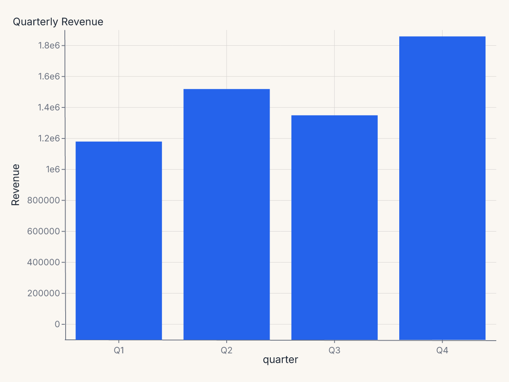
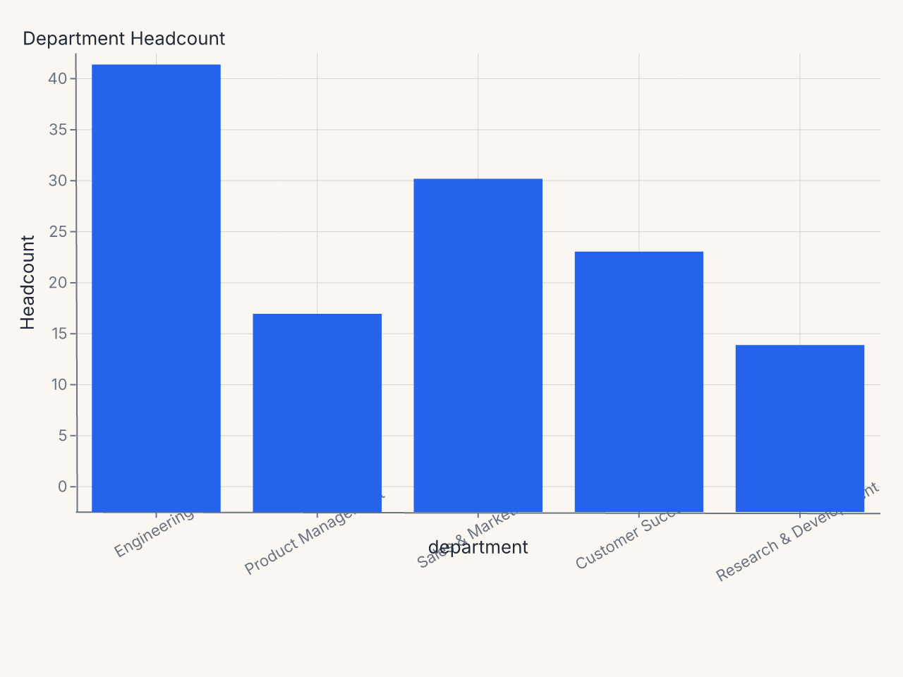
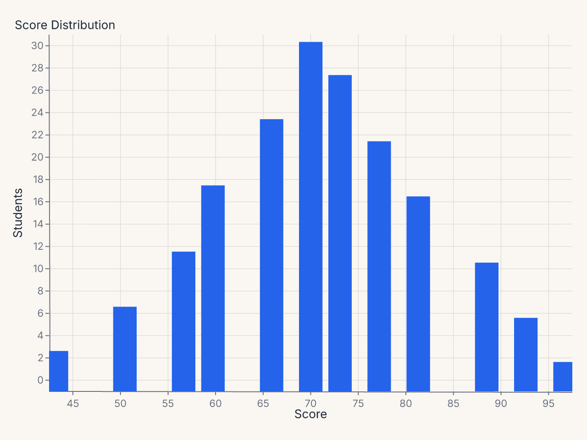
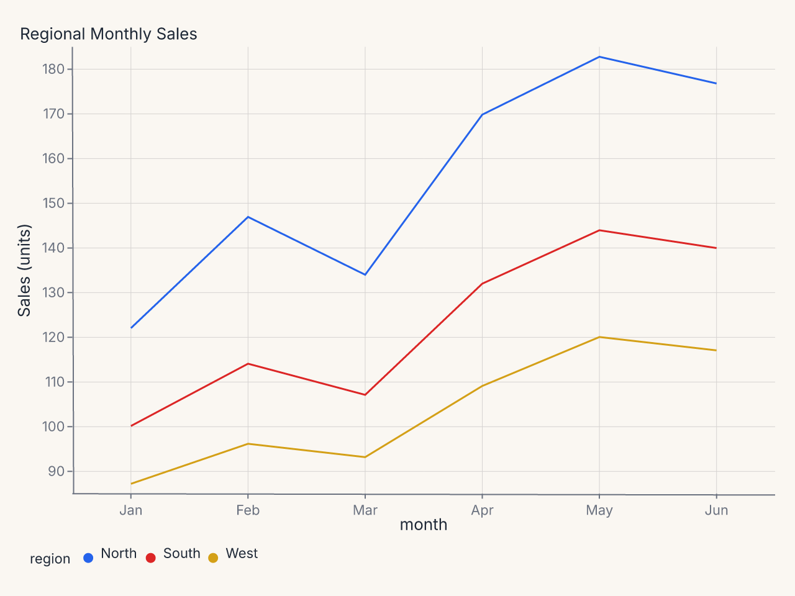
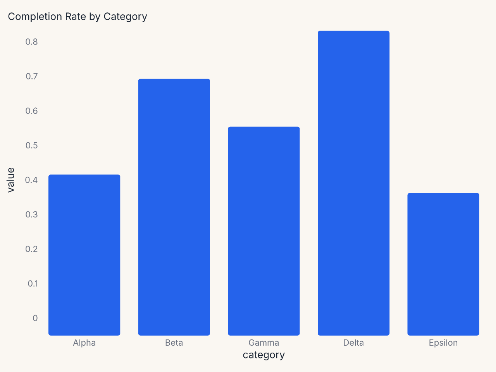

# Configuration Objects

Ferrum's declarative configuration surface exposes six typed config objects, one per
domain. Each is an immutable frozen dataclass. Pass them via `.configure()` or compose
them with the chart via `+`.

---

## AxisConfig

Controls tick labels, tick marks, the axis domain line, gridlines, and the scale domain
for one or more axes.

```python
from ferrum import AxisConfig

AxisConfig(
    x=True,                      # apply to x axis
    y=True,                      # apply to y axis
    label_angle=-45,             # degrees; negative = counter-clockwise
    label_font_size=11.0,
    label_color="#555",
    label_format="currency",     # named preset
    label_format_raw=None,       # raw d3-format string (mutually exclusive with label_format)
    label_overlap="greedy",      # collision strategy
    tick_count=6,
    tick_size=5.0,
    tick_values=[0, 25, 50, 75, 100],
    title_font_size=12.0,
    title_color="#333",
    title_padding=8.0,
    domain=True,                 # show axis line
    domain_color="#ccc",
    domain_width=1.0,
    grid=True,
    grid_color="#e8e8e8",
    grid_dash=[4.0, 4.0],
    grid_width=1.0,
    domain_min=0.0,
    domain_max=100.0,
    nice=True,
    zero=True,
)
```

### Parameters

| Parameter | Type | Default | Description |
|---|---|---|---|
| `x` | `bool` | `True` | Apply this config to the x axis |
| `y` | `bool` | `True` | Apply this config to the y axis |
| `label_angle` | `float | None` | `None` | Tick label rotation in degrees |
| `label_font_size` | `float | None` | `None` | Tick label font size |
| `label_color` | `str | None` | `None` | Tick label color |
| `label_format` | `str | None` | `None` | Named format preset; see [Format Presets](format-presets.md) |
| `label_format_raw` | `str | None` | `None` | Raw d3-format or strftime string |
| `label_overlap` | `str | None` | `None` | Overlap strategy: `"greedy"`, `"parity"`, `"rotate"`, or `"true"`/`"false"` |
| `tick_count` | `int | None` | `None` | Suggested number of ticks |
| `tick_size` | `float | None` | `None` | Tick mark length in pixels |
| `tick_values` | `list | None` | `None` | Explicit tick positions |
| `title_font_size` | `float | None` | `None` | Axis title font size |
| `title_color` | `str | None` | `None` | Axis title color |
| `title_padding` | `float | None` | `None` | Gap between title and tick labels |
| `domain` | `bool | None` | `None` | Show axis line |
| `domain_color` | `str | None` | `None` | Axis line color |
| `domain_width` | `float | None` | `None` | Axis line width |
| `grid` | `bool | None` | `None` | Show grid lines |
| `grid_color` | `str | None` | `None` | Grid line color |
| `grid_dash` | `list[float] | None` | `None` | Grid dash pattern, e.g. `[4, 4]` |
| `grid_width` | `float | None` | `None` | Grid line width |
| `domain_min` | `float | None` | `None` | Minimum of the scale domain |
| `domain_max` | `float | None` | `None` | Maximum of the scale domain |
| `nice` | `bool | None` | `None` | Round domain to nice values |
| `zero` | `bool | None` | `None` | Include zero in the domain |
| `label_padding` | `float | None` | `None` | Pixel gap between tick mark and label text (defaults to 2.0) |
| `grid_opacity` | `float | None` | `None` | Grid line opacity (0–1) |
| `orient` | `str | None` | `None` | Axis side: `"top"`/`"bottom"` (x) or `"left"`/`"right"` (y); set via `axis_x`/`axis_y`, not the shared `axis` |
| `translate` | `float | None` | `None` | Pixel translation of the axis group perpendicular to its line |
| `min_band` | `float | None` | `None` | Lower bound for the reserved axis margin band, in pixels |
| `max_band` | `float | None` | `None` | Upper bound for the reserved axis margin band, in pixels |
| `tick_extra` | `bool | None` | `None` | Append an extra tick at each domain boundary |
| `tick_min_step` | `float | None` | `None` | Minimum step between ticks in data space |
| `title_orient` | `str | None` | `None` | Side/orientation of the axis title |
| `zindex` | `int | None` | `None` | Coarse draw order of the axis relative to marks |

### Notes

- `label_format` and `label_format_raw` are mutually exclusive; providing both raises
  `ValueError` at construction time.
- `label_format` is validated against the known preset list at construction time.
- The `x` and `y` booleans control which axes this instance targets. To give x and y
  different settings, use `configure(axis_x=..., axis_y=...)` on the chart.

### Example: currency-formatted y axis

```python
import polars as pl
import ferrum as fm

df = pl.DataFrame({
    "quarter": ["Q1", "Q2", "Q3", "Q4"],
    "revenue": [1_240_000, 1_580_000, 1_410_000, 1_920_000],
})

chart = (
    fm.Chart(df)
    .mark_bar()
    .encode(
        x=fm.X("quarter:N", sort=None),
        y="revenue:Q",
    )
    .configure_axis(y=True, x=False, label_format="currency")
    .labs(title="Quarterly Revenue", y="Revenue")
)
```



### Example: rotated x labels for long category names

```python
import polars as pl
import ferrum as fm

df = pl.DataFrame({
    "department": [
        "Engineering", "Product Management", "Sales & Marketing",
        "Customer Success", "Research & Development",
    ],
    "headcount": [42, 18, 31, 24, 15],
})

chart = (
    fm.Chart(df)
    .mark_bar()
    .encode(
        x=fm.X("department:N", sort="-y"),
        y="headcount:Q",
    )
    .configure_axis(x=True, y=False, label_angle=-40)
    .labs(title="Department Headcount", x=None, y="Headcount")
)
```



### Example: custom tick positions

```python
import polars as pl
import ferrum as fm

df = pl.DataFrame({
    "score": [45, 52, 58, 61, 67, 71, 74, 78, 82, 89, 93, 97],
    "count": [3, 7, 12, 18, 24, 31, 28, 22, 17, 11, 6, 2],
})

chart = (
    fm.Chart(df)
    .mark_bar()
    .encode(x="score:Q", y="count:Q")
    .configure(
        axis_x=fm.AxisConfig(tick_values=[0, 60, 70, 80, 90, 100], label_font_size=11),
        axis_y=fm.AxisConfig(tick_count=5, label_format="integer"),
    )
    .labs(title="Score Distribution", x="Score", y="Students")
)
```



---

## LegendConfig

Controls legend placement, layout, and typography.

```python
from ferrum import LegendConfig

LegendConfig(
    orient="bottom",          # right | left | top | bottom | none
    direction="horizontal",   # vertical | horizontal
    columns=4,
    title_font_size=12.0,
    label_font_size=11.0,
    symbol_size=100.0,
    symbol_type="circle",
    gradient_length=120.0,
    offset=10.0,
    padding=4.0,
)
```

### Parameters

| Parameter | Type | Default | Description |
|---|---|---|---|
| `orient` | `str | None` | `None` | Legend position: `"right"`, `"left"`, `"top"`, `"bottom"`, or `"none"` |
| `direction` | `str | None` | `None` | Item layout: `"vertical"` or `"horizontal"` |
| `columns` | `int | None` | `None` | Columns in multi-column layout |
| `title_font_size` | `float | None` | `None` | Legend title font size |
| `label_font_size` | `float | None` | `None` | Legend label font size |
| `symbol_size` | `float | None` | `None` | Symbol area (in square pixels) |
| `symbol_type` | `str | None` | `None` | Symbol shape |
| `gradient_length` | `float | None` | `None` | Continuous gradient legend length |
| `offset` | `float | None` | `None` | Offset from the plot area edge |
| `padding` | `float | None` | `None` | Internal padding between items |
| `label_color` | `str | None` | `None` | Legend label color |
| `label_limit` | `float | None` | `None` | Max label width in pixels; wider labels truncate with an ellipsis |
| `symbol_stroke_width` | `float | None` | `None` | Stroke width of legend symbol swatches |
| `gradient_thickness` | `float | None` | `None` | Gradient (colorbar) legend thickness in pixels |
| `title_padding` | `float | None` | `None` | Padding between the legend title and its entries |
| `row_padding` | `float | None` | `None` | Vertical entry spacing (vertical-direction legends) |
| `column_padding` | `float | None` | `None` | Horizontal entry spacing (horizontal-direction legends) |
| `clip_height` | `float | None` | `None` | Cap on legend group height in pixels; overflow is clipped |
| `tick_min_step` | `float | None` | `None` | Minimum step between colorbar ticks in data units |
| `zindex` | `int | None` | `None` | Coarse draw order of the legend relative to marks |

### Notes

- `orient="none"` hides the legend entirely.
- `orient` is validated at construction time.

### Example: horizontal legend at bottom

```python
import polars as pl
import ferrum as fm

df = pl.DataFrame({
    "month": ["Jan", "Feb", "Mar", "Apr", "May", "Jun"] * 3,
    "region": ["North"] * 6 + ["South"] * 6 + ["West"] * 6,
    "sales": [
        120, 145, 132, 168, 181, 175,
        98, 112, 105, 130, 142, 138,
        85, 94, 91, 107, 118, 115,
    ],
})

chart = (
    fm.Chart(df)
    .mark_line()
    .encode(x="month:N", y="sales:Q", color="region:N")
    .configure_legend(orient="bottom", direction="horizontal")
    .labs(title="Regional Monthly Sales", x=None, y="Sales (units)")
)
```



---

## TitleConfig

Controls chart title and subtitle styling.

```python
from ferrum import TitleConfig

TitleConfig(
    font_size=18.0,
    font_weight="bold",
    anchor="start",          # start | middle | end
    color="#222",
    offset=8.0,
    subtitle_font_size=13.0,
    subtitle_color="#666",
)
```

### Parameters

| Parameter | Type | Default | Description |
|---|---|---|---|
| `font_size` | `float | None` | `None` | Title font size |
| `font_weight` | `str | None` | `None` | Title weight, e.g. `"bold"` or `"600"` |
| `anchor` | `str | None` | `None` | Horizontal alignment: `"start"`, `"middle"`, or `"end"` |
| `color` | `str | None` | `None` | Title color |
| `offset` | `float | None` | `None` | Pixel offset from the plot area |
| `subtitle_font_size` | `float | None` | `None` | Subtitle font size |
| `subtitle_color` | `str | None` | `None` | Subtitle color |

### Notes

- `anchor` is validated at construction time. Valid values are `"start"`, `"middle"`,
  and `"end"`.

### Example: left-aligned title

```python
chart.configure_title(anchor="start", font_size=16, color="#1a1a2e")
```

---

## GridConfig

Controls gridlines independently from axis configuration. `GridConfig` lives at the chart
level; for per-axis grid control, use the `grid`, `grid_color`, `grid_dash`, and
`grid_width` parameters on `AxisConfig`.

`GridConfig` styles a single gridline level (the **major** lines). For two-level gridlines
with separate major/minor styling, use the theme-level [`Grid`][ferrum.Grid] value class
(`Theme(grid=Grid(major=..., minor=...))`) — see the
[Themes guide](../themes.md#major-and-minor-gridlines-with-fmgrid).

```python
from ferrum import GridConfig

GridConfig(
    x=False,               # no vertical grid lines
    y=True,                # horizontal grid lines
    color="#e8e8e8",
    width=1.0,
    dash=[4.0, 4.0],
    opacity=0.8,
    band_colors=["#f9f9f9", "#ffffff"],  # alternating bands
)
```

### Parameters

| Parameter | Type | Default | Description |
|---|---|---|---|
| `x` | `bool | None` | `None` | Show vertical grid lines (along x axis) |
| `y` | `bool | None` | `None` | Show horizontal grid lines (along y axis) |
| `color` | `str | None` | `None` | Grid line color |
| `width` | `float | None` | `None` | Grid line width |
| `dash` | `list[float] | None` | `None` | Dash pattern, e.g. `[4, 4]` |
| `opacity` | `float | None` | `None` | Grid line opacity |
| `band_colors` | `list[str] | None` | `None` | Alternating fill colors between grid lines |

### Notes

- `band_colors` takes a list of two color strings for even/odd bands. Set to `None`
  (the default) to disable band fills.

### Example: dashed horizontal gridlines only

```python
chart.configure_grid(x=False, y=True, dash=[4, 4], color="#ddd")
```

---

## PaddingConfig

Controls plot-area margins. `auto` is opt-in (default `False`). When `auto=True`, a
side left unset (`None`) expands to keep a continuous axis's edge-tick label or axis
title from clipping past the rendered viewport edge — it does not cover annotations
or ordinal/nominal axis labels (which never overhang the plot edge), and a y-axis
capped tight enough via `max_band` can still leave its own label or title outside the
canvas on that axis. Use `PaddingConfig` to supply exact margins, optionally combined
with `auto=True` for the sides you don't set.

```python
from ferrum import PaddingConfig

PaddingConfig(
    top=20.0,
    right=40.0,
    bottom=60.0,
    left=80.0,
    auto=True,    # all four sides are set here, so auto has nothing left to expand
)
```

### Parameters

| Parameter | Type | Default | Description |
|---|---|---|---|
| `top` | `float | None` | `None` | Top margin in pixels |
| `right` | `float | None` | `None` | Right margin in pixels |
| `bottom` | `float | None` | `None` | Bottom margin in pixels |
| `left` | `float | None` | `None` | Left margin in pixels |
| `auto` | `bool` | `False` | Opt-in: expand an unset side to fit continuous-axis tick labels/titles |

### Notes

- A side you set explicitly is never touched by `auto` — explicit values are always
  used exactly, on every side, regardless of `auto`. `auto` only ever expands a side
  left at its default (`None`).
- When `auto=False` (the default), unset sides fall back to the flat theme padding;
  labels or titles may clip.

### Example: minimal axes with tight padding

```python
import polars as pl
import ferrum as fm

df = pl.DataFrame({
    "category": ["Alpha", "Beta", "Gamma", "Delta", "Epsilon"],
    "value": [0.42, 0.68, 0.55, 0.81, 0.37],
})

chart = (
    fm.Chart(df)
    .mark_bar(corner_radius=3)
    .encode(
        x=fm.X("category:N", sort="-y"),
        y=fm.Y("value:Q", axis=fm.Axis(label_format=".0%")),
    )
    .configure_axis(domain=False, tick_size=0, grid=False, label_font_size=11)
    .configure_padding(top=10, right=10, bottom=10, left=10)
    .labs(title="Completion Rate by Category", x=None, y=None)
)
```



---

## ColorConfig

Controls default color scale selections at the chart level. When set, these override the
theme's palette defaults for this chart only.

```python
from ferrum import ColorConfig

ColorConfig(
    scheme="okabe_ito",               # categorical
    sequential_scheme="viridis",
    diverging_scheme="rdbu",
    domain=["low", "medium", "high"], # explicit domain
    range=["#4292c6", "#08519c"],     # explicit color range
)
```

### Parameters

| Parameter | Type | Default | Description |
|---|---|---|---|
| `scheme` | `str | None` | `None` | Named categorical color scheme |
| `sequential_scheme` | `str | None` | `None` | Named sequential ramp |
| `diverging_scheme` | `str | None` | `None` | Named diverging ramp |
| `domain` | `list | None` | `None` | Explicit scale domain values |
| `range` | `list[str] | None` | `None` | Explicit list of color strings |

### Notes

- Available named schemes are the same as `Theme(color_scheme=...)`. See
  [Themes](../themes.md#available-palettes) for the full palette list.
- `domain` and `range` accept the same types as Vega-Lite's color scale definitions.

### Example: brand palette for one chart

```python
chart.configure_color(range=["#0d47a1", "#1565c0", "#1976d2", "#1e88e5"])
```

---

## The Configure Container

`Configure` holds all six config objects together. Use it when you want to reuse a
configuration bundle across multiple charts.

```python
from ferrum import Configure, AxisConfig, LegendConfig, TitleConfig, GridConfig

dashboard_config = Configure(
    axis=AxisConfig(label_font_size=10, grid_color="#f0f0f0"),
    legend=LegendConfig(orient="bottom", direction="horizontal"),
    title=TitleConfig(anchor="start", font_size=14),
    grid=GridConfig(x=False, y=True),
)

chart1 = fm.Chart(df1).mark_bar().encode(...) + dashboard_config
chart2 = fm.Chart(df2).mark_line().encode(...) + dashboard_config
```

When you compose two `Configure` objects via `+` on a chart, fields are merged: later
`Configure` entries win on key conflicts within the same domain. The merge is additive —
you can build up configuration incrementally without losing earlier settings.

---

## Per-axis targeting

The `.configure()` method accepts `axis`, `axis_x`, `axis_y`, and `axis_y2` separately,
letting x and y carry independent settings. The specificity order within a chart is:

1. `axis_y` beats `axis` for the y axis
2. `axis_x` beats `axis` for the x axis
3. `axis_y2` applies only to the secondary y axis

```python
from ferrum import AxisConfig

chart.configure(
    axis=AxisConfig(grid=True, grid_color="#eee"),   # both axes: grid on
    axis_x=AxisConfig(label_angle=-45),              # x only: rotate labels
    axis_y=AxisConfig(label_format="si"),            # y only: SI prefix
)
```
