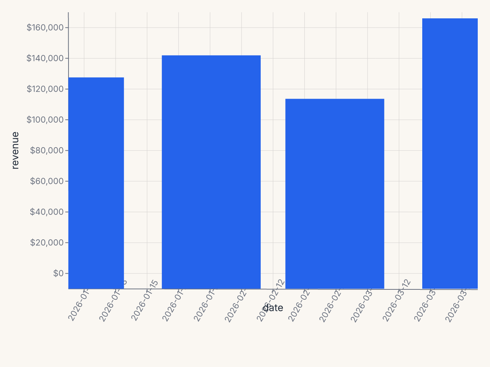
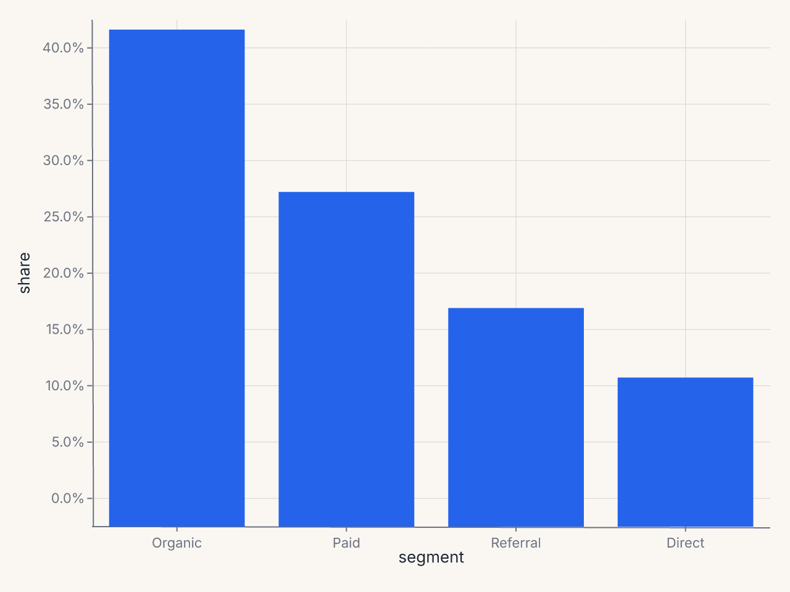

# Format Presets

Named format presets let you control how axis tick labels and legend labels display
values without memorizing d3-format strings or strftime patterns. Presets resolve to
format strings in Python before the chart spec reaches the Rust renderer.

Use `label_format` in `AxisConfig` (or in `.configure_axis()`) for named presets, and
`label_format_raw` when you need a format the presets don't cover.

```python
import ferrum as fm

# Named preset
chart.configure_axis(label_format="currency")

# Raw d3-format string
chart.configure_axis(label_format_raw="$,.2f")
```

`label_format` and `label_format_raw` are mutually exclusive. Providing both raises
`ValueError` at construction time.

---

## Numeric presets

These presets apply to quantitative (`Q`) axes.

| Preset | d3-format | Example output | When to use |
|---|---|---|---|
| `"integer"` | `,.0f` | 1,234 | Counts, whole-number values |
| `"decimal"` | `,.2f` | 1,234.56 | General floating-point |
| `"decimal1"` | `,.1f` | 1,234.6 | One decimal, with thousands separator |
| `"percent"` | `.1%` | 45.2% | Rates, proportions (0–1 input) |
| `"percent_int"` | `.0%` | 45% | Rounded percentages |
| `"si"` | `.2s` | 1.2k | Large numbers, abbreviated |
| `"currency"` | `$,.0f` | $1,234 | Dollar amounts, no cents |
| `"currency_cents"` | `$,.2f` | $1,234.56 | Dollar amounts with cents |
| `"compact"` | `.2~s` | 1.2k | Like `"si"` but trailing zeros suppressed |
| `"scientific"` | `.2e` | 1.23e+3 | Scientific/engineering notation |
| `"ordinal"` | *(Rust-side)* | 1st, 2nd, 3rd | Rankings, ordered labels |

### Notes on `"ordinal"`

The `"ordinal"` preset uses a special sentinel value that the Rust renderer converts into
ordinal suffixes (1st, 2nd, 3rd, 4th, …). This is implemented natively in the renderer
and does not map to a standard d3-format string.

### Notes on `"percent"`

d3-format's `.1%` multiplies the input by 100 and appends a `%` sign. If your data is
already in the 0–100 range (not 0–1), use `label_format_raw` with a custom string:

```python
# Data is already in percent form (e.g. 45.2, not 0.452)
chart.configure_axis(label_format_raw=".1f%%")
```

---

## Time presets

These presets apply to temporal (`T`) axes. They use strftime-style patterns.

| Preset | Pattern | Example output | When to use |
|---|---|---|---|
| `"date_short"` | `%b %-d` | Jan 5 | Compact dates (day of year) |
| `"date_long"` | `%B %-d, %Y` | January 5, 2026 | Full date labels |
| `"date_iso"` | `%Y-%m-%d` | 2026-01-05 | ISO 8601, machine-readable |
| `"month"` | `%b` | Jan | Monthly axis, year from context |
| `"month_year"` | `%b %Y` | Jan 2026 | Monthly axis with year |
| `"year"` | `%Y` | 2026 | Annual axis |
| `"time"` | `%H:%M` | 14:30 | 24-hour time |
| `"time_12h"` | `%-I:%M %p` | 2:30 PM | 12-hour time |
| `"datetime"` | `%b %-d, %H:%M` | Jan 5, 14:30 | Date and time combined |

### Notes on platform portability

The `%-d` and `%-I` patterns (no-zero-padded day/hour) are Linux-specific strftime
extensions. On Windows, use `%#d` and `%#I` instead. On macOS and Linux, `%-d` is
supported.

---

## Using raw format strings

When no preset covers your case, `label_format_raw` accepts any valid d3-format string
(for quantitative axes) or strftime pattern (for temporal axes):

```python
# Two decimal places, no thousands separator
chart.configure_axis(label_format_raw=".2f")

# Millions with one decimal
chart.configure_axis(label_format_raw="$.1fM")

# Custom date format
chart.configure_axis(label_format_raw="%d/%m/%Y")
```

For the full d3-format spec, see [d3-format documentation](https://github.com/d3/d3-format).

---

## Programmatic preset resolution

You can resolve a preset to its underlying format string in Python:

```python
from ferrum import resolve_format

resolve_format("currency")     # "$,.0f"
resolve_format("date_short")   # "%b %-d"
resolve_format("ordinal")      # "__ordinal__"  (Rust-side sentinel)
```

`resolve_format` raises `ValueError` for unknown preset names.

---

## Per-axis vs. chart-level format

The same format options are available at two scopes:

**Chart level** (applies to all axes that don't have a per-channel override):

```python
chart.configure_axis(label_format="currency")
```

**Per-channel** (applies only to that specific encoding's axis):

```python
chart.encode(
    y=fm.Y("revenue:Q", axis=fm.Axis(label_format="$,.0f")),
)
```

Per-channel always wins over chart-level configure. Use chart-level for a sensible default
and per-channel to override for one axis.

---

## Examples

### Revenue chart with currency y and short date x

```python
import ferrum as fm
import polars as pl

df = pl.DataFrame({
    "date": ["2026-01-01", "2026-02-01", "2026-03-01", "2026-04-01"],
    "revenue": [125000, 138500, 112000, 161000],
}).with_columns(pl.col("date").str.to_date())

chart = (
    fm.Chart(df)
    .mark_bar()
    .encode(x="date:T", y="revenue:Q")
    .configure(
        axis_x=fm.AxisConfig(label_format="month_year"),
        axis_y=fm.AxisConfig(label_format="currency"),
    )
)
```



### Percentage axis

```python
df = pl.DataFrame({
    "segment": ["Organic", "Paid", "Referral", "Direct"],
    "share": [0.42, 0.28, 0.18, 0.12],
})

chart = (
    fm.Chart(df)
    .mark_bar()
    .encode(x="segment:N", y="share:Q")
    .configure_axis(y=True, x=False, label_format="percent")
)
```



### SI prefix for large counts

```python
chart.configure_axis(y=True, x=False, label_format="si")
# 1500000 → "1.5M", 950000 → "950k"
```
