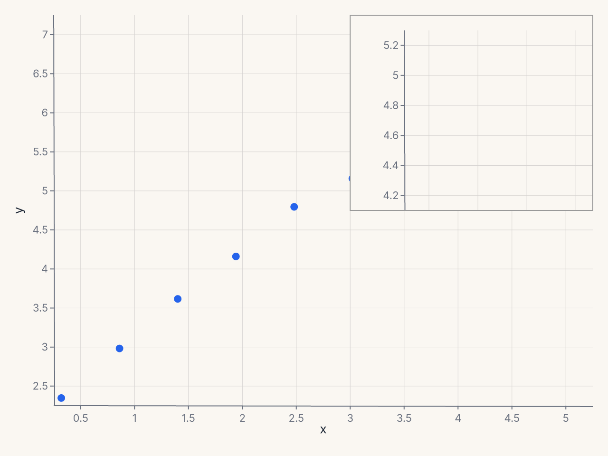
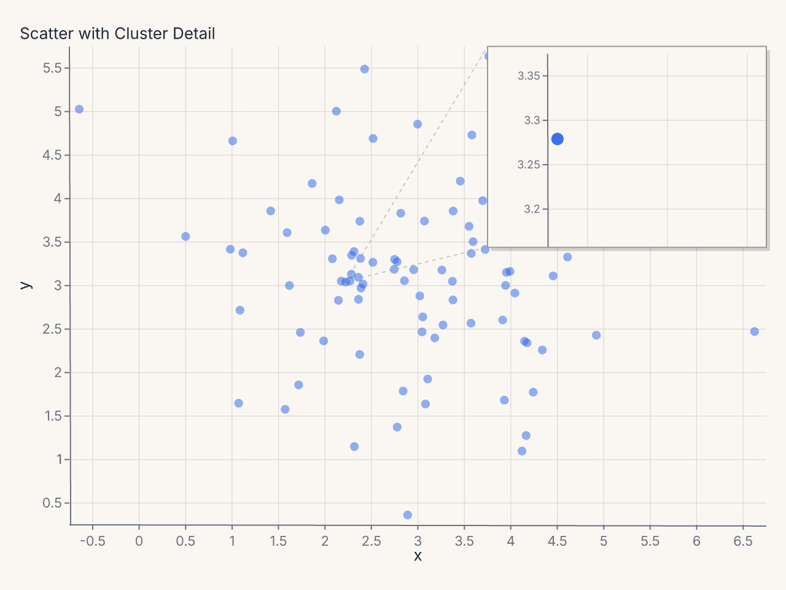
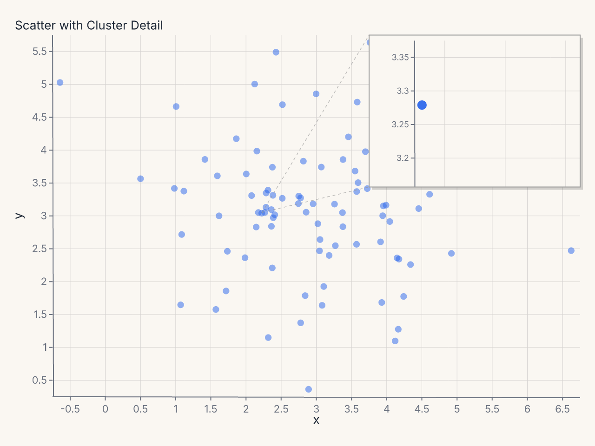
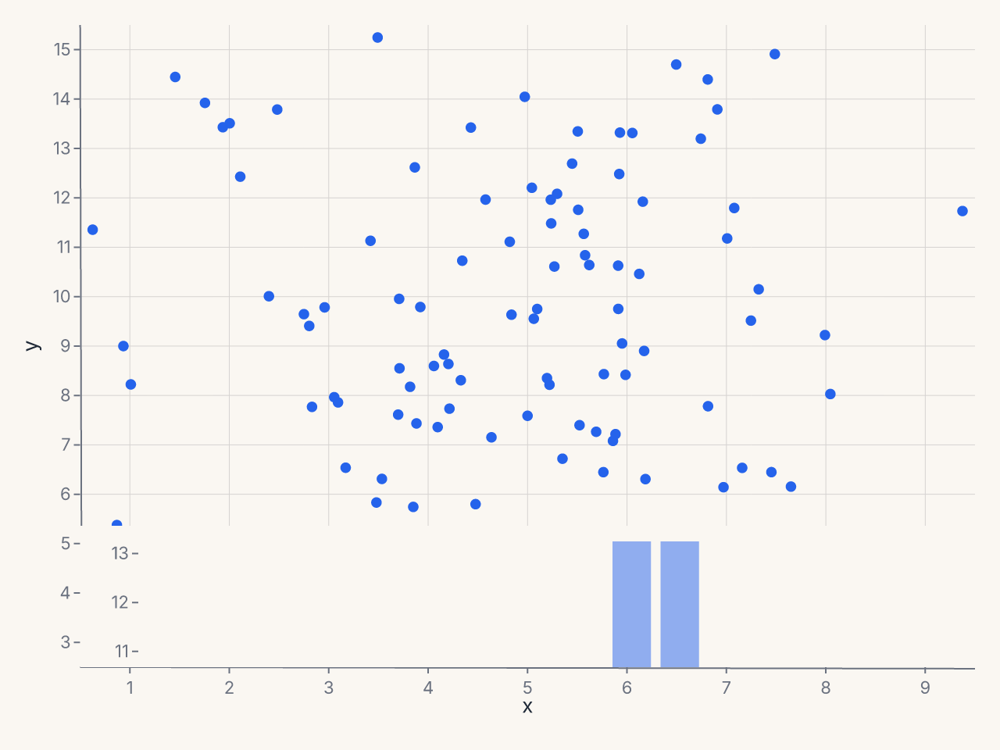
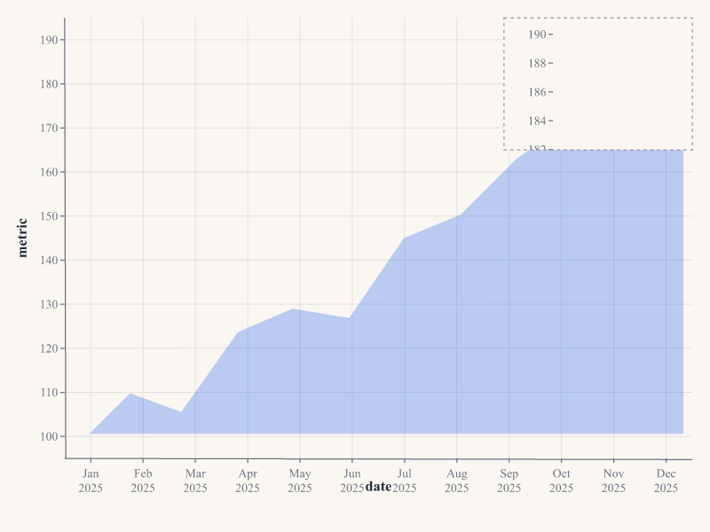

# Inset Panels

`Inset` embeds a self-contained sub-chart overlaid on a parent chart's plot area. The inset
has its own independent scales, axes, marks, and configuration. It overlays without
reflowing the parent — the parent's layout is computed first, and the inset is painted
on top at its specified bounds.

Typical uses: zoom panels for a region of interest, detail views of a dense area,
supplementary distributions alongside a main scatter.

---

## Basic usage

Compose an `Inset` onto a chart with `+`:

```python
import ferrum as fm
import polars as pl

df = pl.DataFrame({
    "x": [0.5, 1.0, 1.5, 2.0, 2.5, 3.0, 3.5, 4.0, 4.5, 5.0],
    "y": [2.1, 2.8, 3.5, 4.1, 4.8, 5.2, 5.8, 6.3, 6.9, 7.4],
})

# Build a zoom view of the [1.0, 3.0] x range
zoom_df = df.filter(pl.col("x").is_between(1.0, 3.0))
zoom = (
    fm.Chart(zoom_df)
    .mark_point(size=120)
    .encode(x="x:Q", y="y:Q")
)

# Embed the zoom in the top-right of the parent
chart = (
    fm.Chart(df)
    .mark_point(size=50)
    .encode(x="x:Q", y="y:Q")
    + fm.Inset(
        chart=zoom,
        bounds=(fm.norm(0.55), fm.norm(0.0), fm.norm(1.0), fm.norm(0.5)),
    )
)
```



The inset occupies the top-right 40% x 45% of the plot area. Scales, ticks, and marks
inside the inset are computed independently from the parent.

**Recipe: scatter with zoomed cluster detail**

```python
import polars as pl
import ferrum as fm
import random

random.seed(42)
xs = [random.gauss(3.0, 1.5) for _ in range(90)] + [random.gauss(2.0, 0.15) for _ in range(10)]
ys = [random.gauss(3.0, 1.2) for _ in range(90)] + [random.gauss(3.0, 0.12) for _ in range(10)]

df = pl.DataFrame({"x": xs, "y": ys})
cluster_df = df.filter(
    pl.col("x").is_between(1.6, 2.4) & pl.col("y").is_between(2.6, 3.4)
)

zoom = (
    fm.Chart(cluster_df)
    .mark_point(size=80, opacity=0.9)
    .encode(x="x:Q", y="y:Q")
    .configure_axis(label_font_size=9, tick_count=4)
    .configure_padding(top=6, right=6, bottom=6, left=6, auto=False)
)

chart = (
    fm.Chart(df)
    .mark_point(size=40, opacity=0.5)
    .encode(x="x:Q", y="y:Q")
    .labs(title="Scatter with Cluster Detail")
    + fm.Inset(
        chart=zoom,
        bounds=(fm.norm(0.6), fm.norm(0.0), fm.norm(1.0), fm.norm(0.42)),
        connect_to=(2.0, 3.0),
        connect_style="lines",
        shadow=True,
    )
)
```



---

## Constructor reference

```python
fm.Inset(
    chart,                     # Chart: the chart to embed (required)
    bounds,                    # tuple: (left, top, right, bottom) (required)
    border=True,               # bool: draw a border around the inset
    border_color="#999",       # str
    border_dash=None,          # list[float] | None: dash pattern for border
    background="#fff",         # str | None: background color; None = transparent
    shadow=False,              # bool: drop shadow
    connect_to=None,           # tuple | None: (x, y) source region in parent
    connect_style="lines",     # str: connector style
)
```

### Parameters

| Parameter | Type | Default | Description |
|---|---|---|---|
| `chart` | `Chart` | required | The sub-chart to embed |
| `bounds` | `tuple` | required | `(left, top, right, bottom)` in `norm`, `px`, or data coords |
| `border` | `bool` | `True` | Draw a border around the inset |
| `border_color` | `str` | `"#999"` | Border color |
| `border_dash` | `list[float] | None` | `None` | Border dash pattern |
| `background` | `str | None` | `"#fff"` | Inset background; `None` for transparent |
| `shadow` | `bool` | `False` | Apply a drop shadow |
| `connect_to` | `tuple | None` | `None` | Data coords `(x, y)` of the source region |
| `connect_style` | `str` | `"lines"` | Connector style: `"bracket"`, `"lines"`, or `"none"` |

### Validation

- `connect_style` must be one of `"bracket"`, `"lines"`, or `"none"`. Invalid values
  raise `ValueError` at construction time.

---

## Specifying bounds

The `bounds` tuple `(left, top, right, bottom)` defines the inset position and size
within the parent's plot area. Each element can be:

- A plain `float` (data-space coordinate) — useful when you want the inset at a
  specific data location.
- `fm.norm(f)` — fraction of the plot-area width or height (0.0 to 1.0).
- `fm.px(n)` — absolute pixels from the plot-area origin.

Most use cases call for `fm.norm(...)`:

```python
# Top-right corner, 35% wide × 40% tall
bounds=(fm.norm(0.65), fm.norm(0.0), fm.norm(1.0), fm.norm(0.40))

# Bottom-left corner, 40% wide × 35% tall
bounds=(fm.norm(0.0), fm.norm(0.65), fm.norm(0.40), fm.norm(1.0))

# Fixed pixel size at top-left
bounds=(fm.px(10), fm.px(10), fm.px(220), fm.px(160))
```

---

## Connecting the inset to a source region

When the inset zooms into a specific region of the parent chart, `connect_to` draws a
connector from the source region to the inset boundary:

```python
fm.Inset(
    chart=zoom,
    bounds=(fm.norm(0.6), fm.norm(0.0), fm.norm(1.0), fm.norm(0.45)),
    connect_to=(1.5, 3.2),       # data coords of the source region center
    connect_style="lines",       # draw lines from corners of source to inset
)
```

| Style | Description |
|---|---|
| `"lines"` | Lines from the source region corners to the inset border |
| `"bracket"` | Bracket around the source region |
| `"none"` | No connector |

---

## Inset is independent

An inset's configuration does not inherit from the parent chart:

- The inset's scales are computed independently.
- The parent's theme applies to the inset unless you set a different theme on the inset
  chart explicitly.
- The parent's `configure_*()` settings do **not** cascade into the inset.
- The inset does not affect the parent's layout.

To style the inset differently from the parent:

```python
zoom = (
    fm.Chart(zoom_df)
    .mark_point(size=80)
    .encode(x="x:Q", y="y:Q")
    .configure_axis(domain=False, grid=False)
    .configure_padding(top=4, right=4, bottom=4, left=4, auto=False)
)
```

---

## Common patterns

### Detail zoom panel

```python
# Scatter with a zoomed inset on the dense cluster
cluster_df = df.filter(
    pl.col("x").is_between(1.6, 2.4) & pl.col("y").is_between(2.6, 3.4)
)
zoom = (
    fm.Chart(cluster_df)
    .mark_point(size=80, opacity=0.9)
    .encode(x="x:Q", y="y:Q")
    .configure_axis(label_font_size=9, tick_count=4)
    .configure_padding(top=6, right=6, bottom=6, left=6, auto=False)
)

chart = (
    fm.Chart(df)
    .mark_point(size=40, opacity=0.5)
    .encode(x="x:Q", y="y:Q")
    .labs(title="Scatter with Cluster Detail")
    + fm.Inset(
        chart=zoom,
        bounds=(fm.norm(0.6), fm.norm(0.0), fm.norm(1.0), fm.norm(0.42)),
        connect_to=(2.0, 3.0),
        connect_style="lines",
        shadow=True,
    )
)
```



### Marginal histogram inset

```python
# Pre-compute histogram bins for the inset
hist_df = (
    df.with_columns(pl.col("x").round(0).alias("x_bin"))
    .group_by("x_bin")
    .agg(pl.len().alias("count"))
    .sort("x_bin")
)

hist = (
    fm.Chart(hist_df)
    .mark_bar(opacity=0.5)
    .encode(x="x_bin:Q", y="count:Q")
    .configure_axis(domain=False, grid=False, tick_count=0)
    .configure_padding(top=2, right=2, bottom=2, left=2, auto=False)
)

chart = (
    fm.Chart(df)
    .mark_point()
    .encode(x="x:Q", y="y:Q")
    + fm.Inset(
        chart=hist,
        bounds=(fm.norm(0.0), fm.norm(0.78), fm.norm(1.0), fm.norm(1.0)),
        border=False,
        background=None,
    )
)
```



### Dashboard card with summary inset

```python
import datetime

dates = pl.date_range(datetime.date(2025, 1, 1), datetime.date(2025, 12, 1), "1mo", eager=True)
metrics = [100, 112, 108, 125, 130, 128, 145, 150, 162, 170, 178, 190]
df = pl.DataFrame({"date": dates, "metric": metrics})
recent_df = df.tail(4)

sparkline = (
    fm.Chart(recent_df)
    .mark_line(stroke_width=1.5, color="#16a34a")
    .encode(x="date:T", y="metric:Q")
    .configure_axis(domain=False, grid=False, tick_count=0)
    .configure_padding(top=2, right=2, bottom=2, left=2, auto=False)
)

chart = (
    fm.Chart(df)
    .mark_area(opacity=0.3)
    .encode(x="date:T", y="metric:Q")
    + fm.Inset(
        chart=sparkline,
        bounds=(fm.norm(0.7), fm.norm(0.0), fm.norm(1.0), fm.norm(0.3)),
        border_dash=[3, 3],
        shadow=False,
    )
)
```


