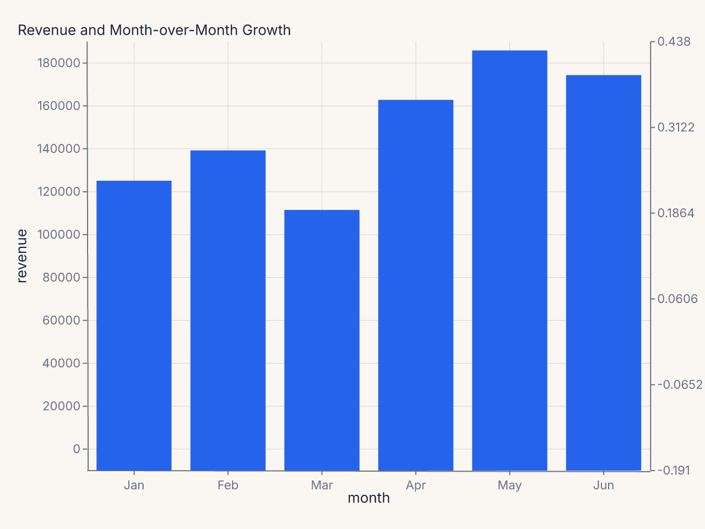
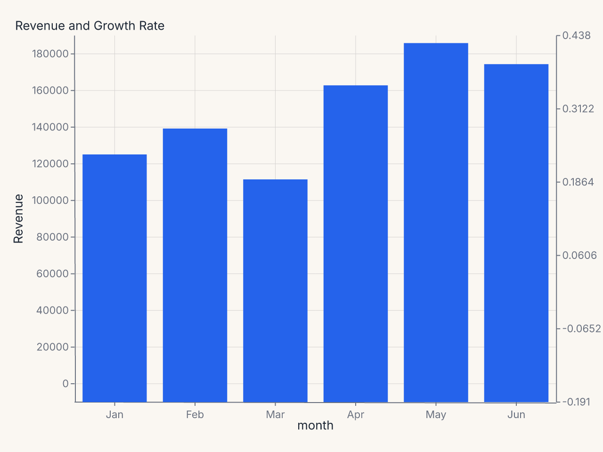
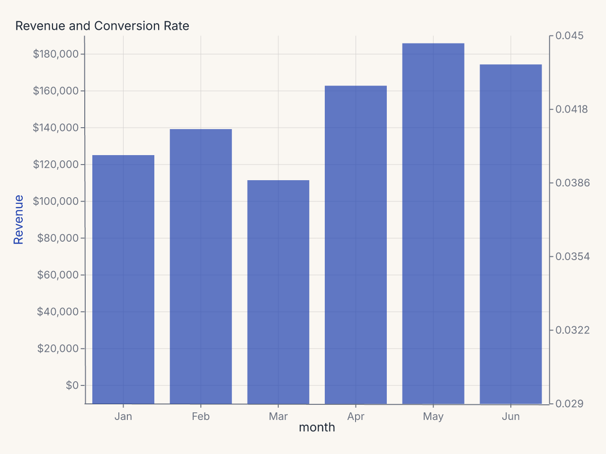
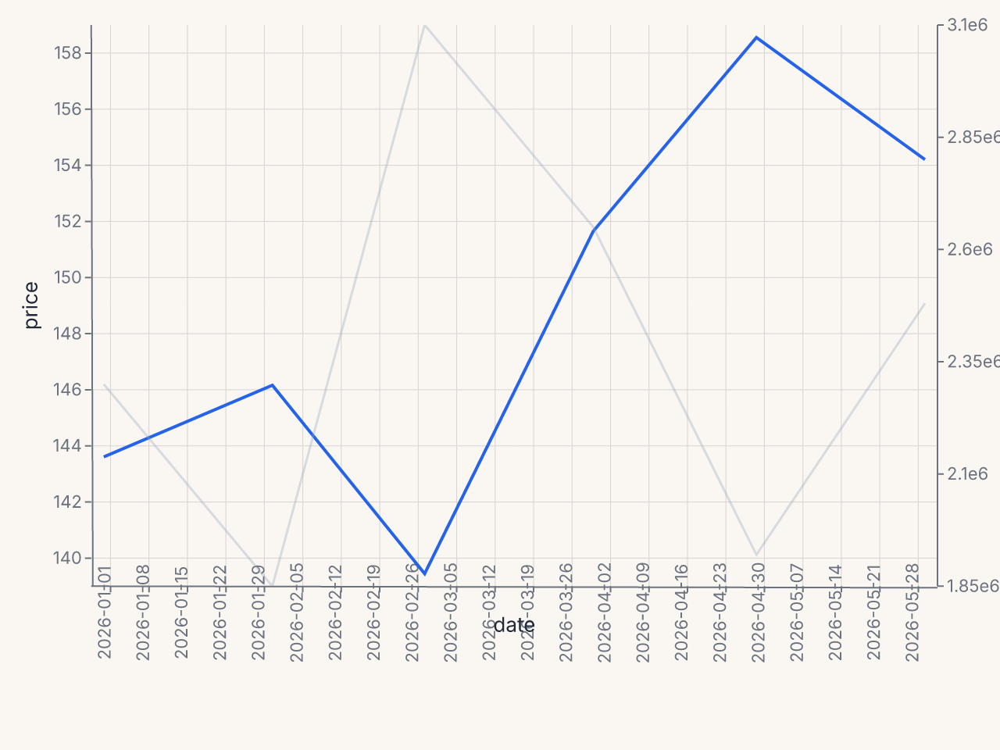

# Secondary Axes

`SecondaryY` adds a second y axis to a chart with an independent scale. The secondary
series reads from the same DataFrame as the primary chart but maps to a different field and
a different y scale. The secondary y axis appears on the right side of the plot.

---

## Basic usage

Compose a `SecondaryY` onto a chart with `+`:

```python
import ferrum as fm
import polars as pl

df = pl.DataFrame({
    "month": ["Jan", "Feb", "Mar", "Apr", "May", "Jun"],
    "revenue": [125000, 138500, 112000, 161000, 183000, 172000],
    "growth_rate": [0.0, 0.107, -0.191, 0.438, 0.137, -0.066],
})

chart = (
    fm.Chart(df)
    .mark_bar()
    .encode(x="month:N", y="revenue:Q")
    .labs(title="Revenue and Month-over-Month Growth")
    + fm.SecondaryY(field="growth_rate", mark="line", color="#e74c3c")
)
```



The bars measure revenue on the left y axis; the line measures growth rate on the right y
axis. Both axes are independent — their domains, ticks, and formats are computed
separately.

**Recipe: color-coded dual-axis chart**

```python
import polars as pl
import ferrum as fm

df = pl.DataFrame({
    "month": ["Jan", "Feb", "Mar", "Apr", "May", "Jun"],
    "revenue": [125_000, 138_500, 112_000, 161_000, 183_000, 172_000],
    "conversion_rate": [0.032, 0.038, 0.029, 0.041, 0.045, 0.043],
})

chart = (
    fm.Chart(df)
    .mark_bar(opacity=0.7, color="#1e40af")
    .encode(x="month:N", y="revenue:Q")
    .configure(
        axis_y=fm.AxisConfig(label_format="currency", title_color="#1e40af"),
        axis_y2=fm.AxisConfig(label_format="percent", title_color="#dc2626"),
    )
    .labs(title="Revenue and Conversion Rate", y="Revenue")
    + fm.SecondaryY(
        field="conversion_rate",
        mark="line",
        color="#dc2626",
        axis=fm.Axis(title="Conversion Rate"),
    )
)
```



---

## Constructor reference

```python
fm.SecondaryY(
    field,              # str: data field for the secondary y axis (required)
    mark="line",        # str: mark type for the secondary series
    axis=None,          # Axis | None: per-axis configuration for y2
    color=None,         # str | None: mark color
    opacity=None,       # float | None: mark opacity
    scale=None,         # Scale | None: scale configuration for y2
)
```

### Parameters

| Parameter | Type | Default | Description |
|---|---|---|---|
| `field` | `str` | required | Data field mapped to the secondary y axis |
| `mark` | `str` | `"line"` | Mark type: `"line"`, `"point"`, `"bar"`, etc. |
| `axis` | `Axis | None` | `None` | Per-axis config applied to the right-side y2 axis |
| `color` | `str | None` | `None` | Mark color |
| `opacity` | `float | None` | `None` | Mark opacity |
| `scale` | `Scale | None` | `None` | Scale config for the secondary y axis |

---

## Configuring the secondary axis

Use the `axis` parameter on `SecondaryY` to configure the y2 axis directly:

```python
+ fm.SecondaryY(
    field="growth_rate",
    mark="line",
    color="#e74c3c",
    axis=fm.Axis(
        title="Month-over-Month Growth",
        label_format=".1%",
        title_color="#e74c3c",
    ),
)
```

Alternatively, use `configure(axis_y2=...)` at the chart level:

```python
chart.configure(
    axis_y2=fm.AxisConfig(label_format="percent", title_color="#e74c3c")
)
```

`axis_y2` in `.configure()` applies to the secondary y axis. It follows the standard
cascade: per-channel `axis=` on `SecondaryY` beats the chart-level `axis_y2` config.

---

## Color coding the axes

When a dual-axis chart has two distinct series with different units, it helps to color-code
the axis labels to match their series. Set `title_color` on each axis:

```python
chart = (
    fm.Chart(df)
    .mark_bar(opacity=0.7, color="#1e40af")
    .encode(x="month:N", y="revenue:Q")
    .configure(
        axis_y=fm.AxisConfig(label_format="currency", title_color="#1e40af"),
        axis_y2=fm.AxisConfig(label_format="percent", title_color="#dc2626"),
    )
    .labs(title="Revenue and Conversion Rate", y="Revenue")
    + fm.SecondaryY(
        field="conversion_rate",
        mark="line",
        color="#dc2626",
        axis=fm.Axis(title="Conversion Rate"),
    )
)
```



---

## Scale configuration

Use `scale=` to control the secondary y axis scale. For example, to use a log scale for
the secondary series:

```python
+ fm.SecondaryY(
    field="volume",
    mark="bar",
    color="#6b7280",
    opacity=0.3,
    scale=fm.LogScale(),
)
```

---

## Interaction with BreakAxis

`SecondaryY` and `BreakAxis` are independent. A break on the primary y axis (`BreakAxis(axis="y", ...)`)
does not affect the secondary y axis scale. Both operate on their own domains and the
relationship between them is not constrained.

---

## Common patterns

### Volume overlay (bars + line)

```python
df = pl.DataFrame({
    "date": pl.date_range(pl.date(2026, 1, 1), pl.date(2026, 6, 30), "1mo", eager=True),
    "price": [142.5, 145.2, 138.1, 151.0, 158.3, 153.7],
    "volume": [2300000, 1850000, 3100000, 2650000, 1920000, 2480000],
})

chart = (
    fm.Chart(df)
    .mark_line(stroke_width=2)
    .encode(x="date:T", y="price:Q")
    .configure(axis_x=fm.AxisConfig(label_format="month_year"))
    + fm.SecondaryY(
        field="volume",
        mark="bar",
        color="#94a3b8",
        opacity=0.35,
        axis=fm.Axis(title="Volume", label_format=".2s"),
    )
)
```



### Score vs. threshold (scatter + reference line)

```python
+ fm.SecondaryY(
    field="threshold",
    mark="line",
    color="#ef4444",
    axis=fm.Axis(title="Threshold", domain_min=0, domain_max=1),
)
```
