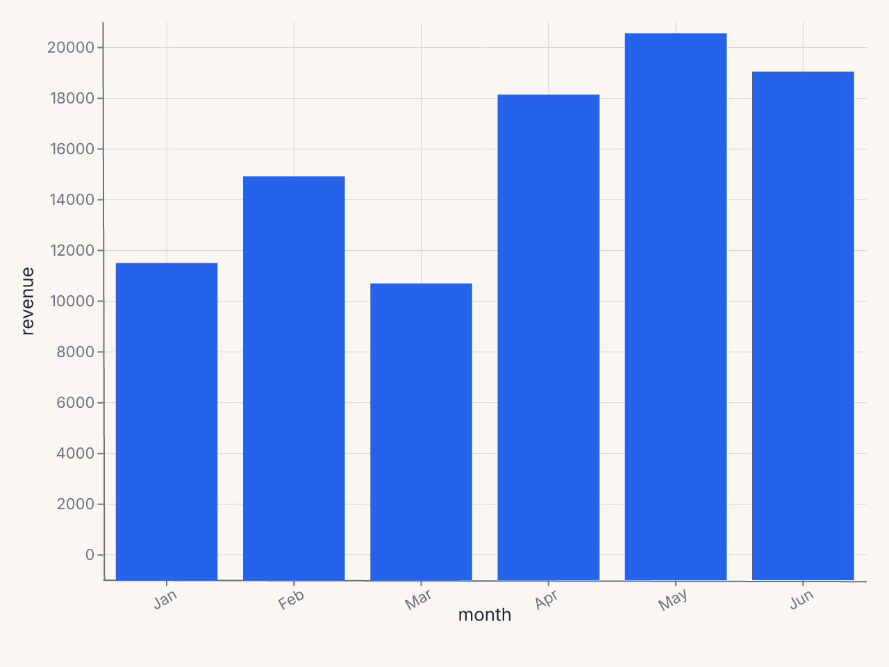
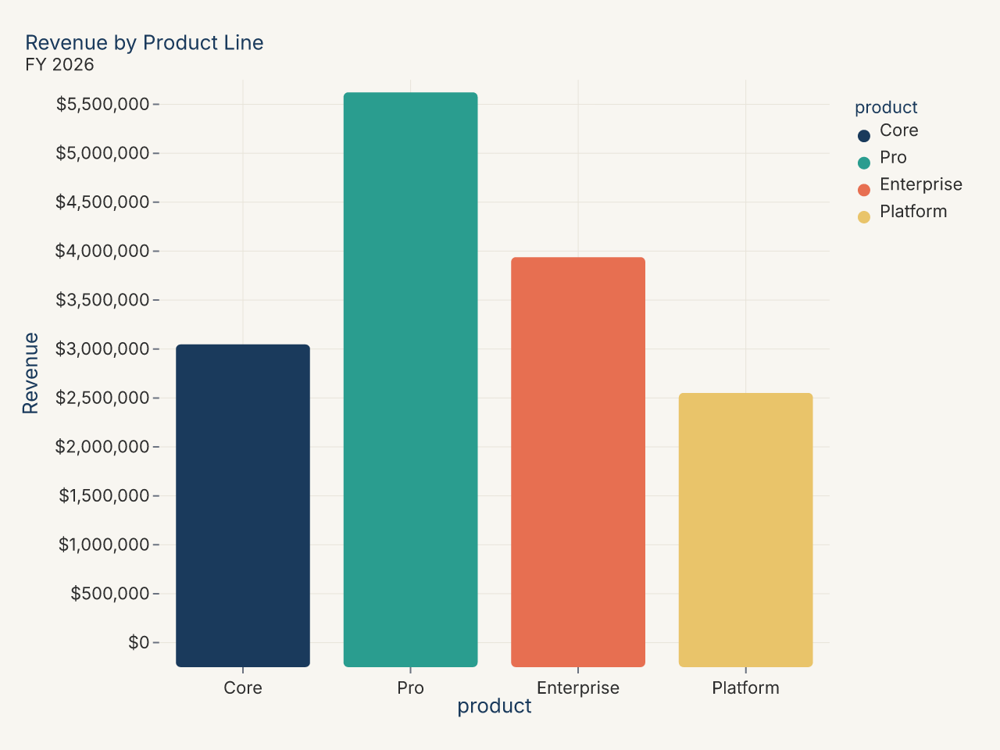
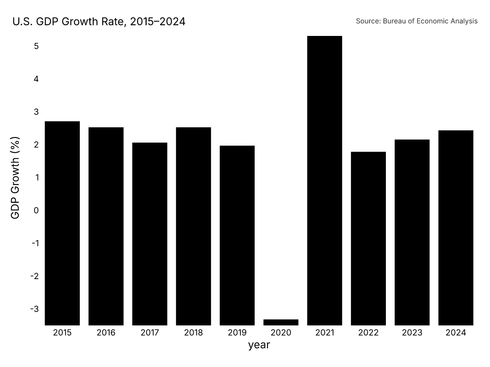
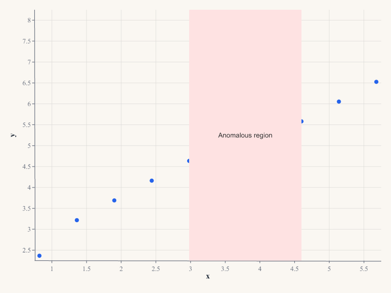
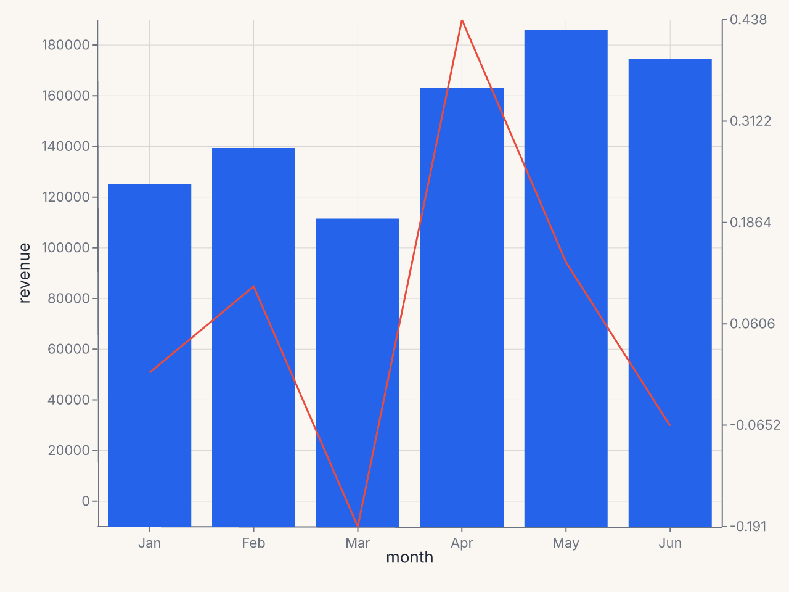
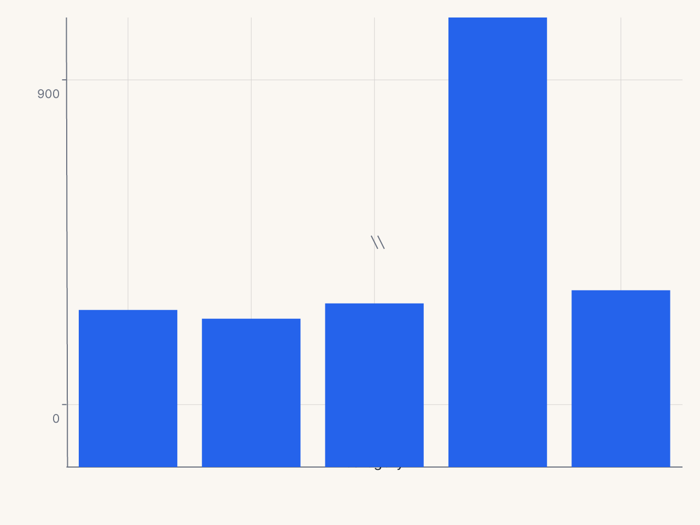
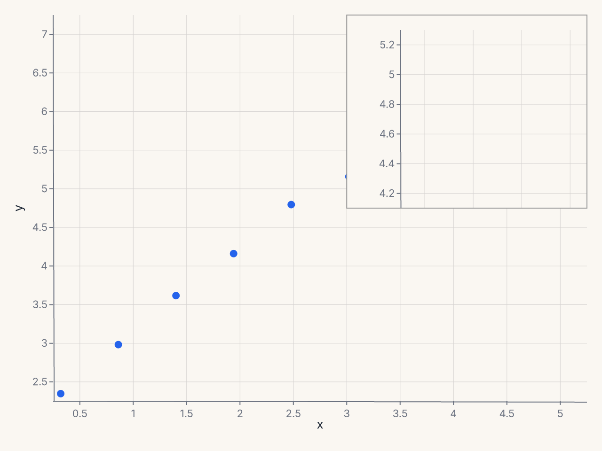

# Customizing Charts

Ferrum gives you fine-grained control over chart appearance — axis formatting, legend
layout, annotations, secondary axes, broken axes, and inset panels — without breaking out
of its declarative model. Every customization is a value you compose with your chart; nothing
mutates global state, and no chart is secretly reconfigured by an import side-effect.

## The Configuration Cascade

When ferrum resolves how an element should look, it walks a six-level precedence stack.
Higher levels win.

```
1. chart.override(...)            ← spec-path escape hatch (last resort)
2. Per-channel axis= / legend=    ← "this specific axis or legend"
3. chart.configure_*() / Configure  ← "all matching elements on this chart"
4. chart.theme(...)               ← per-chart visual identity
5. set_default_theme(...)         ← session / notebook ambient default
6. Rust renderer defaults         ← built-in fallback
```

A quick example that exercises the three most common levels:

```python
import ferrum as fm
import polars as pl

df = pl.DataFrame({
    "month": ["Jan", "Feb", "Mar", "Apr", "May", "Jun"],
    "revenue": [12000, 15400, 11200, 18600, 21000, 19500],
})

chart = (
    fm.Chart(df)
    .mark_bar()
    .encode(
        x="month:N",
        y=fm.Y("revenue:Q", axis=fm.Axis(format="$,.0f")),  # level 2: per-channel
    )
    .configure_axis(label_angle=-30)                          # level 3: all axes
    .theme(fm.themes.minimal)                                 # level 4: per-chart theme
)
```



The per-channel `Axis(format=...)` on `y` wins over anything `configure_axis` sets for the
y axis. The theme's grid and padding preferences apply where neither level 2 nor 3 set a
value. Rust defaults fill the rest.

## Theme vs Configure

Both tools change how a chart looks; they serve different purposes.

**Theme** is for visual *identity*: background color, typography, palette, opacity, and the
stylistic decisions you want consistently across many charts. A theme is a portable value
you can share, version-control, and apply to whole notebooks or dashboards.

```python
brand = fm.Theme(
    background="#f8f4ef",
    mark_color="#1a5fb4",
    grid_color="#e0dbd4",
    color_scheme="tableau10",
)
```

**Configure** is for *structural* decisions about a specific chart: how the x axis labels
should angle when they collide, whether the legend belongs at the bottom, what tick count
the y axis should use. These are chart-specific tweaks that vary based on the data and
context, not your brand identity.

```python
chart = (
    fm.Chart(df)
    .mark_bar()
    .encode(x="long_category_name:N", y="value:Q")
    .theme(brand)                            # identity
    .configure_axis(label_angle=-45)         # structural tweak for this chart
    .configure_legend(orient="bottom")       # structural tweak for this chart
)
```

A good rule of thumb: if the setting belongs in your style guide, it belongs in a theme.
If it depends on the shape of the data (label length, axis range, legend density), use
configure.

**Recipe: brand theme with custom palette**

```python
import polars as pl
import ferrum as fm

BRAND_COLORS = ["#1a3a5c", "#2a9d8f", "#e76f51", "#e9c46a"]

brand_theme = fm.Theme(
    background="#f8f6f1",
    mark_color=BRAND_COLORS[0],
    font_color="#2d2d2d",
    grid_color="#e8e4da",
    grid=True,
    axis_line=False,
    title_font_weight="bold",
    title_color="#1a3a5c",
)

df = pl.DataFrame({
    "product": ["Core", "Pro", "Enterprise", "Platform"],
    "revenue": [3_200_000, 5_800_000, 4_100_000, 2_700_000],
})

chart = (
    fm.Chart(df)
    .mark_bar(corner_radius=3)
    .encode(
        x=fm.X("product:N", sort="-y"),
        y="revenue:Q",
        color="product:N",
    )
    .theme(brand_theme)
    .configure_color(range=BRAND_COLORS)
    .configure_axis(y=True, x=False, label_format="currency")
    .configure_title(anchor="start")
    .configure_legend(orient="none")
    .labs(title="Revenue by Product Line", subtitle="FY 2026", x=None, y="Revenue")
)
```



**Recipe: publication-ready chart**

```python
import polars as pl
import ferrum as fm
import ferrum.annotation as ann

df = pl.DataFrame({
    "year": [str(y) for y in range(2015, 2025)],
    "gdp_growth": [3.1, 2.9, 2.4, 2.9, 2.3, -3.4, 5.9, 2.1, 2.5, 2.8],
})

chart = (
    fm.Chart(df)
    .mark_bar()
    .encode(
        x=fm.X("year:N", axis=fm.Axis(label_angle=0)),
        y=fm.Y("gdp_growth:Q", axis=fm.Axis(title="GDP Growth (%)")),
        color=fm.Color(
            "gdp_growth:Q",
            scale=fm.DivergingScale(scheme="rdbu", domain=[-4, 4]),
            legend=None,
        ),
    )
    .theme(fm.themes.publication)
    .configure_axis(domain=False, tick_size=0)
    .configure_title(anchor="start", font_size=14)
    .configure_legend(orient="none")
    .labs(title="U.S. GDP Growth Rate, 2015–2024")
    + ann.text(
        fm.norm(0.0), fm.norm(1.03),
        "Source: Bureau of Economic Analysis",
        font_size=9, color="#666", anchor="start",
    )
)
```



## Configuration Methods

Six `.configure_*()` methods cover the main configuration domains. Each returns a new
`Chart` — the original is not mutated.

### `.configure_axis()`

Controls tick labels, tick marks, axis lines, gridlines, and scale domain.

```python
chart.configure_axis(
    label_angle=-45,          # rotate labels
    label_format="currency",  # named preset
    tick_count=6,
    domain=False,             # hide axis line
    grid=True,
    grid_color="#eee",
)
```

To target x and y independently, use the lower-level `.configure()`:

```python
from ferrum import AxisConfig

chart.configure(
    axis_x=AxisConfig(label_angle=-45, label_format="date_short"),
    axis_y=AxisConfig(label_format="si", tick_count=5),
)
```

See [Axis Configuration](concepts/configuration.md#axisconfig) for the full parameter list.

### `.configure_legend()`

Controls legend position, layout, and typography.

```python
chart.configure_legend(
    orient="bottom",
    direction="horizontal",
    columns=3,
)
```

### `.configure_title()`

Controls chart title styling.

```python
chart.configure_title(
    font_size=18,
    anchor="start",
    color="#333",
)
```

### `.configure_grid()`

Controls gridlines independently from axis configuration.

```python
chart.configure_grid(
    x=False,    # no vertical grid
    y=True,
    color="#f0f0f0",
    dash=[4, 4],
)
```

### `.configure_padding()`

Controls plot-area margins. With `auto=True` (the default), ferrum expands margins
automatically when labels or annotations would be clipped.

```python
chart.configure_padding(top=20, right=40, bottom=60, left=60, auto=True)
```

### `.configure_color()`

Controls default color scales across the chart.

```python
chart.configure_color(
    scheme="okabe_ito",         # categorical
    sequential_scheme="viridis",
)
```

## Using Configure Objects Directly

The `.configure_*()` sugar is convenient for one-offs. When you want to reuse a
configuration across many charts, build a `Configure` object and compose it with `+`:

```python
from ferrum import Configure, AxisConfig, LegendConfig

report_config = Configure(
    axis=AxisConfig(label_font_size=11, grid_color="#f0f0f0"),
    legend=LegendConfig(orient="bottom", direction="horizontal"),
)

chart1 = fm.Chart(df1).mark_bar().encode(...) + report_config
chart2 = fm.Chart(df2).mark_line().encode(...) + report_config
```

The `+` operator on `Chart` dispatches on the operand type: a `Configure` merges config,
an annotation primitive appends to the annotation layer, and a `Chart` adds a mark layer
(the existing layering behavior). All operands are immutable; `+` always returns a new
object.

## Format Presets

Instead of memorizing d3-format strings, use named presets in `label_format`:

| Preset | Example output | Notes |
|---|---|---|
| `"integer"` | 1,234 | Thousands-separated integer |
| `"decimal"` | 1,234.56 | Two decimal places |
| `"decimal1"` | 1,234.6 | One decimal place |
| `"percent"` | 45.2% | One decimal place |
| `"percent_int"` | 45% | No decimal places |
| `"si"` | 1.2k | SI prefix abbreviation |
| `"currency"` | $1,234 | Dollar, no cents |
| `"currency_cents"` | $1,234.56 | Dollar with cents |
| `"compact"` | 1.2k | Trailing zeros suppressed |
| `"scientific"` | 1.23e+3 | Scientific notation |
| `"ordinal"` | 1st, 2nd, 3rd | Ordinal suffixes |
| `"date_short"` | Jan 5 | Short date |
| `"date_long"` | January 5, 2026 | Long date |
| `"date_iso"` | 2026-01-05 | ISO 8601 |
| `"month"` | Jan | Month abbreviation |
| `"month_year"` | Jan 2026 | Month and year |
| `"year"` | 2026 | Year only |
| `"time"` | 14:30 | 24-hour time |
| `"time_12h"` | 2:30 PM | 12-hour time |
| `"datetime"` | Jan 5, 14:30 | Date and time |

When you need something a preset doesn't cover, use `label_format_raw` with a d3-format
string directly:

```python
chart.configure_axis(label_format_raw=".3f")  # three decimal places
```

`label_format` and `label_format_raw` are mutually exclusive. Setting one clears the other.

See [Format Presets](concepts/format-presets.md) for the full reference.

## Annotations

Ferrum's annotation layer lets you add text, arrows, shapes, and callouts to a chart
without leaving the declarative model. All annotations are positioned in one of three
coordinate systems:

- **Data coordinates** (default): bare `float` or `int`. Moves with the data scale.
- **Pixel coordinates**: `fm.px(n)`. Fixed offset from the plot-area origin.
- **Normalized coordinates**: `fm.norm(f)`. Fraction of the plot area (0.0 to 1.0).

```python
df = pl.DataFrame({
    "x": [1.0, 1.5, 2.0, 2.5, 3.0, 3.5, 4.0, 4.5, 5.0, 5.5],
    "y": [2.1, 3.0, 3.5, 4.0, 4.5, 8.2, 5.0, 5.5, 6.0, 6.5],
})

chart = (
    fm.Chart(df)
    .mark_point()
    .encode(x="x:Q", y="y:Q")
    + fm.annotation.text(3.5, 8.2, "Anomaly", color="#c0392b", font_size=13)
    + fm.annotation.arrow(3.5, 8.0, 3.5, 6.5)
    + fm.annotation.span("x", 3.0, 4.5, fill="#fee2e2", opacity=0.08, label="Anomalous region")
)
```



Eight annotation primitives are available: `text`, `arrow`, `rect`, `line`, `span`,
`bracket`, `callout`, and `image`.

See [Annotations](concepts/annotations.md) for detailed usage of each primitive.

## Structural Features

Three structural features extend charts beyond simple axes:

### SecondaryY — Dual Axes

`SecondaryY` adds an independent right-side y axis bound to a different field:

```python
chart = (
    fm.Chart(df)
    .mark_bar()
    .encode(x="month:N", y="revenue:Q")
    + fm.SecondaryY(field="growth_rate", mark="line", color="#e74c3c")
)
```



See [Secondary Axes](concepts/secondary-axes.md).

### BreakAxis — Outlier Gaps

`BreakAxis` skips a region of the scale with a visual break indicator:

```python
chart = (
    fm.Chart(df)
    .mark_bar()
    .encode(x="category:N", y="value:Q")
    + fm.BreakAxis(axis="y", gap=(100, 800))
)
```



See [Break Axes](concepts/break-axes.md).

### Inset — Zoomed Detail Panels

`Inset` embeds a self-contained sub-chart over the parent plot area:

```python
zoom = (
    fm.Chart(df.filter(pl.col("x").is_between(1.0, 3.0)))
    .mark_point(size=120)
    .encode(x="x:Q", y="y:Q")
)
chart = (
    fm.Chart(df)
    .mark_point(size=50)
    .encode(x="x:Q", y="y:Q")
    + fm.Inset(chart=zoom, bounds=(fm.norm(0.55), fm.norm(0.0), fm.norm(1.0), fm.norm(0.5)))
)
```



See [Inset Panels](concepts/inset-panels.md).

## The Override Escape Hatch

For the rare case where ferrum's typed surface hasn't caught up to what you need, `.override()`
lets you inject spec-path key/value pairs directly:

```python
chart.override(x_axis_label_angle=-60, y_axis_tick_count=8)
```

Use override only as a last resort. Unknown paths raise `FerrumOverrideError` at render time
with a closest-match suggestion. Paths that have a typed equivalent emit a deprecation warning
pointing to the right method.

See [Override](concepts/override.md) for path conventions and validation behavior.

## Migration from matplotlib

| matplotlib | ferrum equivalent |
|---|---|
| `ax.set_xlabel("Revenue")` | `.labs(x="Revenue")` |
| `ax.set_title("Monthly Sales")` | `.labs(title="Monthly Sales")` |
| `ax.tick_params(axis='x', rotation=45)` | `.configure_axis(label_angle=45)` |
| `ax.set_xlim(0, 100)` | `.xlim(0, 100)` or `configure_axis(domain_min=0, domain_max=100)` |
| `ax.set_xticks([0, 25, 50, 75, 100])` | `.configure_axis(tick_values=[0, 25, 50, 75, 100])` |
| `ax.xaxis.set_major_formatter(...)` | `.configure_axis(label_format="currency")` |
| `ax.legend(loc="lower center")` | `.configure_legend(orient="bottom")` |
| `ax.legend(ncols=3)` | `.configure_legend(columns=3)` |
| `ax.get_legend().set_visible(False)` | `.configure_legend(orient="none")` |
| `ax.set_facecolor("#f0f0f0")` | `.theme(fm.Theme(background="#f0f0f0"))` |
| `ax.grid(True, color="#ddd")` | `.configure_grid(color="#ddd")` |
| `ax.spines[...].set_visible(False)` | `.configure_axis(domain=False)` |
| `ax.annotate("text", xy=...)` | `+ fm.annotation.callout(x, y, "text")` |
| `ax.axhline(y=0)` | `+ fm.annotate_hline(value=0)` |
| `ax.axvspan(x1, x2)` | `+ fm.annotation.span("x", x1, x2, fill="#eee")` |
| `ax.twinx()` | `+ fm.SecondaryY(field="col2")` |
| Broken axis with `brokenaxes` | `+ fm.BreakAxis(axis="y", gap=(lo, hi))` |
| Inset with `mpl_toolkits.axes_grid1` | `+ fm.Inset(chart=zoom_chart, bounds=...)` |

## Where to Go Next

- [Themes](themes.md) — visual identity, built-in themes, custom themes
- [Composition](composition.md) — layering, faceting, and multi-panel layouts
- [Marks & Encodings](marks-encodings.md) — the per-channel `axis=Axis(...)` and `legend=Legend(...)` options
- [Concepts: Configuration](concepts/configuration.md) — full parameter reference for all 6 config objects
- [Concepts: Format Presets](concepts/format-presets.md) — all named presets with examples
- [Concepts: Annotations](concepts/annotations.md) — all 8 annotation primitives
- [Concepts: Secondary Axes](concepts/secondary-axes.md) — dual-axis charts
- [Concepts: Break Axes](concepts/break-axes.md) — handling outlier values
- [Concepts: Inset Panels](concepts/inset-panels.md) — embedded detail views
- [Concepts: Override](concepts/override.md) — spec-path escape hatch
