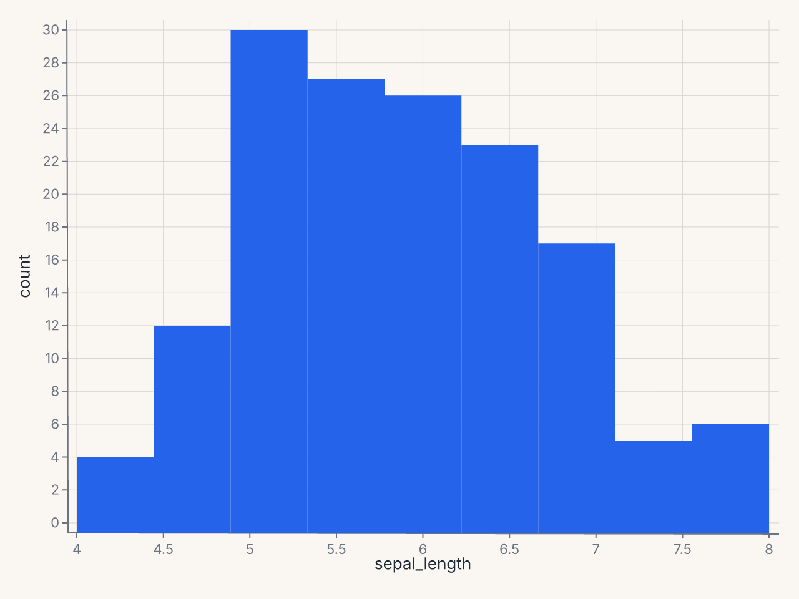
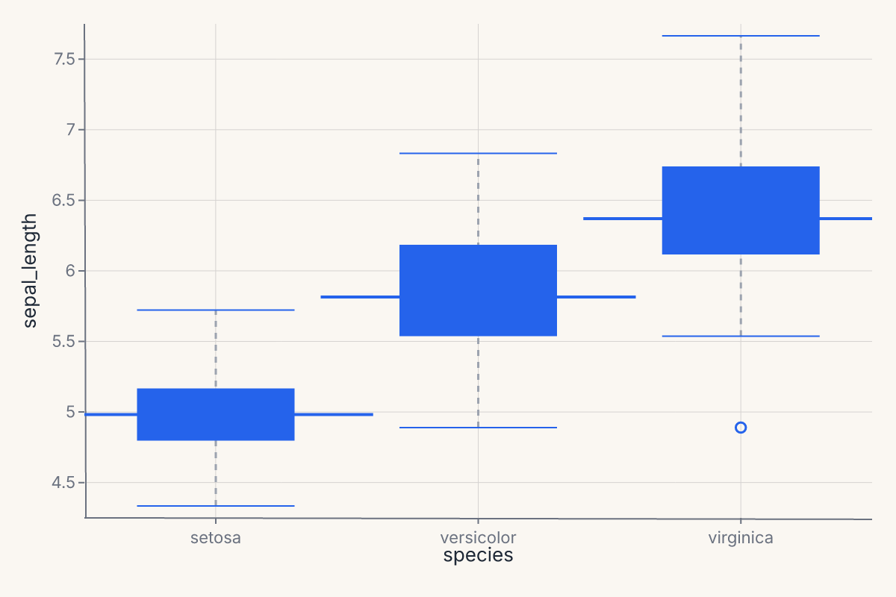
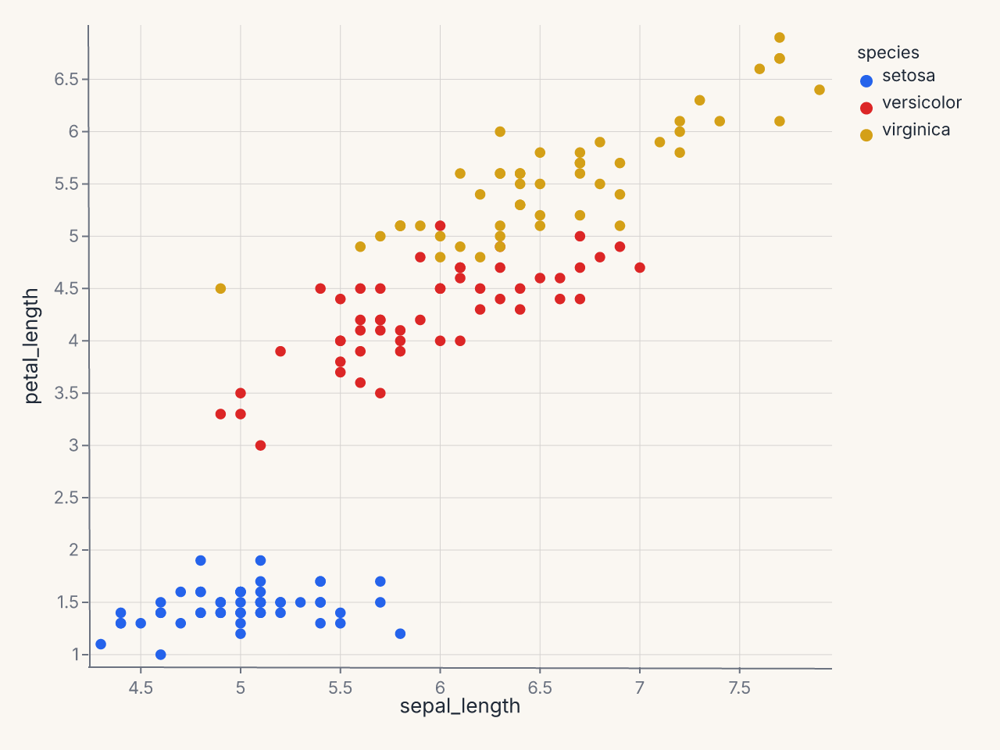
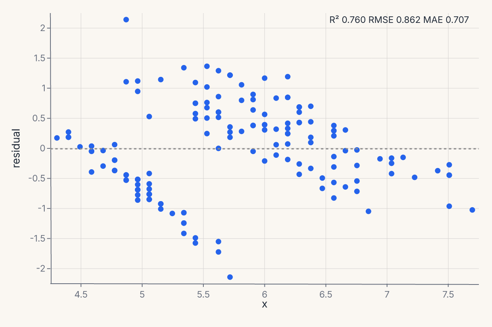
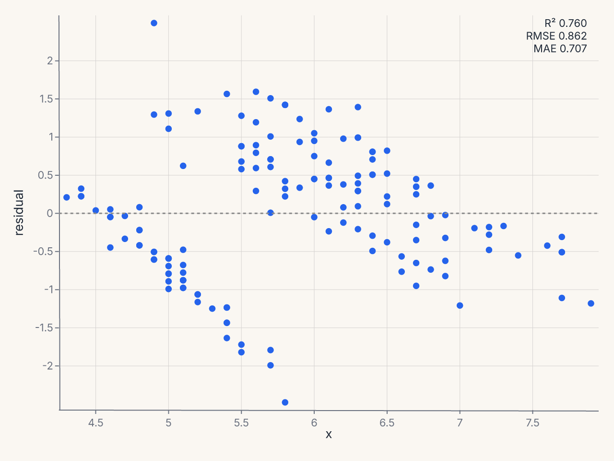
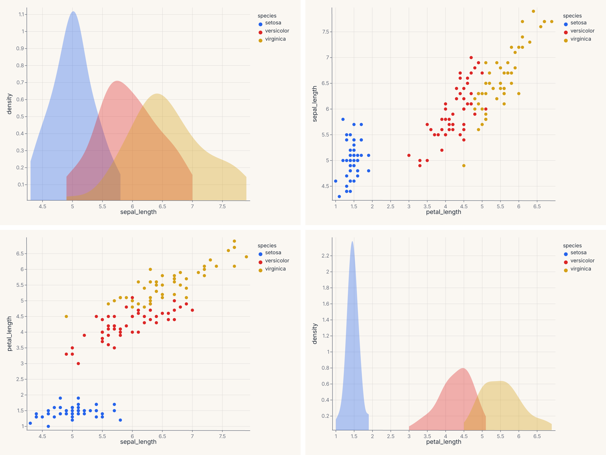
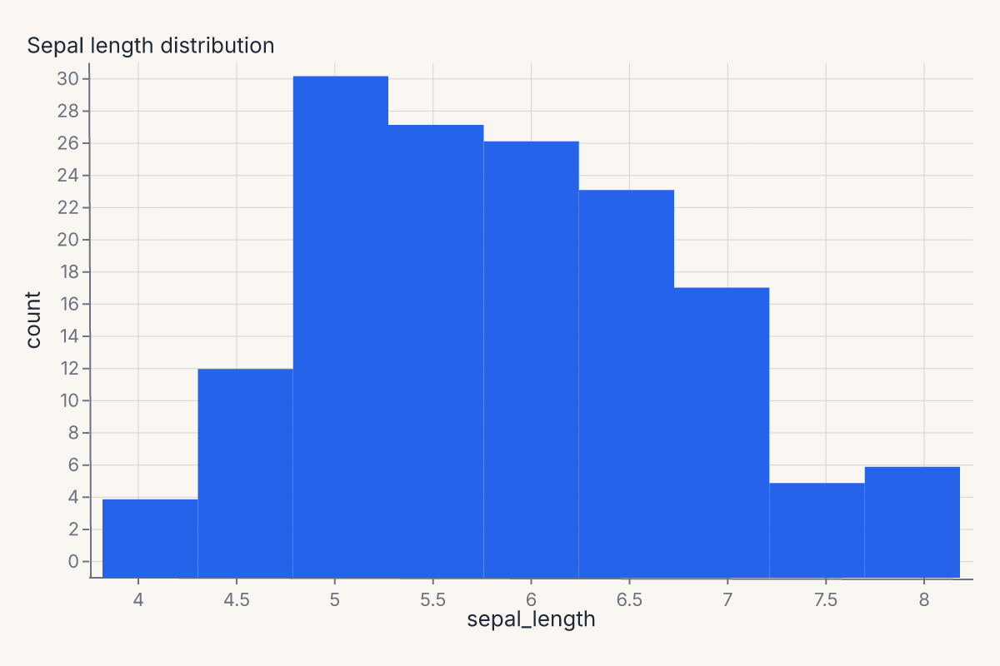
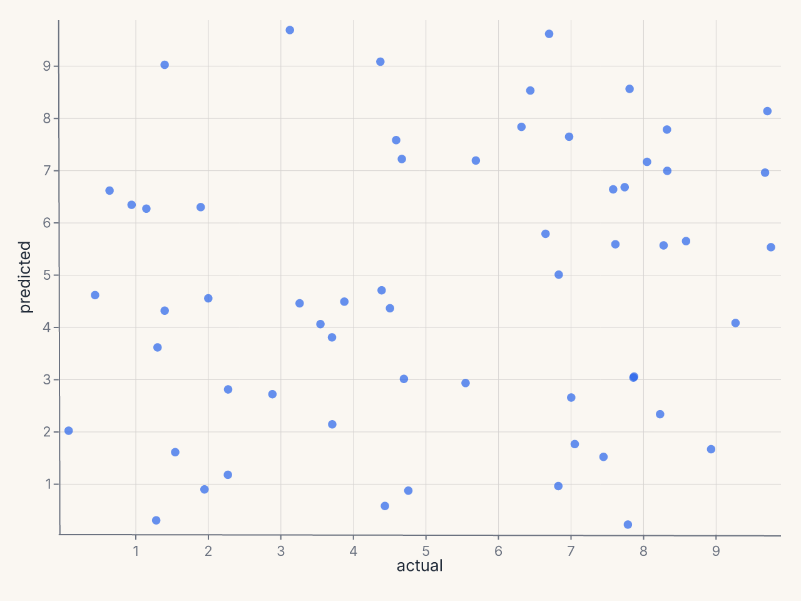

# Figure-level helpers

Figure-level helpers are one-line entry points for common chart patterns. They are convenience over the grammar, not parallel objects: each helper builds a [`Chart`][ferrum.Chart] (or a compound view like [`JointChart`][ferrum.JointChart] / [`RepeatChart`][ferrum.RepeatChart] / [`ClusterMapChart`][ferrum.ClusterMapChart]) and returns it. The result is themeable, composable, savable, and renderable in exactly the same way as a chart you wrote from primitives.

This page covers the grammar-level helpers in [`ferrum.plots`][]. Each is also available at the top level ([`fm.displot`][ferrum.displot] ≡ `fm.plots.displot`). For diagnostic helpers (`roc_chart`, `confusion_matrix_chart`, etc.), see [Model diagnostics](model-diagnostics.md).

## When to use a helper

Reach for a helper when:

- You want the canonical version of a common chart with one call.
- You're prototyping and the chart shape is more important than fine-grained control.
- You're following a seaborn-style mental model ([`displot`][ferrum.displot], [`catplot`][ferrum.catplot], [`lmplot`][ferrum.lmplot] follow seaborn's signatures intentionally).

Drop down into the grammar when:

- You need a mark or transform that the helper doesn't expose.
- You want to layer the helper output with something else (you can — see the end of this page).
- You're authoring a chart that doesn't fit any of the standard patterns.

The two paths converge: a helper's output and a grammar-authored chart are the same kind of object. Switching between them mid-pipeline is a non-event.

## Grammar-level helpers

| Helper | What it produces | Family |
|---|---|---|
| [`displot`][ferrum.displot] | Univariate distribution | Distribution |
| [`catplot`][ferrum.catplot] | Categorical comparison | Categorical |
| [`relplot`][ferrum.relplot] | Relational scatter or line | Relational |
| [`lmplot`][ferrum.lmplot] | Regression scatter with fit overlay | Regression |
| [`regplot`][ferrum.regplot] | Single-axes regression plot | Regression |
| [`residplot`][ferrum.residplot] | Residuals from a regression fit | Regression |
| [`pairplot`][ferrum.pairplot] | Pairwise scatter grid | Matrix |
| [`heatmap`][ferrum.heatmap] | 2-D heatmap of a wide table | Matrix |
| [`clustermap`][ferrum.clustermap] | Clustered heatmap with dendrograms | Matrix |
| [`jointplot`][ferrum.jointplot] | Bivariate plot with marginal distributions | Joint |

## Distribution: `displot`

A univariate distribution plot. Supports `kind="hist"` (default), `"kde"`, `"ecdf"`, and `"rug"`. Returns a [`Chart`][ferrum.Chart].

```python
import ferrum as fm
import polars as pl
from sklearn.datasets import load_iris

raw = load_iris()
iris = pl.DataFrame(raw.data, schema=["sepal_length", "sepal_width", "petal_length", "petal_width"]).with_columns(
    species=pl.Series([raw.target_names[t] for t in raw.target])
)
chart = fm.displot(iris, x="sepal_length", kind="hist")
assert chart.show_svg().startswith("<svg")
```



[`displot`][ferrum.displot] follows seaborn's signature: `x`, `y`, `hue`, `col`, `row` for encoding; `kind` for the geometry; `bins`, `bandwidth`, `bw_adjust`, `multiple`, `kde`, `rug` for the statistical details.

## Categorical: `catplot`

Categorical comparisons across groups. Supports `kind="strip"` (default), `"swarm"`, `"box"`, `"violin"`, `"boxen"`, `"point"`, `"bar"`, `"count"`. Returns a [`Chart`][ferrum.Chart].

```python
import ferrum as fm
import polars as pl
from sklearn.datasets import load_iris

raw = load_iris()
iris = pl.DataFrame(raw.data, schema=["sepal_length", "sepal_width", "petal_length", "petal_width"]).with_columns(
    species=pl.Series([raw.target_names[t] for t in raw.target])
)
chart = fm.catplot(iris, x="species", y="sepal_length", kind="box")
assert chart.show_svg().startswith("<svg")
```



[`catplot`][ferrum.catplot] is the one-call entry point for the boxplot / violin / strip / swarm family. It selects the right composite mark based on `kind=` and applies sensible defaults (jitter for strip plots, dodge for grouped bars, bootstrap CIs for point and bar estimates).

## Relational: `relplot`

`relplot` produces a relational plot — scatter or line — with optional faceting. Supports `kind="scatter"` (default) and `"line"`. Returns a [`Chart`][ferrum.Chart].

```python
import ferrum as fm
import polars as pl
from sklearn.datasets import load_iris

raw = load_iris()
iris = pl.DataFrame(raw.data, schema=["sepal_length", "sepal_width", "petal_length", "petal_width"]).with_columns(
    species=pl.Series([raw.target_names[t] for t in raw.target])
)
chart = fm.relplot(iris, x="sepal_length", y="petal_length", hue="species", kind="scatter")
assert chart.show_svg().startswith("<svg")
```



[`relplot`][ferrum.relplot] follows seaborn's signature: `x`, `y`, `hue`, `size`, `style`, `col`, `row` for encoding; `kind` for the geometry. Use it when you want a quick faceted scatter or line chart without dropping into the grammar.

## Regression: `lmplot` and `residplot`

[`lmplot`][ferrum.lmplot] produces a regression scatter with a fit overlay. The fit is configurable through `method=` (`"lm"`, `"loess"`, `"logistic"`, polynomial order) and `ci=` for the confidence band. Returns a [`Chart`][ferrum.Chart] with the scatter and the fit as layers.

```python
import ferrum as fm
import polars as pl
from sklearn.datasets import load_iris

raw = load_iris()
iris = pl.DataFrame(raw.data, schema=["sepal_length", "sepal_width", "petal_length", "petal_width"]).with_columns(
    species=pl.Series([raw.target_names[t] for t in raw.target])
)
chart = fm.lmplot(iris, x="sepal_length", y="petal_length")
assert chart.show_svg().startswith("<svg")
```



[`residplot`][ferrum.residplot] plots the residuals from a regression fit. Useful for diagnosing whether a linear fit is appropriate and whether residuals are heteroscedastic. Returns a [`Chart`][ferrum.Chart].

```python
import ferrum as fm
import polars as pl
from sklearn.datasets import load_iris

raw = load_iris()
iris = pl.DataFrame(raw.data, schema=["sepal_length", "sepal_width", "petal_length", "petal_width"]).with_columns(
    species=pl.Series([raw.target_names[t] for t in raw.target])
)
chart = fm.residplot(iris, x="sepal_length", y="petal_length")
assert chart.show_svg().startswith("<svg")
```


Pass `lowess=True` to overlay a lowess smoother on the residuals; `robust=True` switches the fit to a robust regression so outliers don't pull the line.

## Matrix: `pairplot`, `heatmap`, `clustermap`

[`pairplot`][ferrum.pairplot] produces a pairwise-scatter grid (also known as a scatterplot matrix). Returns a [`RepeatChart`][ferrum.RepeatChart].

```python
import ferrum as fm
import polars as pl
from sklearn.datasets import load_iris

raw = load_iris()
iris = pl.DataFrame(raw.data, schema=["sepal_length", "sepal_width", "petal_length", "petal_width"]).with_columns(
    species=pl.Series([raw.target_names[t] for t in raw.target])
)
chart = fm.pairplot(iris, vars=["sepal_length", "petal_length"], hue="species")
assert chart.show_svg().startswith("<svg")
```



For a triangular instead of square layout, pass `corner=True`. To set diagonal cells separately (typically univariate distributions), use `diag_kind="hist"` or `"kde"`.

[`heatmap`][ferrum.heatmap] renders a 2-D heatmap from a wide-format DataFrame. Each row of the input becomes a row of the heatmap; each numeric column becomes a column. Returns a [`Chart`][ferrum.Chart].

```python
import ferrum as fm
import polars as pl
import numpy as np

rng = np.random.default_rng(0)
table = pl.DataFrame({
    "a": rng.standard_normal(6),
    "b": rng.standard_normal(6),
    "c": rng.standard_normal(6),
    "d": rng.standard_normal(6),
})
chart = fm.heatmap(table, annot=True, cmap="blues")
assert chart.show_svg().startswith("<svg")
```



[`clustermap`][ferrum.clustermap] returns a [`ClusterMapChart`][ferrum.ClusterMapChart] — a heatmap with row and column dendrograms computed from a hierarchical clustering of the data. The signature mirrors seaborn's: `method=` selects the linkage ("ward", "single", "complete", "average"), `metric=` selects the distance ("euclidean", "correlation", etc.), and `z_score=` / `standard_scale=` normalize the data before clustering.

## Joint: `jointplot`

[`jointplot`][ferrum.jointplot] produces a central bivariate plot flanked by univariate marginals — a scatter with marginal histograms is the canonical version. Returns a [`JointChart`][ferrum.JointChart].

```python
import ferrum as fm
import polars as pl
from sklearn.datasets import load_iris

raw = load_iris()
iris = pl.DataFrame(raw.data, schema=["sepal_length", "sepal_width", "petal_length", "petal_width"]).with_columns(
    species=pl.Series([raw.target_names[t] for t in raw.target])
)
chart = fm.jointplot(iris, x="sepal_length", y="petal_length", kind="scatter", marginal_kind="hist")
assert chart.show_svg().startswith("<svg")
```


`kind=` controls the center plot (`"scatter"`, `"kde"`, `"hist"`, `"hex"`, `"reg"`); `marginal_kind=` controls both marginals (`"hist"`, `"kde"`, `"rug"`, `"box"`). The marginals share their data axis with the center.

## Customizing helper output

Since helper output is a regular chart, you can chain grammar methods to customize it:

```python
import ferrum as fm
import polars as pl
from sklearn.datasets import load_iris

raw = load_iris()
iris = pl.DataFrame(raw.data, schema=["sepal_length", "sepal_width", "petal_length", "petal_width"]).with_columns(
    species=pl.Series([raw.target_names[t] for t in raw.target])
)
chart = fm.displot(iris, x="sepal_length", kind="hist").properties(title="Sepal length distribution")
assert chart.show_svg().startswith("<svg")
```



Composite marks (boxplot, errorbar, smooth with CI, etc.) have **named sub-layers** you can inspect:

```python
import ferrum as fm
import polars as pl

df = pl.DataFrame({"x": [1, 2, 3, 4, 5], "y": [2, 4, 3, 5, 4]})
chart = fm.Chart(df).mark_boxplot().encode(x="x", y="y")
names = chart.layer_names
assert "box" in names
assert "median" in names
```

The [model diagnostics](model-diagnostics.md) helpers go further with a built-in `mark=`, `encode=`, `properties=`, `layers=` override surface — see that page for details.

## Helpers and the rest of the grammar

The output of every helper is a regular Ferrum chart object. That means:

- A helper result accepts `.theme()`, `.facet()`, and `.save()` exactly like a primitive chart.
- A helper result can be `hconcat`'d with another helper result or with a grammar-authored chart.
- A helper result can be layered with a grammar-authored chart using `+` when the axes are compatible.

The boundary between helpers and grammar is one-way porous: anything you can do with the grammar, you can do to a helper's output. Anything you can do with a helper, you can also do by hand if you outgrow the helper's options.

Composition in practice:

```python
import ferrum as fm
import polars as pl
from sklearn.datasets import load_iris

raw = load_iris()
iris = pl.DataFrame(raw.data, schema=["sepal_length", "sepal_width", "petal_length", "petal_width"]).with_columns(
    species=pl.Series([raw.target_names[t] for t in raw.target])
)
fit = fm.lmplot(iris, x="sepal_length", y="petal_length")
distribution = fm.displot(iris, x="sepal_length", kind="hist")
report = fit | distribution
assert report.show_svg().startswith("<svg")
```



The regression fit and the distribution plot are concatenated horizontally with the same `|` operator that works for any two charts.

## Where to go next

- [Marks & encodings](marks-encodings.md) for the primitives the helpers compile into.
- [Composition](composition.md) for the operators (`+`, `|`, `&`, `JointChart`, `RepeatChart`) the helpers use internally.
- [Themes](themes.md) — every helper accepts a `theme=` keyword to apply a theme at the call site.
- [Model diagnostics](model-diagnostics.md) for the Phase 10 family of helpers (ROC, calibration, confusion, SHAP, etc.) that follow the same pattern.
- The [API Reference](../api/plots.md) for the full keyword signatures of each helper.
