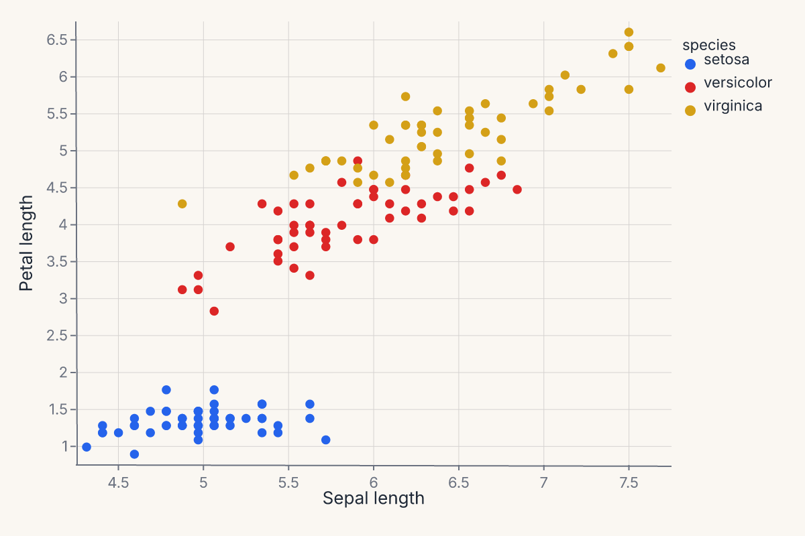
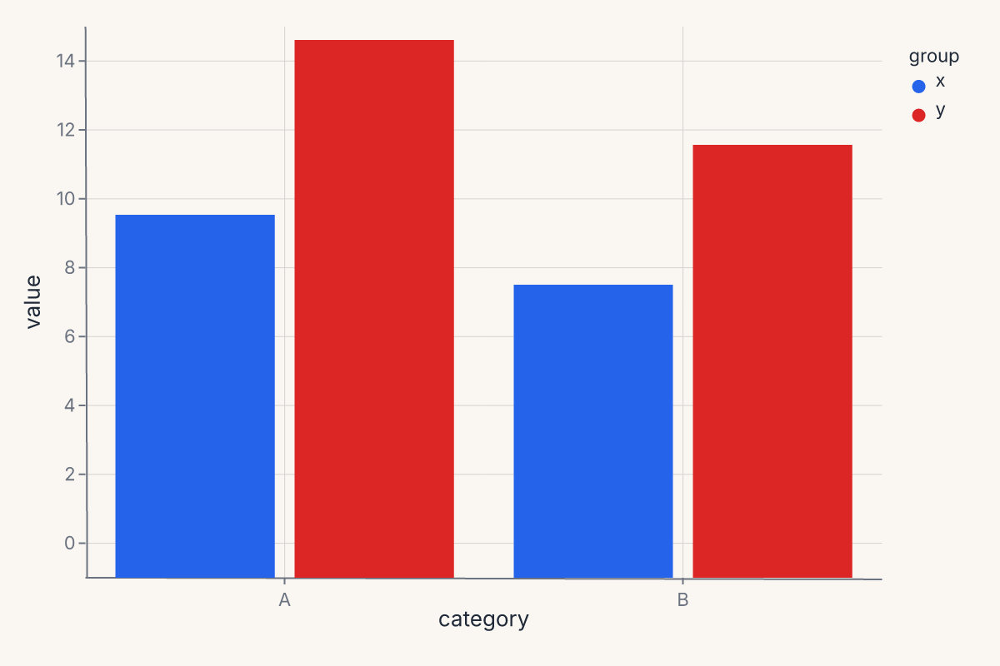
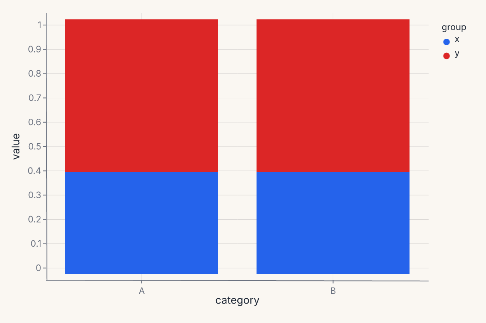
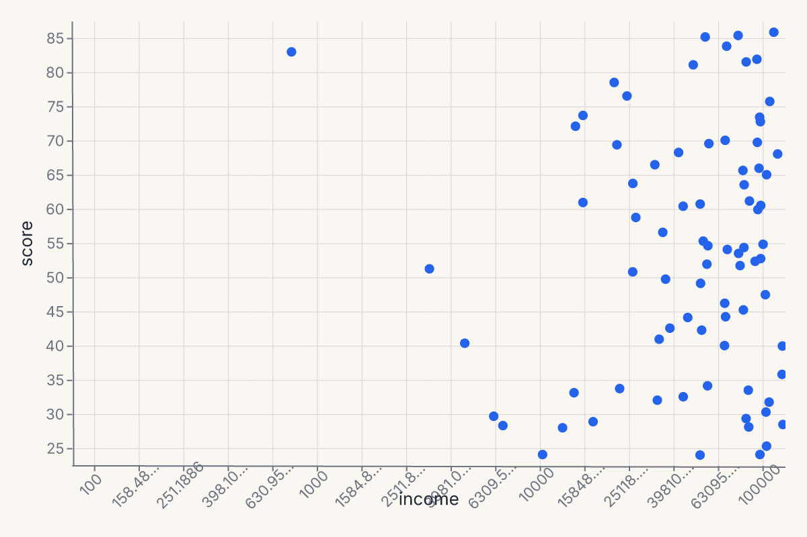
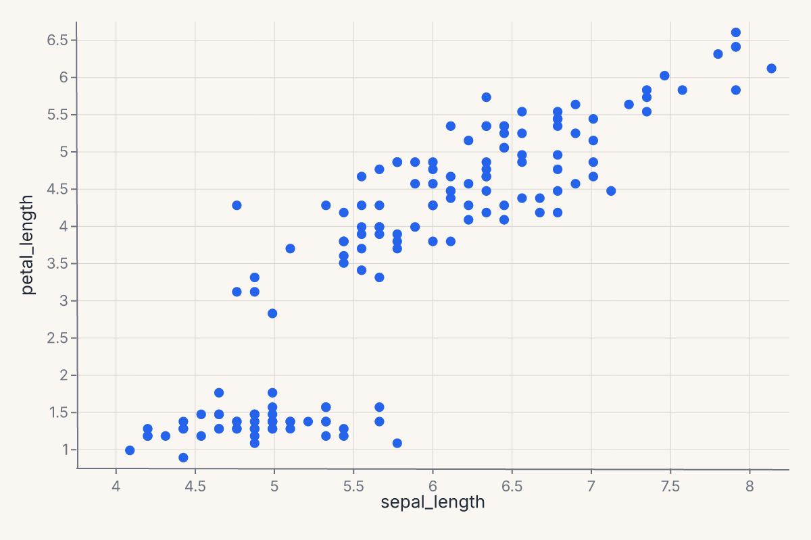
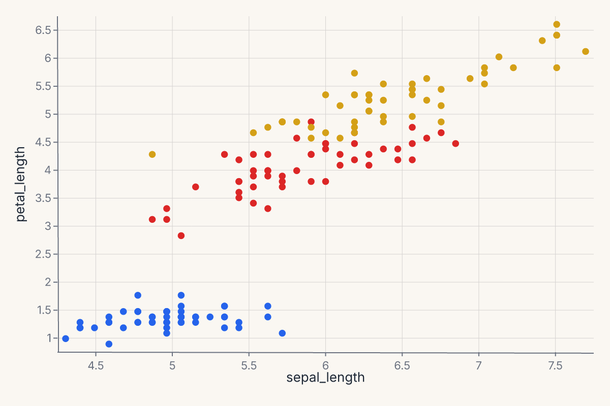
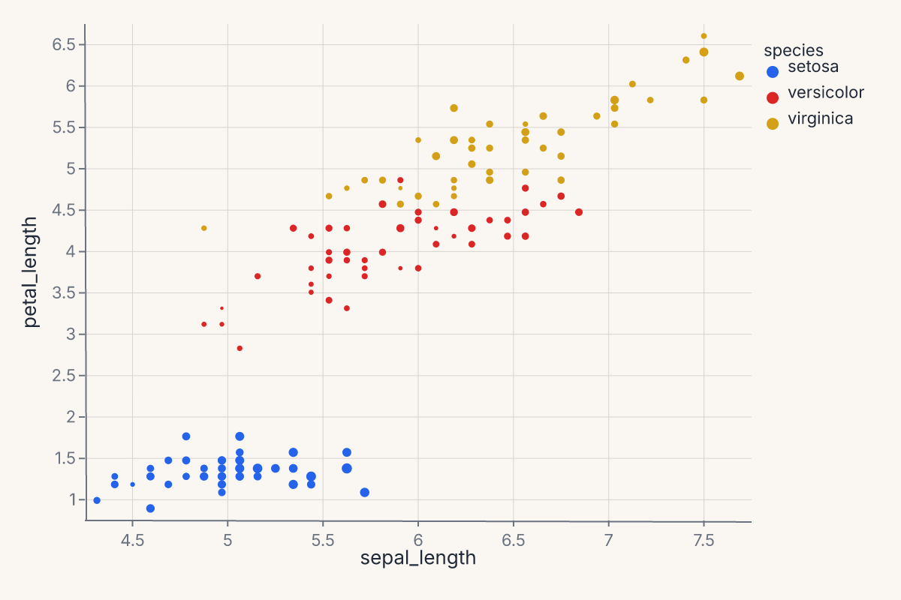
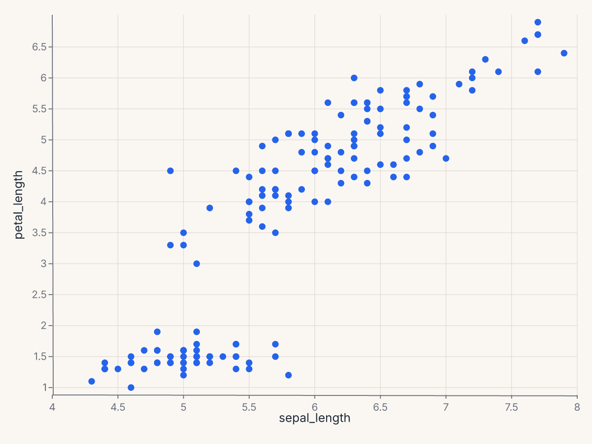
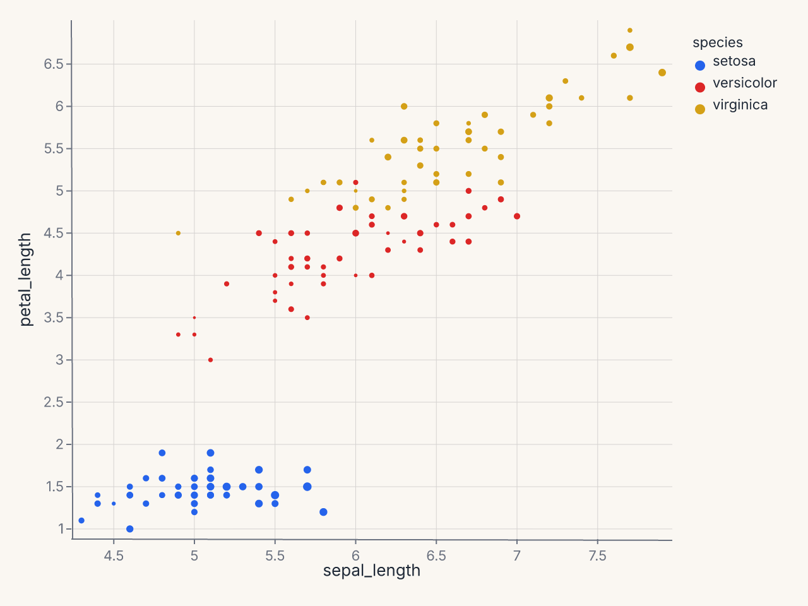
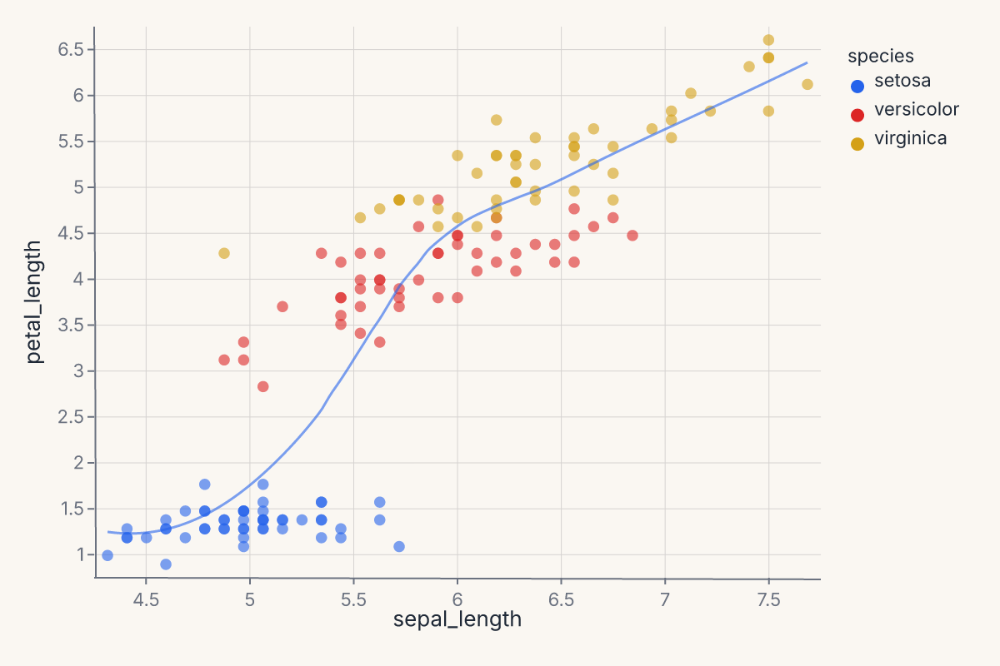

# Marks & encodings

Two primitives carry every Ferrum chart: **marks** (the geometric shapes that visualize your data) and **encodings** (the typed mappings from data fields to visual variables). Picking the right mark + encoding combination is most of what authoring a chart looks like.

This page is the reference for both. It covers the encoding channels, the mark families, the shorthand syntax that compresses common cases, and when to reach for what.

## How a chart is assembled

A Ferrum chart is built by attaching a mark to a data source and declaring which columns drive which visual variables. Every chart follows the same shape:

```python
import ferrum as fm
import polars as pl
from sklearn.datasets import load_iris

raw = load_iris()
iris = pl.DataFrame(raw.data, schema=["sepal_length", "sepal_width", "petal_length", "petal_width"]).with_columns(
    species=pl.Series([raw.target_names[t] for t in raw.target])
)
chart = (
    fm.Chart(iris)
    .mark_point()
    .encode(x="sepal_length", y="petal_length", color="species:N")
)
assert chart.show_svg().startswith("<svg")
```


The three pieces — data, mark, encoding — compose freely. You can change the mark without touching the encoding ([`mark_line()`][ferrum.Chart.mark_line] instead of [`mark_point()`][ferrum.Chart.mark_point]), change the encoding without touching the mark, or compose multiple marks against the same encoding (see [Composition](composition.md)).

## Encoding channels

An encoding channel declares: *this field drives this visual variable*. Channels are typed by the engine: a quantitative field gets a continuous scale, a nominal field gets a categorical color palette, a temporal field gets a time scale. You can be explicit by passing an encoding object ([`fm.X("col", type="Q")`][ferrum.X]) or use the shorthand syntax (described below).

### Positional channels

These channels place marks in space:

| Channel | Purpose |
|---|---|
| `x`, `y` | Primary horizontal / vertical position. |
| `x2`, `y2` | Secondary position. Used for bands, segments, intervals, error extents. |
| `xerror`, `yerror`, `xerror2`, `yerror2` | Error extents around the primary position. |
| `theta`, `radius` | Polar coordinates. Used with [`CoordPolar`][ferrum.CoordPolar]. |

Most charts only declare `x` and `y`. The rest unlock band marks (`mark_area`, `mark_errorband`), intervals (`mark_rect`, `mark_rule`), and polar plots.

### Appearance channels

These channels modulate how marks look:

| Channel | Purpose |
|---|---|
| `color` | Mark color. Continuous fields get a perceptually uniform palette; categorical fields get a discrete palette. |
| `fill`, `stroke` | Override color separately for the fill and stroke. `color` sets both. |
| `opacity`, `fill_opacity`, `stroke_opacity` | Mark opacity. |
| `stroke_width`, `stroke_dash` | Stroke styling. |
| `size` | Mark size. |
| `shape` | Mark glyph (for `mark_point`). |
| `angle` | Rotation. |

Appearance channels can take either a field name (data-driven) or a literal value (constant for all marks). Setting `color="red"` colors every mark red; setting `color="species:N"` colors marks by the `species` column.

### Text and metadata channels

These channels carry information that does not directly map to position or appearance:

| Channel | Purpose |
|---|---|
| `text` | Text content for `mark_text`. |
| `detail` | Additional grouping that does not affect appearance — useful for keeping series separate without coloring them differently. |
| `tooltip`, `tooltip_field` | Field shown on hover. In interactive mode, renders as a tooltip overlay; in static output, becomes accessibility metadata. |
| `href` | URL the mark links to. |
| `description` | Accessibility description. |
| `key` | Stable identity for interactive selections. |

### Faceting channels

These channels split the chart into small multiples:

| Channel | Purpose |
|---|---|
| `facet` | Single faceting variable, wrapped into a grid. |
| `facet_row`, `facet_col` | Row / column facets for a 2-D small-multiples grid. |

Faceting is structural: it produces multiple panels rather than overlaying marks. To layer marks against the same axes, use [Composition](composition.md).

## The shorthand string syntax

Encodings accept a compact string syntax that handles the most common cases without explicit channel objects:

| Shorthand | Meaning |
|---|---|
| `"field"` | Field with inferred type (engine picks Q / N / O / T based on dtype). |
| `"field:Q"` | Explicitly quantitative. |
| `"field:N"` | Nominal (unordered categorical). |
| `"field:O"` | Ordinal (ordered categorical). |
| `"field:T"` | Temporal. |
| `"agg(field):Q"` | Aggregation. Examples: `"mean(price):Q"`, `"count():Q"`, `"sum(qty):Q"`, `"median(value):Q"`. |

The shorthand is purely syntactic sugar over the explicit form. `fm.X("price", type="Q")` and `"price:Q"` produce identical specs. The shorthand keeps simple cases compact; the explicit form unlocks advanced channel options.

When in doubt, use the explicit form:

```python
import ferrum as fm
import polars as pl
from sklearn.datasets import load_iris

raw = load_iris()
iris = pl.DataFrame(raw.data, schema=["sepal_length", "sepal_width", "petal_length", "petal_width"]).with_columns(
    species=pl.Series([raw.target_names[t] for t in raw.target])
)
chart = (
    fm.Chart(iris)
    .mark_point()
    .encode(
        x=fm.X("sepal_length", type="Q", title="Sepal length"),
        y=fm.Y("petal_length", type="Q", title="Petal length"),
        color=fm.Color("species", type="N", title="Species"),
    )
)
assert chart.show_svg().startswith("<svg")
```



## Position adjustments

Position adjustments control how marks that share the same x-position are arranged. Pass a position object to any mark's `position=` parameter.

### [`Dodge`][ferrum.Dodge] — side-by-side (grouped bars)

Spreads marks into non-overlapping groups. The `by` parameter selects the grouping channel (defaults to `color`/`fill`).

```python
import ferrum as fm
import polars as pl

df = pl.DataFrame({
    "category": ["A", "A", "B", "B"],
    "group": ["x", "y", "x", "y"],
    "value": [10.0, 15.0, 8.0, 12.0],
})
chart = (
    fm.Chart(df)
    .mark_bar(position=fm.Dodge(padding=0.05))
    .encode(x="category:N", y="value:Q", color="group:N")
)
```



### [`Stack`][ferrum.Stack] — stacked bars/areas

Accumulates marks vertically. The `offset` parameter controls the stacking strategy:

- `"zero"` (default) — standard cumulative stack from y = 0.
- `"normalize"` — 100% stack; each x-bin scales to a total of 1.
- `"center"` — streamgraph; symmetric around y = 0.

```python
chart = (
    fm.Chart(df)
    .mark_bar(position=fm.Stack(offset="normalize"))
    .encode(x="category:N", y="value:Q", color="group:N")
)
```



### [`Jitter`][ferrum.Jitter] — random displacement for overplotting

Adds controlled noise to one or both axes. Output is deterministic for a given dataset and seed.

```python
chart = (
    fm.Chart(df)
    .mark_point(position=fm.Jitter(axis="x", width=0.3, seed=42))
    .encode(x="category:N", y="value:Q")
)
```

## Axis customization

### Scale types

Positional channels accept an explicit scale via the `scale=` parameter. Ferrum exposes five scale classes:

| Scale | Usage |
|---|---|
| [`LinearScale`][ferrum.LinearScale] | Default continuous scale. |
| [`LogScale`][ferrum.LogScale] | Logarithmic (base-10 by default; configurable via `base=`). |
| [`SymlogScale`][ferrum.SymlogScale] | Symmetric log — handles zero and negatives. |
| [`TimeScale`][ferrum.TimeScale] | Temporal axis. |
| [`OrdinalScale`][ferrum.OrdinalScale] | Discrete/categorical. |

```python
import ferrum as fm
import polars as pl
import numpy as np

rng = np.random.default_rng(42)
df_log = pl.DataFrame({"income": rng.uniform(100, 100000, 80), "score": rng.uniform(20, 90, 80)})
chart = (
    fm.Chart(df_log)
    .mark_point(size=40)
    .encode(
        x=fm.X("income", scale=fm.LogScale(domain=[100, 100000], base=10)),
        y="score:Q",
    )
)
assert chart.show_svg().startswith("<svg")
```



### Axis limits (domain)

Set explicit axis limits by passing a `domain=` list to the scale constructor:

```python
import ferrum as fm
import polars as pl
from sklearn.datasets import load_iris

raw = load_iris()
iris = pl.DataFrame(raw.data, schema=["sepal_length", "sepal_width", "petal_length", "petal_width"])
chart = (
    fm.Chart(iris)
    .mark_point(size=40)
    .encode(
        x=fm.X("sepal_length", scale=fm.LinearScale(domain=[4, 8])),
        y="petal_length:Q",
    )
)
assert chart.show_svg().startswith("<svg")
```



### Reversed axis

Swap the domain endpoints to reverse an axis:

```python
# Reversed y-axis (high values at bottom)
chart = (
    fm.Chart(df)
    .mark_point()
    .encode(
        x="x:Q",
        y=fm.Y("depth", scale=fm.LinearScale(domain=[100, 0])),
    )
)
```

## Legend control

The `legend` parameter on appearance channels controls legend rendering.

### Suppressing the legend

Pass `legend=False` or `legend=None` to hide the legend for a channel:

```python
chart = (
    fm.Chart(df)
    .mark_point()
    .encode(
        x="x:Q", y="y:Q",
        color=fm.Color("species", legend=False),
    )
)
```



### Legend title

The legend title defaults to the field name. Override it with the `title=` parameter on the encoding channel:

```python
chart = (
    fm.Chart(df)
    .mark_point()
    .encode(
        x="x:Q", y="y:Q",
        color=fm.Color("species", title="Iris species"),
    )
)
```

Legend suppression is currently supported on [`Color`][ferrum.Color]. Other appearance channels (`size`, `shape`) accept the `legend` kwarg but it is reserved for future use.

## Palette cycling

When the number of distinct categories exceeds the palette length, colors **cycle** — category `i` receives `palette[i % len(palette)]`. The same modular-index strategy applies to the shape palette. This means that with many categories, some groups will share a color or glyph. If your data has more groups than palette entries, consider switching to a larger palette via `scheme=` or reducing cardinality before plotting.

## Mark families

Ferrum ships 54 mark methods on [`Chart`][ferrum.Chart]. They group into families by what they're for.

### Primitive marks

The geometric building blocks. Use these when you want direct control over what gets drawn.

| Method | Geometry |
|---|---|
| [`mark_point()`][ferrum.Chart.mark_point] | Discrete points. The default scatter mark. |
| [`mark_line()`][ferrum.Chart.mark_line] | Polyline connecting points in order. |
| [`mark_area()`][ferrum.Chart.mark_area] | Filled area, optionally banded with `y2`. |
| [`mark_bar()`][ferrum.Chart.mark_bar] | Vertical or horizontal bars. |
| [`mark_rect()`][ferrum.Chart.mark_rect] | Rectangular cells. Used for heatmaps and intervals. |
| [`mark_rule()`][ferrum.Chart.mark_rule] | Reference lines (often horizontal or vertical). |
| [`mark_text()`][ferrum.Chart.mark_text] | Text labels (paired with the `text` encoding). |
| [`mark_label()`][ferrum.Chart.mark_label] | Positioned text labels with automatic collision avoidance. |
| [`mark_image()`][ferrum.Chart.mark_image] | Image tiles from URL fields. |
| [`mark_tick()`][ferrum.Chart.mark_tick] | Short ticks, often used for rug plots. |
| [`mark_segment()`][ferrum.Chart.mark_segment] | Arbitrary line segments from `(x, y)` to `(x2, y2)`. |

Example — basic scatter:

```python
import ferrum as fm
import polars as pl
from sklearn.datasets import load_iris

raw = load_iris()
iris = pl.DataFrame(raw.data, schema=["sepal_length", "sepal_width", "petal_length", "petal_width"]).with_columns(
    species=pl.Series([raw.target_names[t] for t in raw.target])
)
chart = (
    fm.Chart(iris)
    .mark_point()
    .encode(
        x="sepal_length",
        y="petal_length",
        color="species:N",
        size="sepal_width",
    )
)
assert chart.show_svg().startswith("<svg")
```



### Statistical marks

These marks compute a transform on your data before rendering — KDE, binning, smoothing, contours, quantile-quantile reference, or arbitrary functions. The transform happens in Rust, declared in the chart spec.

| Method | Transform |
|---|---|
| [`mark_smooth()`][ferrum.Chart.mark_smooth] | LOESS or OLS regression overlay (with optional CI band). |
| [`mark_errorbar()`][ferrum.Chart.mark_errorbar] | Error bars with optional terminal ticks. |
| [`mark_errorband()`][ferrum.Chart.mark_errorband] | Filled band between `y` and `y2`. |
| [`mark_histogram()`][ferrum.Chart.mark_histogram] | Binned counts or densities. |
| [`mark_density()`][ferrum.Chart.mark_density] | 1-D kernel density estimate. |
| [`mark_contour()`][ferrum.Chart.mark_contour] | 2-D density contours. |
| [`mark_hex()`][ferrum.Chart.mark_hex] | Hexagonal binning for large datasets. |
| [`mark_raster()`][ferrum.Chart.mark_raster] | Pre-aggregated rectangular grid. |
| [`mark_qq()`][ferrum.Chart.mark_qq] | Quantile-quantile plot against a reference distribution. |
| [`mark_function()`][ferrum.Chart.mark_function] | Plot an arbitrary `f(x)` over a domain. |

#### `mark_smooth` methods

The smoothing method is selected with the `method=` kwarg. The computation runs in Rust.

| Method | Description |
|---|---|
| `"loess"` (default) | Locally-weighted polynomial regression. |
| `"lm"` | Ordinary least-squares linear fit. |

Key parameters:

- `ci` — confidence interval level (e.g. `0.95`). When set, emits a ribbon + line layered chart. Default `None` (no band).
- `bandwidth` — LOESS span fraction in `(0, 1]`. Default `0.75`. Ignored when `method="lm"`.
- `degree` — LOESS polynomial degree (`1` or `2`). Default `2`. Ignored when `method="lm"`.
- `n` — number of evaluation grid points. Default `200`.

!!! note
    `"logistic"` regression is available via the separate [`Logistic`][ferrum.Logistic] transform (used by [`lmplot`][ferrum.lmplot]), not through [`mark_smooth`][ferrum.Chart.mark_smooth].

Example — 1-D kernel density estimate:

```python
import ferrum as fm
import polars as pl
from sklearn.datasets import load_iris

raw = load_iris()
iris = pl.DataFrame(raw.data, schema=["sepal_length", "sepal_width", "petal_length", "petal_width"]).with_columns(
    species=pl.Series([raw.target_names[t] for t in raw.target])
)
chart = (
    fm.Chart(iris)
    .mark_density(bandwidth="scott")
    .encode(x="sepal_length")
)
assert chart.show_svg().startswith("<svg")
```



Stat marks are described in detail in [Stats in the rendering pipeline](concepts/stats-pipeline.md).

### Grouped transforms with `groupby`

Statistical marks compute their transform over the entire dataset by default. To compute independently per group — one LOESS line per species, one KDE per category — pass `groupby=`:

```python
import ferrum as fm
import polars as pl
from sklearn.datasets import load_iris

raw = load_iris()
iris = pl.DataFrame(raw.data, schema=["sepal_length", "sepal_width", "petal_length", "petal_width"]).with_columns(
    species=pl.Series([raw.target_names[t] for t in raw.target])
)
chart = (
    fm.Chart(iris)
    .mark_smooth(method="loess", groupby="species")
    .encode(x="sepal_length", y="petal_length", color="species:N")
)
assert chart.show_svg().startswith("<svg")
```



The `groupby` parameter is available on `mark_smooth`, `mark_density`, and `mark_histogram`. The group column is preserved in the transform output so downstream `color=` encoding maps each group to a distinct visual.

This is especially important when layering a statistical mark with a scatter via `+` — without `groupby`, the transform runs over all data combined and produces a single aggregate line.

### Distribution-summary marks

For comparing categorical distributions at a glance:

| Method | Geometry |
|---|---|
| [`mark_boxplot()`][ferrum.Chart.mark_boxplot] | Tukey boxplot — quartiles, whiskers, outliers. |
| [`mark_violin()`][ferrum.Chart.mark_violin] | Symmetric KDE per group. |
| [`mark_boxen()`][ferrum.Chart.mark_boxen] | Letter-value boxplot — more quantiles for larger samples. |
| [`mark_swarm()`][ferrum.Chart.mark_swarm] | Beeswarm jitter (categorical scatter without overlap). |

Example — boxplot by species:

```python
import ferrum as fm
import polars as pl
from sklearn.datasets import load_iris

raw = load_iris()
iris = pl.DataFrame(raw.data, schema=["sepal_length", "sepal_width", "petal_length", "petal_width"]).with_columns(
    species=pl.Series([raw.target_names[t] for t in raw.target])
)
chart = (
    fm.Chart(iris)
    .mark_boxplot()
    .encode(x="species:N", y="sepal_length")
)
assert chart.show_svg().startswith("<svg")
```


### Composition marks

| Method | Geometry |
|---|---|
| [`mark_ribbon()`][ferrum.Chart.mark_ribbon] | Continuous band, typically paired with a line overlay. |

### Other marks

| Method | Geometry |
|---|---|
| [`mark_geoshape()`][ferrum.Chart.mark_geoshape] | Geographic polygons (GeoJSON-backed). |
| [`mark_arc()`][ferrum.Chart.mark_arc] | Arc/wedge segments for pie and donut charts (polar coordinates). |

### Model-diagnostic marks

These marks work with [`ModelSource`][ferrum.ModelSource] to produce evaluation plots. For most use cases, prefer the figure-level helpers ([`roc_chart`][ferrum.roc_chart], [`calibration_chart`][ferrum.calibration_chart], etc.) covered in [Figure-level helpers](figure-helpers.md). The marks exist for when you want grammar-level composition of custom diagnostic views.

**Classification:**

| Method | Purpose |
|---|---|
| [`mark_roc()`][ferrum.Chart.mark_roc] | ROC curve with AUC annotation. |
| [`mark_pr()`][ferrum.Chart.mark_pr] | Precision-recall curve. |
| [`mark_calibration()`][ferrum.Chart.mark_calibration] | Calibration (reliability) curve. |
| [`mark_confusion()`][ferrum.Chart.mark_confusion] | Confusion matrix heatmap. |
| [`mark_class_prediction_error()`][ferrum.Chart.mark_class_prediction_error] | Stacked prediction-error bars by class. |
| [`mark_discrimination_threshold()`][ferrum.Chart.mark_discrimination_threshold] | Metrics vs. decision threshold. |
| [`mark_gain()`][ferrum.Chart.mark_gain] | Cumulative gains chart. |
| [`mark_lift()`][ferrum.Chart.mark_lift] | Lift curve. |

**Regression:**

| Method | Purpose |
|---|---|
| [`mark_residuals()`][ferrum.Chart.mark_residuals] | Residuals vs. fitted values. |
| [`mark_prediction_error()`][ferrum.Chart.mark_prediction_error] | Predicted vs. actual scatter with identity line. |

**Explanation:**

| Method | Purpose |
|---|---|
| [`mark_importance()`][ferrum.Chart.mark_importance] | Feature importance bar chart. |
| [`mark_shap_beeswarm()`][ferrum.Chart.mark_shap_beeswarm] | SHAP beeswarm summary plot. |
| [`mark_shap_bar()`][ferrum.Chart.mark_shap_bar] | SHAP mean-absolute bar plot. |
| [`mark_shap_waterfall()`][ferrum.Chart.mark_shap_waterfall] | SHAP waterfall for a single prediction. |
| [`mark_pdp()`][ferrum.Chart.mark_pdp] | Partial dependence plot. |

**Model selection:**

| Method | Purpose |
|---|---|
| [`mark_learning_curve()`][ferrum.Chart.mark_learning_curve] | Train/test score vs. sample size. |
| [`mark_validation_curve()`][ferrum.Chart.mark_validation_curve] | Score vs. hyperparameter value. |
| [`mark_cv_scores()`][ferrum.Chart.mark_cv_scores] | Cross-validation score distribution. |
| [`mark_alpha_selection()`][ferrum.Chart.mark_alpha_selection] | Regularization path (alpha vs. metric). |

**Clustering and manifold:**

| Method | Purpose |
|---|---|
| [`mark_silhouette()`][ferrum.Chart.mark_silhouette] | Silhouette coefficient per sample. |
| [`mark_pca_scree()`][ferrum.Chart.mark_pca_scree] | PCA explained variance scree plot. |
| [`mark_intercluster_distance()`][ferrum.Chart.mark_intercluster_distance] | Inter-cluster distance map. |
| [`mark_decision_boundary()`][ferrum.Chart.mark_decision_boundary] | 2-D decision boundary contour. |
| [`mark_rank1d()`][ferrum.Chart.mark_rank1d] | Univariate feature ranking. |
| [`mark_rank2d()`][ferrum.Chart.mark_rank2d] | Pairwise feature ranking matrix. |
| [`mark_parallel_coordinates()`][ferrum.Chart.mark_parallel_coordinates] | Parallel coordinates plot by class. |

## Picking a mark

A quick decision guide for the common cases:

- **One variable, looking at distribution shape?** `mark_density()` or `mark_histogram()`.
- **One variable across groups?** `mark_boxplot()` (or `mark_violin()` for symmetric KDEs, `mark_swarm()` for full points).
- **Two variables, looking at relationship?** `mark_point()` (low cardinality), `mark_hex()` (high cardinality), `mark_smooth()` overlaid on points (with a regression line).
- **Two variables over time?** `mark_line()`, optionally with `mark_ribbon()` or `mark_errorband()` for uncertainty.
- **Counts by category?** `mark_bar()`. Add `encode(color="...")` and a stacking position adjustment for stacked bars.
- **A discrete grid of values?** `mark_rect()`. The same primitive serves heatmaps and binned 2-D histograms.
- **Model diagnostic?** Use the figure-level helpers in [Figure-level helpers](figure-helpers.md) and [Model diagnostics](model-diagnostics.md) rather than calling diagnostic marks directly.

## A complete example

Combining multiple marks against one data source with shared encodings (full composition is covered on the [Composition](composition.md) page):

```python
import ferrum as fm
import polars as pl
from sklearn.datasets import load_iris

raw = load_iris()
iris = pl.DataFrame(raw.data, schema=["sepal_length", "sepal_width", "petal_length", "petal_width"]).with_columns(
    species=pl.Series([raw.target_names[t] for t in raw.target])
)
points = (
    fm.Chart(iris)
    .mark_point(opacity=0.6)
    .encode(x="sepal_length", y="petal_length", color="species:N")
)
trend = (
    fm.Chart(iris)
    .mark_smooth(method="loess")
    .encode(x="sepal_length", y="petal_length", color="species:N")
)
combined = points + trend
assert combined.show_svg().startswith("<svg")
```



This puts a per-species LOESS overlay on top of a scatter. Same encoding, two marks, one layered chart — the `+` operator on `Chart` produces a layered view that renders both marks against the same axes.

## Where to go next

- [Composition](composition.md) for how to combine multiple marks and charts into compound views (`Layer`, `HConcat`, `VConcat`, `JointChart`, etc.).
- [Themes](themes.md) for changing how marks look without changing the chart spec.
- [Figure-level helpers](figure-helpers.md) for one-line entry points to common chart patterns.
- [Stats in the rendering pipeline](concepts/stats-pipeline.md) for the design rationale behind statistical marks.
- The [API Reference](../api/ferrum.md) for the full method signatures of every mark and encoding channel.
