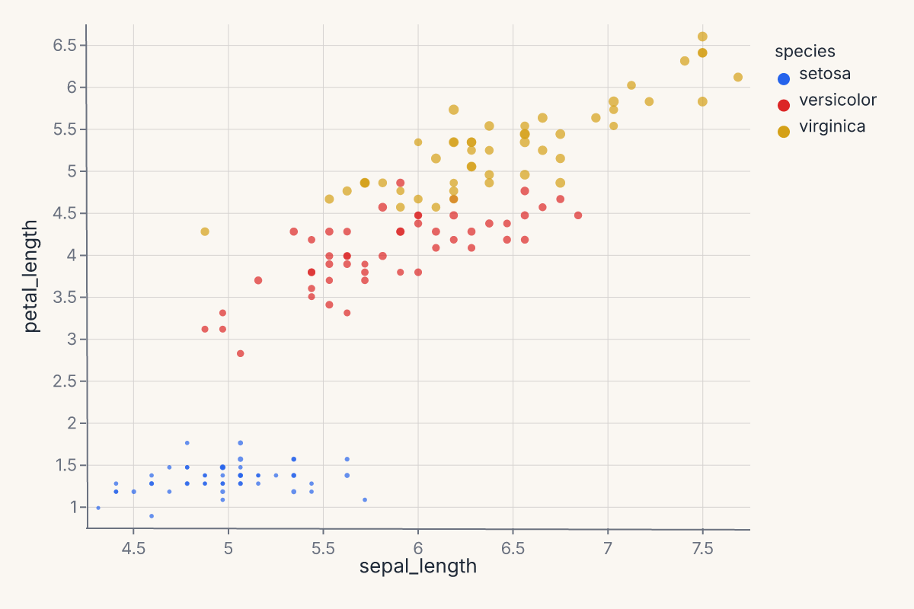
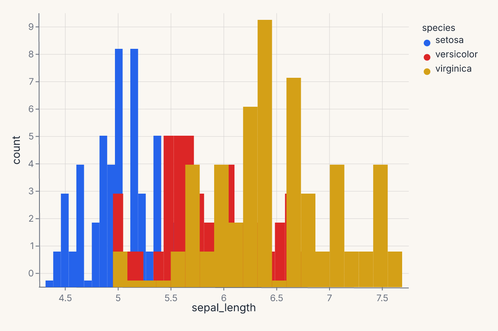
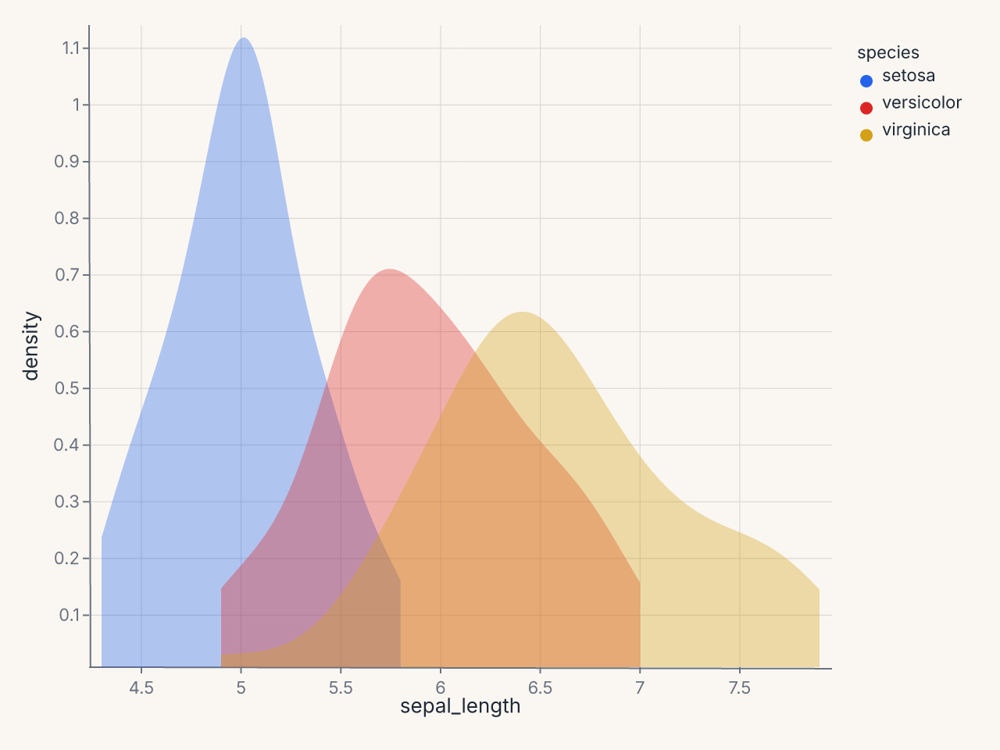
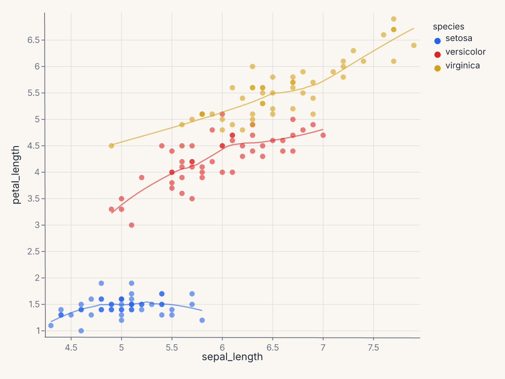
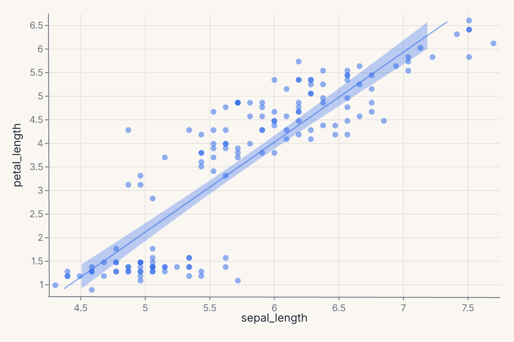
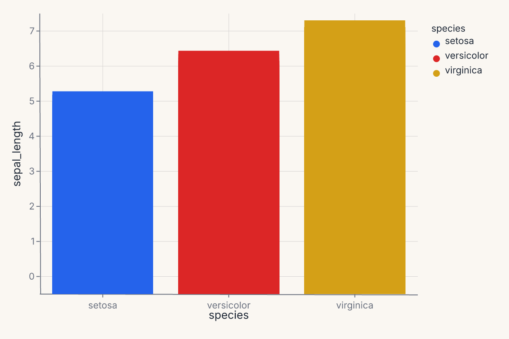
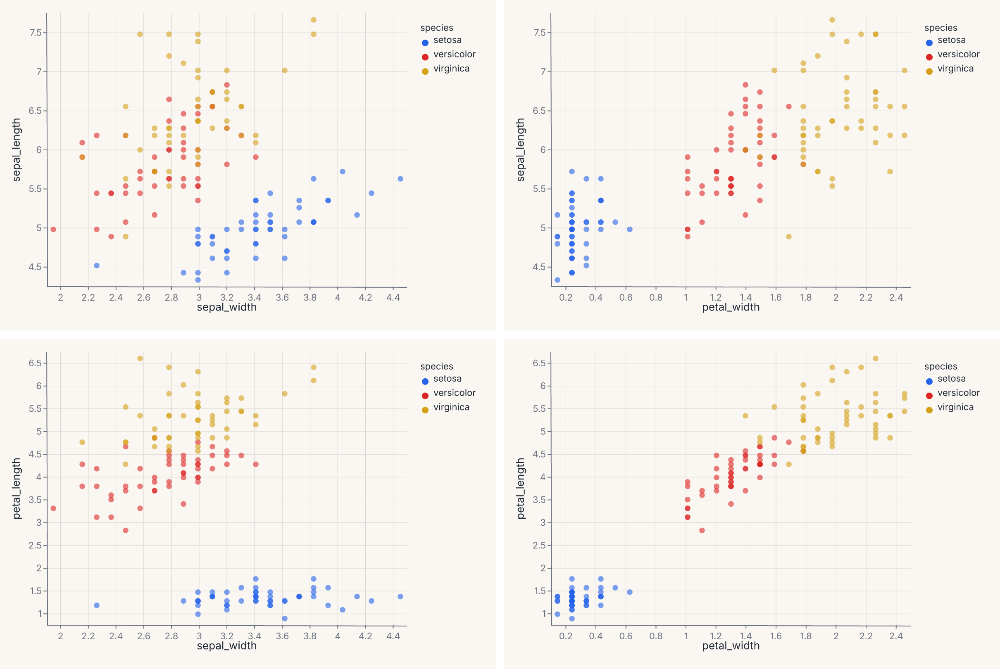
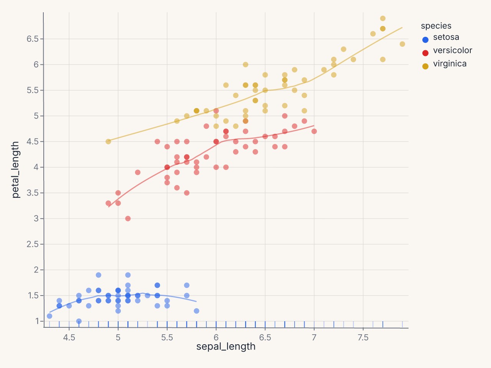
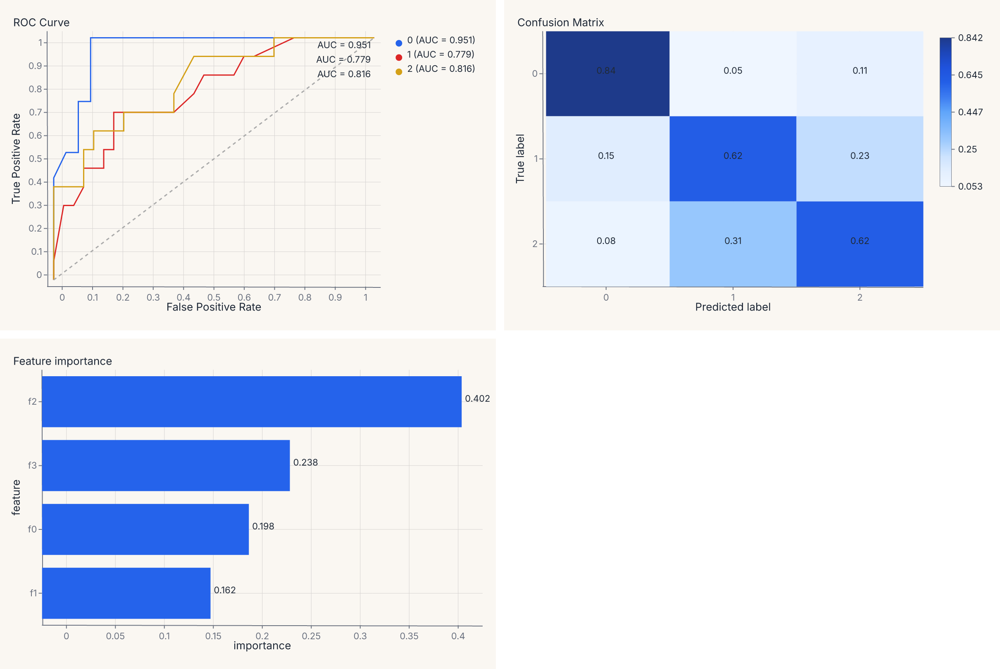
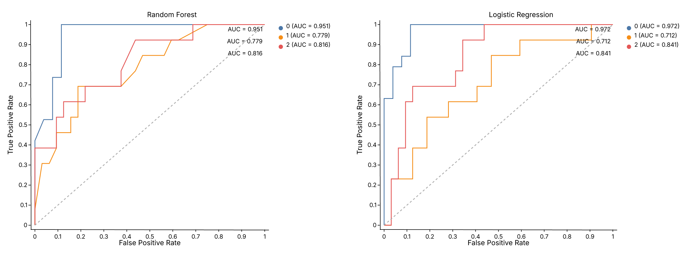

# Recipes

Worked examples using the grammar API. Each recipe starts from data and builds up to a finished chart. The progression runs from simple single-mark charts to multi-layer compositions with per-group transforms.

## Scatter with color and size

Map two continuous fields to position and two more to appearance:

```python
import ferrum as fm
import polars as pl
from sklearn.datasets import load_iris

raw = load_iris()
iris = pl.DataFrame(raw.data, schema=["sepal_length", "sepal_width", "petal_length", "petal_width"]).with_columns(
    species=pl.Series([raw.target_names[t] for t in raw.target])
)
chart = (
    fm.Chart(iris)
    .mark_point(opacity=0.7)
    .encode(
        x="sepal_length",
        y="petal_length",
        color="species:N",
        size="petal_width",
    )
)
assert chart.show_svg().startswith("<svg")
```



## Histogram with hue overlay

Stack or layer distributions by a categorical variable:

```python
import ferrum as fm
import polars as pl
from sklearn.datasets import load_iris

raw = load_iris()
iris = pl.DataFrame(raw.data, schema=["sepal_length", "sepal_width", "petal_length", "petal_width"]).with_columns(
    species=pl.Series([raw.target_names[t] for t in raw.target])
)
chart = (
    fm.Chart(iris)
    .mark_histogram(bin_count=20, groupby="species")
    .encode(x="sepal_length", color="species:N")
)
assert chart.show_svg().startswith("<svg")
```



## Per-group KDE

Use `groupby` to compute a separate density estimate per category:

```python
import ferrum as fm
import polars as pl
from sklearn.datasets import load_iris

raw = load_iris()
iris = pl.DataFrame(raw.data, schema=["sepal_length", "sepal_width", "petal_length", "petal_width"]).with_columns(
    species=pl.Series([raw.target_names[t] for t in raw.target])
)
chart = (
    fm.Chart(iris)
    .mark_density(bandwidth="scott", groupby="species")
    .encode(x="sepal_length", color="species:N")
)
assert chart.show_svg().startswith("<svg")
```



Without `groupby`, the density is computed over all rows combined. With `groupby="species"`, each species gets its own KDE curve colored by the `color` encoding.

## Scatter + per-group smooth

Layer a scatter with per-species LOESS trend lines. The `groupby` parameter is essential — without it, one combined line is computed:

```python
import ferrum as fm
import polars as pl
from sklearn.datasets import load_iris

raw = load_iris()
iris = pl.DataFrame(raw.data, schema=["sepal_length", "sepal_width", "petal_length", "petal_width"]).with_columns(
    species=pl.Series([raw.target_names[t] for t in raw.target])
)
points = (
    fm.Chart(iris)
    .mark_point(opacity=0.6)
    .encode(x="sepal_length", y="petal_length", color="species:N")
)
trend = (
    fm.Chart(iris)
    .mark_smooth(method="loess", groupby="species")
    .encode(x="sepal_length", y="petal_length", color="species:N")
)
chart = points + trend
assert chart.show_svg().startswith("<svg")
```



The `+` operator layers both marks on shared axes. The scatter renders the raw points; the smooth renders the fitted curves. Both share the same `color` scale.

## Scatter + smooth with confidence interval

Add a confidence band around the regression line with `ci=`:

```python
import ferrum as fm
import polars as pl
from sklearn.datasets import load_iris

raw = load_iris()
iris = pl.DataFrame(raw.data, schema=["sepal_length", "sepal_width", "petal_length", "petal_width"]).with_columns(
    species=pl.Series([raw.target_names[t] for t in raw.target])
)
points = (
    fm.Chart(iris)
    .mark_point(opacity=0.5)
    .encode(x="sepal_length", y="petal_length")
)
fit = (
    fm.Chart(iris)
    .mark_smooth(method="lm", ci=0.95)
    .encode(x="sepal_length", y="petal_length")
)
chart = points + fit
assert chart.show_svg().startswith("<svg")
```



`ci=0.95` produces a layered ribbon (band) + line chart. The ribbon shows the 95% confidence interval around the OLS fit. Use `method="lm"` for linear regression or `method="loess"` for a local smoother.

## Bar chart with color

A simple grouped bar chart using a categorical x-axis:

```python
import ferrum as fm
import polars as pl
from sklearn.datasets import load_iris

raw = load_iris()
iris = pl.DataFrame(raw.data, schema=["sepal_length", "sepal_width", "petal_length", "petal_width"]).with_columns(
    species=pl.Series([raw.target_names[t] for t in raw.target])
)
chart = (
    fm.Chart(iris)
    .mark_bar()
    .encode(x="species:N", y="sepal_length", color="species:N")
)
assert chart.show_svg().startswith("<svg")
```



## Pairwise scatter grid

Use [`RepeatChart`][ferrum.RepeatChart] to show multiple field combinations in a grid:

```python
import ferrum as fm
import polars as pl
from sklearn.datasets import load_iris

raw = load_iris()
iris = pl.DataFrame(raw.data, schema=["sepal_length", "sepal_width", "petal_length", "petal_width"]).with_columns(
    species=pl.Series([raw.target_names[t] for t in raw.target])
)
template = (
    fm.Chart(iris)
    .mark_point(opacity=0.6)
    .encode(x=fm.Repeat.column, y=fm.Repeat.row, color="species:N")
)
chart = fm.RepeatChart(
    template,
    row=["sepal_length", "petal_length"],
    column=["sepal_width", "petal_width"],
)
assert chart.show_svg().startswith("<svg")
```



Each cell in the grid swaps one field into the x or y encoding. This is the grammar-level equivalent of [`fm.pairplot()`][ferrum.pairplot] — use [`RepeatChart`][ferrum.RepeatChart] when you want full control over the template chart.

## Three-layer scatter with smooth and rug

Stack three grammar layers into one chart — scatter, per-group LOESS trend, and a rug plot showing the marginal distribution:

```python
import ferrum as fm
import polars as pl
from sklearn.datasets import load_iris

raw = load_iris()
iris = pl.DataFrame(raw.data, schema=["sepal_length", "sepal_width", "petal_length", "petal_width"]).with_columns(
    species=pl.Series([raw.target_names[t] for t in raw.target])
)
points = (
    fm.Chart(iris)
    .mark_point(opacity=0.5, size=40)
    .encode(x="sepal_length", y="petal_length", color="species:N")
)
smooth = (
    fm.Chart(iris)
    .mark_smooth(method="loess", groupby="species")
    .encode(x="sepal_length", y="petal_length", color="species:N")
)
rug = (
    fm.Chart(iris)
    .mark_tick(opacity=0.3)
    .encode(x="sepal_length", color="species:N")
)
chart = points + smooth + rug
assert chart.show_svg().startswith("<svg")
```



Each `+` adds another layer on the same axes. All three layers share the x/y scales and the color palette. The rug ticks along the bottom show the marginal distribution of sepal length per species.

## Multi-panel model report

Compose multiple diagnostic charts into a single view. Train a model, then build a four-panel report with one line of composition:

```python
import ferrum as fm
import polars as pl
import numpy as np
from sklearn.datasets import load_iris
from sklearn.ensemble import RandomForestClassifier
from sklearn.model_selection import train_test_split

raw = load_iris()
rng = np.random.default_rng(42)
X_noisy = raw.data + rng.normal(0, 1.5, raw.data.shape)
X_train, X_test, y_train, y_test = train_test_split(
    X_noisy, raw.target, test_size=0.3, random_state=42
)
model = RandomForestClassifier(n_estimators=50, random_state=42).fit(X_train, y_train)

roc = fm.roc_chart(model, X_test, y_test)
cm = fm.confusion_matrix_chart(model, X_test, y_test)
importances = fm.importance_chart(model, X_test, y_test)
report = (roc | cm) & importances
assert report.show_svg().startswith("<svg")
```



The `|` operator places charts side by side; `&` stacks vertically. The result is a single SVG with three panels — same grammar, same theme, one `.save()` call.

## Comparing two models side by side

Diagnostic chart output is a regular `Chart` — add titles, apply themes, and compose with `|`:

```python
import ferrum as fm
import numpy as np
from sklearn.datasets import load_iris
from sklearn.ensemble import RandomForestClassifier
from sklearn.linear_model import LogisticRegression
from sklearn.model_selection import train_test_split

raw = load_iris()
rng = np.random.default_rng(42)
X_noisy = raw.data + rng.normal(0, 1.5, raw.data.shape)
X_train, X_test, y_train, y_test = train_test_split(
    X_noisy, raw.target, test_size=0.3, random_state=42
)
rf = RandomForestClassifier(n_estimators=50, random_state=42).fit(X_train, y_train)
lr = LogisticRegression(max_iter=500, random_state=42).fit(X_train, y_train)

roc_rf = fm.roc_chart(rf, X_test, y_test).properties(title="Random Forest")
roc_lr = fm.roc_chart(lr, X_test, y_test).properties(title="Logistic Regression")
chart = (roc_rf | roc_lr).theme(fm.themes.publication)
assert chart.show_svg().startswith("<svg")
```



`.properties(title=...)` adds a title to each panel. `.theme()` applies to the entire composed view. The same pattern works for any diagnostic helper — swap `roc_chart` for `calibration_chart`, `pr_chart`, or `confusion_matrix_chart`.

## Where to go next

- [Marks & encodings](marks-encodings.md) for the full mark and encoding reference.
- [Composition](composition.md) for layering, concatenation, and compound views.
- [Figure-level helpers](figure-helpers.md) for one-line entry points to common patterns.
- [Saving & export](saving-and-export.md) for output formats and rendering options.
