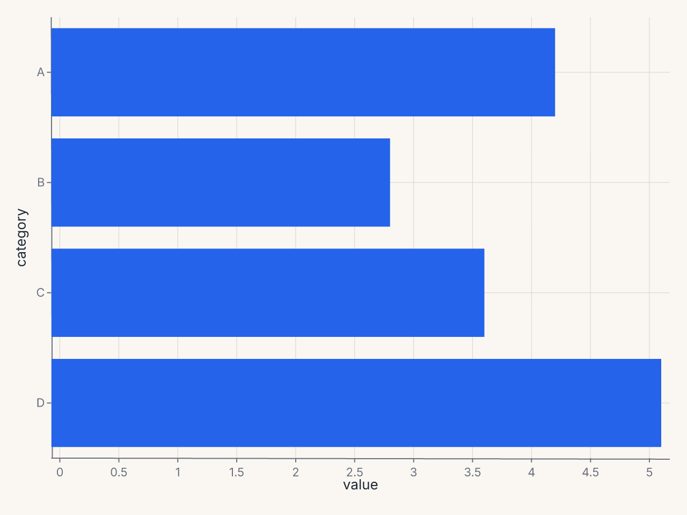
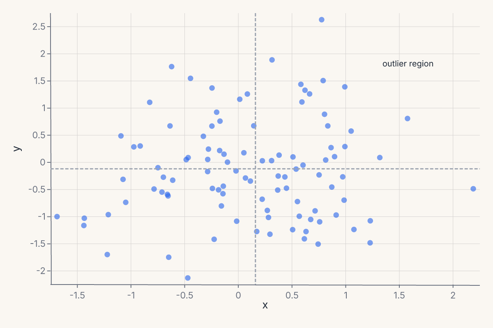
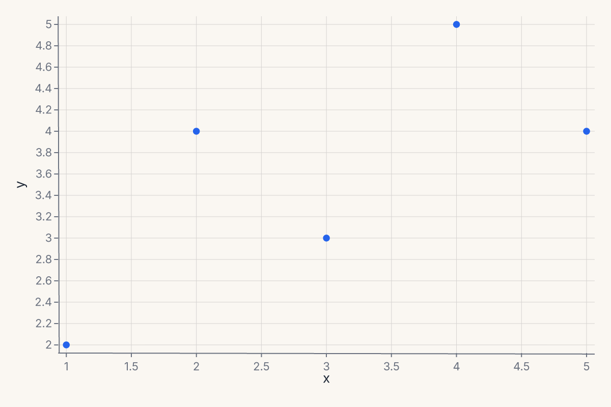
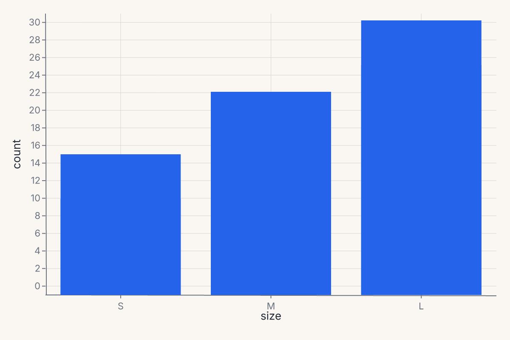
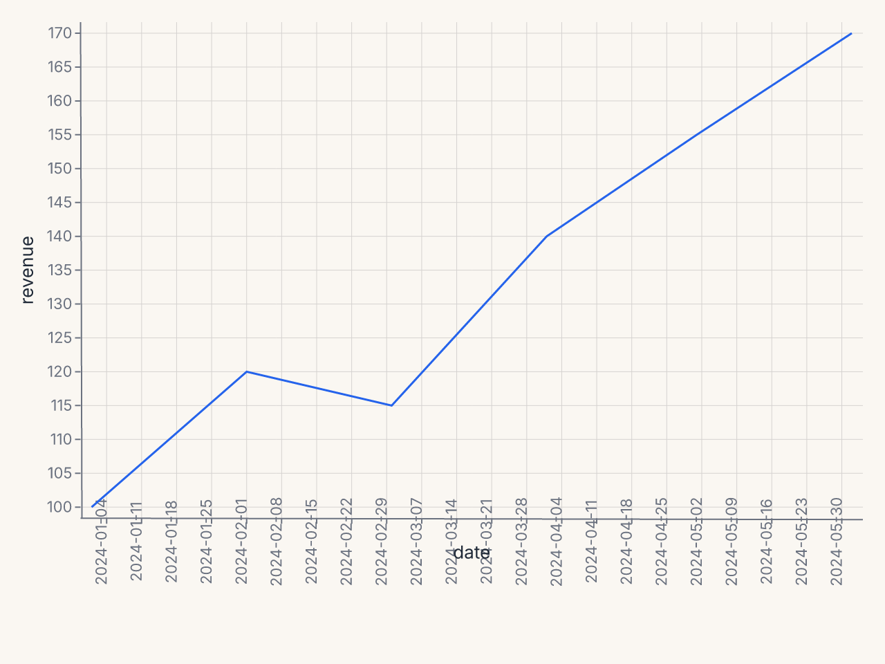
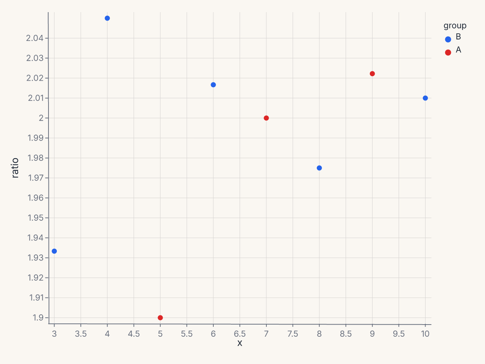
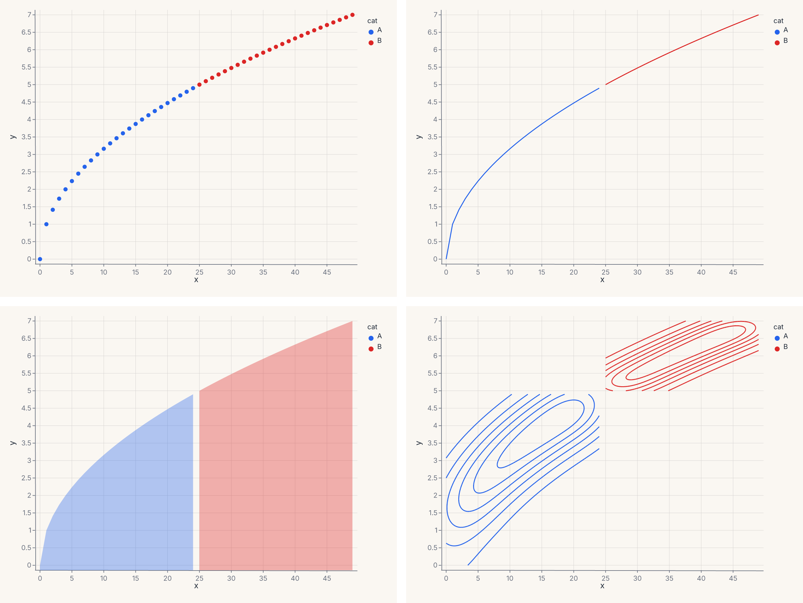
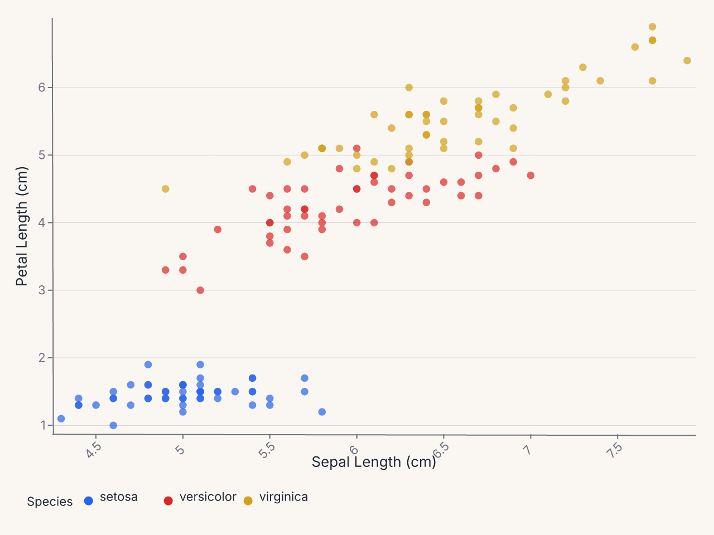
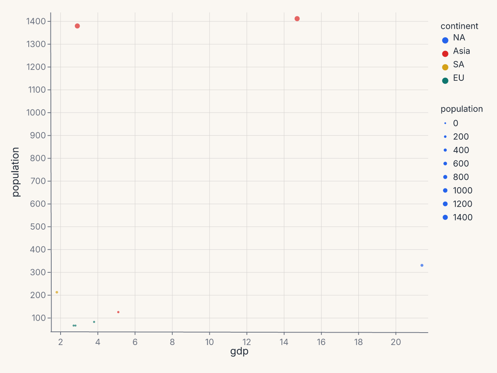

# Recipes

Worked examples using the grammar API. Each recipe starts from data and builds up to a finished chart. The progression runs from simple single-mark charts to multi-layer compositions with per-group transforms.

For explicit data preprocessing (filtering, reshaping, window functions), see the [Data Transforms](data-transforms.md) guide.

## Scatter with color and size

Map two continuous fields to position and two more to appearance:

```python
import ferrum as fm
import polars as pl
from sklearn.datasets import load_iris

raw = load_iris()
iris = pl.DataFrame(raw.data, schema=["sepal_length", "sepal_width", "petal_length", "petal_width"]).with_columns(
    species=pl.Series([raw.target_names[t] for t in raw.target])
)
chart = (
    fm.Chart(iris)
    .mark_point(opacity=0.7)
    .encode(
        x="sepal_length",
        y="petal_length",
        color="species:N",
        size="petal_width",
    )
)
assert chart.to_svg().startswith("<svg")
```


## Histogram with hue overlay

Stack or layer distributions by a categorical variable:

```python
import ferrum as fm
import polars as pl
from sklearn.datasets import load_iris

raw = load_iris()
iris = pl.DataFrame(raw.data, schema=["sepal_length", "sepal_width", "petal_length", "petal_width"]).with_columns(
    species=pl.Series([raw.target_names[t] for t in raw.target])
)
chart = (
    fm.Chart(iris)
    .mark_histogram(bin_count=20, groupby="species")
    .encode(x="sepal_length", color="species:N")
)
assert chart.to_svg().startswith("<svg")
```


## Per-group KDE

Use `groupby` to compute a separate density estimate per category:

```python
import ferrum as fm
import polars as pl
from sklearn.datasets import load_iris

raw = load_iris()
iris = pl.DataFrame(raw.data, schema=["sepal_length", "sepal_width", "petal_length", "petal_width"]).with_columns(
    species=pl.Series([raw.target_names[t] for t in raw.target])
)
chart = (
    fm.Chart(iris)
    .mark_density(bandwidth="scott", groupby="species")
    .encode(x="sepal_length", color="species:N")
)
assert chart.to_svg().startswith("<svg")
```


Without `groupby`, the density is computed over all rows combined. With `groupby="species"`, each species gets its own KDE curve colored by the `color` encoding.

## Scatter + per-group smooth

Layer a scatter with per-species LOESS trend lines. The `groupby` parameter is essential — without it, one combined line is computed:

```python
import ferrum as fm
import polars as pl
from sklearn.datasets import load_iris

raw = load_iris()
iris = pl.DataFrame(raw.data, schema=["sepal_length", "sepal_width", "petal_length", "petal_width"]).with_columns(
    species=pl.Series([raw.target_names[t] for t in raw.target])
)
points = (
    fm.Chart(iris)
    .mark_point(opacity=0.6)
    .encode(x="sepal_length", y="petal_length", color="species:N")
)
trend = (
    fm.Chart(iris)
    .mark_smooth(method="loess", groupby="species")
    .encode(x="sepal_length", y="petal_length", color="species:N")
)
chart = points + trend
assert chart.to_svg().startswith("<svg")
```


The `+` operator layers both marks on shared axes. The scatter renders the raw points; the smooth renders the fitted curves. Both share the same `color` scale.

## Scatter + smooth with confidence interval

Add a confidence band around the regression line with `ci=`:

```python
import ferrum as fm
import polars as pl
from sklearn.datasets import load_iris

raw = load_iris()
iris = pl.DataFrame(raw.data, schema=["sepal_length", "sepal_width", "petal_length", "petal_width"]).with_columns(
    species=pl.Series([raw.target_names[t] for t in raw.target])
)
points = (
    fm.Chart(iris)
    .mark_point(opacity=0.5)
    .encode(x="sepal_length", y="petal_length")
)
fit = (
    fm.Chart(iris)
    .mark_smooth(method="lm", ci=0.95)
    .encode(x="sepal_length", y="petal_length")
)
chart = points + fit
assert chart.to_svg().startswith("<svg")
```


`ci=0.95` produces a layered ribbon (band) + line chart. The ribbon shows the 95% confidence interval around the OLS fit. Use `method="lm"` for linear regression or `method="loess"` for a local smoother.

## Bar chart with color

A simple grouped bar chart using a categorical x-axis:

```python
import ferrum as fm
import polars as pl
from sklearn.datasets import load_iris

raw = load_iris()
iris = pl.DataFrame(raw.data, schema=["sepal_length", "sepal_width", "petal_length", "petal_width"]).with_columns(
    species=pl.Series([raw.target_names[t] for t in raw.target])
)
chart = (
    fm.Chart(iris)
    .mark_bar()
    .encode(x="species:N", y="sepal_length", color="species:N")
)
assert chart.to_svg().startswith("<svg")
```


## Pairwise scatter grid

Use [`RepeatChart`][ferrum.RepeatChart] to show multiple field combinations in a grid:

```python
import ferrum as fm
import polars as pl
from sklearn.datasets import load_iris

raw = load_iris()
iris = pl.DataFrame(raw.data, schema=["sepal_length", "sepal_width", "petal_length", "petal_width"]).with_columns(
    species=pl.Series([raw.target_names[t] for t in raw.target])
)
template = (
    fm.Chart(iris)
    .mark_point(opacity=0.6)
    .encode(x=fm.Repeat.column, y=fm.Repeat.row, color="species:N")
)
chart = fm.RepeatChart(
    template,
    row=["sepal_length", "petal_length"],
    column=["sepal_width", "petal_width"],
)
assert chart.to_svg().startswith("<svg")
```


Each cell in the grid swaps one field into the x or y encoding. This is the grammar-level equivalent of [`fm.pairplot()`][ferrum.pairplot] — use [`RepeatChart`][ferrum.RepeatChart] when you want full control over the template chart.

## Three-layer scatter with smooth and rug

Stack three grammar layers into one chart — scatter, per-group LOESS trend, and a rug plot showing the marginal distribution:

```python
import ferrum as fm
import polars as pl
from sklearn.datasets import load_iris

raw = load_iris()
iris = pl.DataFrame(raw.data, schema=["sepal_length", "sepal_width", "petal_length", "petal_width"]).with_columns(
    species=pl.Series([raw.target_names[t] for t in raw.target])
)
points = (
    fm.Chart(iris)
    .mark_point(opacity=0.5, size=40)
    .encode(x="sepal_length", y="petal_length", color="species:N")
)
smooth = (
    fm.Chart(iris)
    .mark_smooth(method="loess", groupby="species")
    .encode(x="sepal_length", y="petal_length", color="species:N")
)
rug = (
    fm.Chart(iris)
    .mark_tick(opacity=0.3)
    .encode(x="sepal_length", color="species:N")
)
chart = points + smooth + rug
assert chart.to_svg().startswith("<svg")
```


Each `+` adds another layer on the same axes. All three layers share the x/y scales and the color palette. The rug ticks along the bottom show the marginal distribution of sepal length per species.

## Multi-panel model report

Compose multiple diagnostic charts into a single view. Train a model, then build a four-panel report with one line of composition:

```python
import ferrum as fm
import polars as pl
import numpy as np
from sklearn.datasets import load_iris
from sklearn.ensemble import RandomForestClassifier
from sklearn.model_selection import train_test_split

raw = load_iris()
rng = np.random.default_rng(42)
X_noisy = raw.data + rng.normal(0, 1.5, raw.data.shape)
X_train, X_test, y_train, y_test = train_test_split(
    X_noisy, raw.target, test_size=0.3, random_state=42
)
model = RandomForestClassifier(n_estimators=50, random_state=42).fit(X_train, y_train)

roc = fm.roc_chart(model, X_test, y_test)
cm = fm.confusion_matrix_chart(model, X_test, y_test)
importances = fm.importance_chart(model, X_test, y_test)
report = (roc | cm) & importances
assert report.to_svg().startswith("<svg")
```


The `|` operator places charts side by side; `&` stacks vertically. The result is a single SVG with three panels — same grammar, same theme, one `.save()` call.

## Comparing two models side by side

Diagnostic chart output is a regular `Chart` — add titles, apply themes, and compose with `|`:

```python
import ferrum as fm
import numpy as np
from sklearn.datasets import load_iris
from sklearn.ensemble import RandomForestClassifier
from sklearn.linear_model import LogisticRegression
from sklearn.model_selection import train_test_split

raw = load_iris()
rng = np.random.default_rng(42)
X_noisy = raw.data + rng.normal(0, 1.5, raw.data.shape)
X_train, X_test, y_train, y_test = train_test_split(
    X_noisy, raw.target, test_size=0.3, random_state=42
)
rf = RandomForestClassifier(n_estimators=50, random_state=42).fit(X_train, y_train)
lr = LogisticRegression(max_iter=500, random_state=42).fit(X_train, y_train)

roc_rf = fm.roc_chart(rf, X_test, y_test).properties(title="Random Forest")
roc_lr = fm.roc_chart(lr, X_test, y_test).properties(title="Logistic Regression")
chart = (roc_rf | roc_lr).theme(fm.themes.publication)
assert chart.to_svg().startswith("<svg")
```


`.properties(title=...)` adds a title to each panel. `.theme()` applies to the entire composed view. The same pattern works for any diagnostic helper — swap `roc_chart` for `calibration_chart`, `pr_chart`, or `confusion_matrix_chart`.

## Horizontal bars with CoordFlip

Ferrum draws bars vertically by default (x = category, y = value). To flip to horizontal bars, apply [`CoordFlip`][ferrum.CoordFlip]:

```python
import ferrum as fm
import polars as pl

df = pl.DataFrame({"category": ["A", "B", "C", "D"], "value": [4.2, 2.8, 3.6, 5.1]})
chart = (
    fm.Chart(df)
    .mark_bar()
    .encode(x="category:N", y="value")
    .coord(fm.CoordFlip())
)
assert chart.to_svg().startswith("<svg")
```



[`CoordFlip`][ferrum.CoordFlip] swaps the x and y axes at render time — the encoding stays as written, but the visual orientation flips. This is the idiomatic way to produce horizontal bar charts, lollipop charts, or any chart where the categorical axis should run vertically.

Other coordinate systems exist as classes — [`CoordPolar`][ferrum.CoordPolar] (for pie/donut/radial charts) and [`CoordGeo`][ferrum.CoordGeo] (for map projections) — but their renderer support is limited compared to [`CoordFlip`][ferrum.CoordFlip] and the default [`CoordCartesian`][ferrum.CoordCartesian].

## Annotations: reference lines and text callouts

Layer [`mark_rule`][ferrum.Chart.mark_rule] and [`mark_text`][ferrum.Chart.mark_text] on top of a data chart to add reference lines and text annotations:

```python
import ferrum as fm
import polars as pl
import numpy as np

rng = np.random.default_rng(42)
df = pl.DataFrame({"x": rng.standard_normal(100), "y": rng.standard_normal(100)})

scatter = fm.Chart(df).mark_point(opacity=0.6).encode(x="x", y="y")

# Horizontal reference line at y=0
hline = fm.Chart(pl.DataFrame({"y": [0.0]})).mark_rule(stroke="red", stroke_dash=[4, 2]).encode(y="y")

# Vertical reference line at x=0
vline = fm.Chart(pl.DataFrame({"x": [0.0]})).mark_rule(stroke="red", stroke_dash=[4, 2]).encode(x="x")

# Text callout
label = (
    fm.Chart(pl.DataFrame({"x": [1.5], "y": [2.0], "label": ["outlier region"]}))
    .mark_text(fill="gray", font_size=10)
    .encode(x="x", y="y", text="label")
)

chart = scatter + hline + vline + label
assert chart.to_svg().startswith("<svg")
```



The `+` operator layers all marks on the same axes. [`mark_rule`][ferrum.Chart.mark_rule] with only `y` encoded draws a horizontal line spanning the full plot width; with only `x` encoded it draws a vertical line spanning the full height. [`mark_text`][ferrum.Chart.mark_text] places text at the (x, y) position with the string from the `text` encoding channel.

## Chart sizing

Control chart dimensions with `.properties(width=..., height=...)`:

```python
import ferrum as fm
import polars as pl

df = pl.DataFrame({"x": [1, 2, 3, 4, 5], "y": [2, 4, 3, 5, 4]})
chart = (
    fm.Chart(df)
    .mark_point()
    .encode(x="x", y="y")
    .properties(width=600, height=400)
)
assert chart.to_svg().startswith("<svg")
```



The default size is 600 x 400. Use [`.properties()`][ferrum.Chart.properties] when you need a wider plot for time series, a square plot for scatter matrices, or a compact sparkline.

## Custom category order

Force a specific category order on a nominal axis with `sort=`:

```python
import ferrum as fm
import polars as pl

df = pl.DataFrame({"size": ["L", "S", "M", "L", "S", "M"], "count": [30, 10, 20, 25, 15, 22]})
chart = (
    fm.Chart(df)
    .mark_bar()
    .encode(
        x=fm.X("size", type="N", sort=["S", "M", "L"]),
        y="count",
    )
)
assert chart.to_svg().startswith("<svg")
```



The `sort=` parameter on positional channels accepts a list of category values in the desired display order. Without it, categories appear in their natural (alphabetical) order.

## Time-series line chart

Plot temporal data by tagging the date column with `:T`:

```python
import ferrum as fm
import polars as pl
from datetime import date

df = pl.DataFrame({
    "date": [date(2024, 1, 1), date(2024, 2, 1), date(2024, 3, 1),
             date(2024, 4, 1), date(2024, 5, 1), date(2024, 6, 1)],
    "revenue": [100, 120, 115, 140, 155, 170],
})
chart = (
    fm.Chart(df)
    .mark_line()
    .encode(x="date:T", y="revenue")
)
assert chart.to_svg().startswith("<svg")
```



The `:T` suffix tells ferrum the x-axis is temporal, enabling date-aware tick formatting and axis scaling.

## Filtered scatter with derived column

Apply data transforms before rendering — `transform_filter` removes rows and `transform_calculate` adds a computed column:

```python
import ferrum as fm
import polars as pl

df = pl.DataFrame({
    "x": [1, 2, 3, 4, 5, 6, 7, 8, 9, 10],
    "y": [2.1, 4.3, 5.8, 8.2, 9.5, 12.1, 14.0, 15.8, 18.2, 20.1],
    "group": ["A", "A", "B", "B", "A", "B", "A", "B", "A", "B"],
})
chart = (
    fm.Chart(df)
    .transform(
        fm.transform_filter("datum.x > 2"),
        fm.transform_calculate("ratio", "datum.y / datum.x"),
    )
    .mark_point()
    .encode(x="x", y="ratio", color="group:N")
)
assert chart.to_svg().startswith("<svg")
```



`transform_filter` removes rows where x <= 2, `transform_calculate` adds a derived `ratio` column. Both run in Rust before rendering.

## ConcatChart wrapping grid

Arrange multiple charts in a wrapping grid layout using `ConcatChart`:

```python
import ferrum as fm
import polars as pl

df = pl.DataFrame({
    "x": list(range(50)),
    "y": [v ** 0.5 for v in range(50)],
    "cat": ["A"] * 25 + ["B"] * 25,
})
charts = []
for mark_fn in [fm.Chart.mark_point, fm.Chart.mark_line, fm.Chart.mark_area, fm.Chart.mark_density]:
    c = mark_fn(fm.Chart(df)).encode(x="x", y="y", color="cat:N")
    charts.append(c)

grid = fm.ConcatChart(*charts, columns=2, spacing=15.0)
assert grid.to_svg().startswith("<svg")
```



`ConcatChart` arranges 4 charts in a 2-column wrapping grid. Use it when charts share data but show different mark types or encodings.

## Custom axis and legend

Use `Axis(...)` and `Legend(...)` value classes for per-channel control over axis presentation and legend layout:

```python
import ferrum as fm
import polars as pl
from sklearn.datasets import load_iris

raw = load_iris()
iris = pl.DataFrame(raw.data, schema=["sepal_length", "sepal_width", "petal_length", "petal_width"]).with_columns(
    species=pl.Series([raw.target_names[t] for t in raw.target])
)
chart = (
    fm.Chart(iris)
    .mark_point(opacity=0.7)
    .encode(
        x=fm.X("sepal_length", axis=fm.Axis(title="Sepal Length (cm)", grid=False, label_angle=-45)),
        y=fm.Y("petal_length", axis=fm.Axis(title="Petal Length (cm)", tick_count=5)),
        color=fm.Color("species:N", legend=fm.Legend(orient="bottom", columns=3, title="Species")),
    )
)
assert chart.to_svg().startswith("<svg")
```



`Axis(...)` and `Legend(...)` give per-channel control over axis presentation and legend layout without affecting the theme.

## Power-scaled bubble chart

Use `SqrtScale` on the size encoding so bubble area is proportional to the data value:

```python
import ferrum as fm
import polars as pl

df = pl.DataFrame({
    "country": ["US", "China", "India", "Brazil", "UK", "France", "Japan", "Germany"],
    "gdp": [21.4, 14.7, 2.9, 1.8, 2.8, 2.7, 5.1, 3.8],
    "population": [331, 1412, 1380, 213, 67, 67, 126, 83],
    "continent": ["NA", "Asia", "Asia", "SA", "EU", "EU", "Asia", "EU"],
})
chart = (
    fm.Chart(df)
    .mark_point(opacity=0.7)
    .encode(
        x="gdp",
        y="population",
        size=fm.Size("population", scale=fm.SqrtScale(domain=[0, 1500])),
        color="continent:N",
    )
)
assert chart.to_svg().startswith("<svg")
```



`SqrtScale(domain=[0, 1500])` is equivalent to `PowScale(domain=[0, 1500], exponent=0.5)`. It makes bubble area proportional to the data value — without it, large values visually dominate.

## Where to go next

- [Marks & encodings](marks-encodings.md) for the full mark and encoding reference.
- [Composition](composition.md) for layering, concatenation, and compound views.
- [Figure-level helpers](figure-helpers.md) for one-line entry points to common patterns.
- [Saving & export](saving-and-export.md) for output formats and rendering options.
