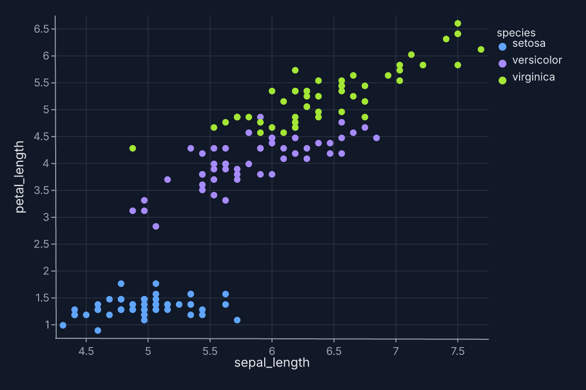
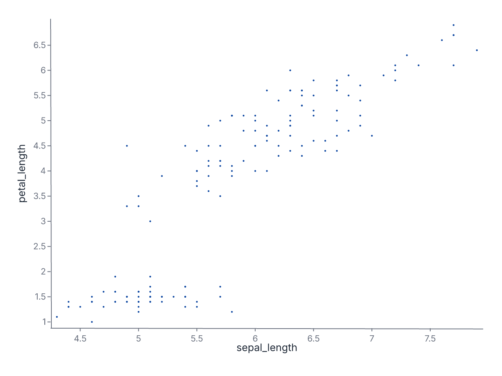

# Themes

A theme is a bundle of style decisions — background, typography, mark color, grid, axes, palettes, padding — that applies uniformly across a chart. Themes are values, not state: you construct a [`Theme`][ferrum.Theme] and pass it where you want it. Nothing mutates global module state, and no chart is "secretly" themed by an import side-effect.

Three layers of theme control let you reach for the right scope: per-chart, process-default, and scoped via a context manager. Per-chart always wins.

## Built-in themes

Ferrum ships twelve built-in themes accessible as attributes of [`ferrum.themes`][]. Three are original identities designed for Ferrum; the rest are established editorial and publication styles.

### Ferrum originals

| Name | Character |
|---|---|
| `default` / `paper_ink` | Warm cream background (`#FAF7F2`), blue lead marks, warm grid. The default identity. |
| `slate_citrus` | Dark navy (`#111827`), vibrant neon accents, lime/cyan categorical cycle. |
| `arctic_signal` | Cool white (`#F8FAFC`), sky blue lead mark, precise signal palette. |

### Established styles

| Name | Character |
|---|---|
| `observable` | White background, tableau blue marks, neutral gray grid. Matches Observable Plot's defaults. |
| `minimal` | No grid, no axis lines, generous padding. |
| `dark` | Dark navy (`#1a1a2e`), light text, dark2 palette. |
| `publication` | Print-ready: white background, no grid, black strokes, bold centered title. |
| `economist` | Light blue background (`#d3e0e6`), red title accents, Set1 palette. |
| `fivethirtyeight` | Grey background (`#f0f0f0`), Set1 palette, bold start-anchored title. |
| `solarized_light` | Warm cream (`#fdf6e3`), muted teal text, Set2 palette. |
| `solarized_dark` | Dark teal (`#002b36`), warm-light text, Set2 palette. |

Apply a theme to a chart:

```python
import ferrum as fm
import polars as pl
from sklearn.datasets import load_iris

raw = load_iris()
iris = pl.DataFrame(raw.data, schema=["sepal_length", "sepal_width", "petal_length", "petal_width"]).with_columns(
    species=pl.Series([raw.target_names[t] for t in raw.target])
)
chart = (
    fm.Chart(iris)
    .mark_point()
    .encode(x="sepal_length", y="petal_length", color="species:N")
    .theme(fm.themes.slate_citrus)
)
assert chart.show_svg().startswith("<svg")
```



Switching themes is one method call away; the rest of the chart spec is untouched.

## Theme as a value

`Theme` is immutable. Once constructed, it cannot be mutated. Methods like [`.update()`][ferrum.Theme.update] return a new `Theme` rather than modifying the original:

```python
import ferrum as fm

base = fm.Theme(background="#f9f9f9", grid=True, padding=16)
darker = base.update(background="#222222", mark_color="#e74c3c")
assert base != darker
assert base.to_theme_inputs_dict()["background_color"] == "#f9f9f9"
assert darker.to_theme_inputs_dict()["background_color"] == "#222222"
```

This immutability is structural: themes are values that compose, like encodings and marks. You can keep a "base theme" in a module and derive variants without worrying about side-effects.

## Theme keys

Every key listed below is plumbed end-to-end from the Python `Theme(...)` constructor through the Rust renderer. Unknown keys raise `ValueError` at construction time — there are no silently ignored keys.

### Canvas

| Key | Type | What it controls |
|---|---|---|
| `background` | str | Chart background as a CSS hex string. |
| `padding` | float | Chart padding in pixels (all four sides). |

### Typography

| Key | Type | What it controls |
|---|---|---|
| `font_family` | str | Default typeface for body text. |
| `font_weight` | str | Default weight (`"normal"`, `"bold"`). |
| `font_color` | str | Default text color. |
| `font_size` | float | Default text size. |
| `title_font_family` | str | Chart title typeface (falls back to `font_family`). |
| `title_font_size` | float | Chart title size. |
| `title_font_weight` | str | Chart title weight. |
| `title_color` | str | Chart title color (falls back to `font_color`). |
| `title_anchor` | str | Title alignment: `"start"`, `"middle"`, or `"end"`. |
| `title_offset` | float | Vertical offset for the title. |
| `label_font_family` | str | Tick label typeface (falls back to `font_family`). |
| `label_color` | str | Tick label color (falls back to `font_color`). |

### Grid

| Key | Type | What it controls |
|---|---|---|
| `grid` | bool | Whether to draw grid lines. |
| `grid_color` | str | Grid line color. |
| `grid_width` | float | Grid line width. |
| `grid_dash` | list | Dash pattern (e.g. `[5, 3]`). |
| `grid_opacity` | float | Grid line opacity. |

### Axes

| Key | Type | What it controls |
|---|---|---|
| `axis_line` | bool | Whether to draw axis strokes. |
| `axis_line_color` | str | Axis stroke color. |
| `axis_line_width` | float | Axis stroke width. |
| `tick_color` | str | Tick mark color. |
| `tick_size` | float | Tick mark length. |
| `tick_width` | float | Tick mark width. |

### Marks

| Key | Type | What it controls |
|---|---|---|
| `mark_color` | str | Default fill/stroke for marks with no explicit `color` encoding. |
| `point_size` | float | Default radius for point marks. |
| `point_opacity` | float | Default opacity for point marks. |
| `line_stroke_width` | float | Default stroke width for line marks. |
| `bar_corner_radius` | float | Corner radius applied to bars. |
| `area_opacity` | float | Default opacity for area marks. |
| `opacity` | float | Global default opacity for all marks. |

### Palettes

| Key | Type | What it controls |
|---|---|---|
| `color_scheme` | str | Categorical palette. See [available palettes](#available-palettes) below. |
| `sequential_scheme` | str | Default sequential ramp for heatmaps, density, continuous-color charts. |
| `diverging_scheme` | str | Default diverging ramp for correlation matrices, diverging-color charts. |

### Layout and decoration

| Key | Type | What it controls |
|---|---|---|
| `legend_orient` | str | Legend position. |
| `legend_direction` | str | Legend layout direction. |
| `legend_title_font_size` | float | Legend title size. |
| `axis_title_padding` | float | Space between axis title and axis. |
| `column_padding` | float | Spacing between columns in multi-panel layouts. |
| `row_padding` | float | Spacing between rows in multi-panel layouts. |
| `strip_background_color` | str | Facet strip-title background. |
| `reference_line_color` | str | Color for reference lines. |
| `reference_line_dash` | list | Dash pattern for reference lines. |

## Available palettes

### Categorical

Ten named categorical palettes, selectable via `color_scheme`:

| Name | Origin |
|---|---|
| `paper_ink` | Ferrum's default — 8 balanced, perceptually distinct colors on warm cream. |
| `slate_citrus` | Ferrum — 8 neon-accent colors designed for dark backgrounds. |
| `arctic_signal` | Ferrum — 8 precise signal colors on cool white. |
| `tableau10` | Tableau's 10-color palette. |
| `okabe_ito` | Okabe-Ito colorblind-safe palette. |
| `set1` | ColorBrewer Set1. |
| `set2` | ColorBrewer Set2. |
| `paired` | ColorBrewer Paired (12 colors). |
| `pastel` | ColorBrewer Pastel. |
| `dark2` | ColorBrewer Dark2. |

### Sequential

Twelve named sequential ramps, selectable via `sequential_scheme`:

| Name | Character |
|---|---|
| `cool_blue` | Paper Ink's default. Blue ramp on warm background. |
| `warm_ochre` | Warm amber ramp. |
| `night_blue` | Slate Citrus's default. Deep blue on dark background. |
| `electric_lime` | Bright lime-green ramp. |
| `signal_blue` | Arctic Signal's default. Sky-to-navy blue. |
| `ember_orange` | Warm orange-to-red ramp. |
| `viridis` | Perceptually uniform yellow-green-blue. |
| `plasma` | Perceptually uniform magenta-orange-yellow. |
| `magma` | Perceptually uniform black-purple-yellow. |
| `inferno` | Perceptually uniform black-red-yellow. |
| `cividis` | Colorblind-optimized blue-yellow. |
| `blues` | ColorBrewer sequential blues. |

### Diverging

Four named diverging ramps, selectable via `diverging_scheme`:

| Name | Character |
|---|---|
| `blue_to_red` | Paper Ink's default diverging. |
| `cyan_to_amber` | Slate Citrus's default diverging. |
| `blue_to_violet` | Arctic Signal's default diverging. |
| `rdbu` | ColorBrewer RdBu. |

## Process-default themes

When you want the same theme to apply to every chart in a notebook or script, set it once with [`set_default_theme()`][ferrum.set_default_theme]:

```python
import ferrum as fm
import polars as pl
from sklearn.datasets import load_iris

raw = load_iris()
iris = pl.DataFrame(raw.data, schema=["sepal_length", "sepal_width", "petal_length", "petal_width"]).with_columns(
    species=pl.Series([raw.target_names[t] for t in raw.target])
)
fm.set_default_theme(fm.themes.dark)
chart = (
    fm.Chart(iris)
    .mark_point()
    .encode(x="sepal_length", y="petal_length", color="species:N")
)
assert chart.show_svg().startswith("<svg")
fm.set_default_theme(fm.themes.default)
```


[`set_default_theme()`][ferrum.set_default_theme] does not mutate a module-level config object. It writes to a per-thread `contextvars.ContextVar`, which means:

- The default is scoped to the current Python interpreter context.
- Concurrent tasks (asyncio, multiprocessing, threads using contextvars) do not share defaults.
- The previous default can be restored explicitly, or implicitly via the context manager (next section).

This is the single documented exception to Ferrum's "no global mutable state" rule, and the mechanism is deliberately scope-bounded.

## Scoped themes via `with`

For code where the theme should change for one block and revert afterward, [`theme_context()`][ferrum.theme_context] is a context manager:

```python
import ferrum as fm
import polars as pl
from sklearn.datasets import load_iris

raw = load_iris()
iris = pl.DataFrame(raw.data, schema=["sepal_length", "sepal_width", "petal_length", "petal_width"]).with_columns(
    species=pl.Series([raw.target_names[t] for t in raw.target])
)
with fm.theme_context(fm.themes.publication):
    publication_chart = (
        fm.Chart(iris)
        .mark_point()
        .encode(x="sepal_length", y="petal_length", color="species:N")
    )
    assert publication_chart.show_svg().startswith("<svg")
assert fm.get_default_theme() == fm.themes.default
```


The previous default is restored on `__exit__`. This is the right scope for a single section of a notebook, a single figure-rendering function, or a test fixture.

## Precedence

When multiple theme sources are in play:

1. **Per-chart `.theme(t)` always wins.** If a chart calls `.theme(dark)`, that chart renders with `dark` regardless of any process default.
2. **Process default applies otherwise.** A chart without an explicit `.theme()` picks up whatever `set_default_theme()` last set (or whatever `theme_context()` currently scopes).
3. **Ferrum's built-in `default` (Paper Ink) is the bottom of the stack.** If nothing else is set, every chart renders with the warm cream Paper Ink identity.

Think of `.theme()` as a chart-level override and `set_default_theme()` / `theme_context()` as ambient defaults.

## Building a custom theme

A custom theme is a `Theme(...)` call with the keys you want:

```python
import ferrum as fm
import polars as pl
from sklearn.datasets import load_iris

raw = load_iris()
iris = pl.DataFrame(raw.data, schema=["sepal_length", "sepal_width", "petal_length", "petal_width"]).with_columns(
    species=pl.Series([raw.target_names[t] for t in raw.target])
)
brand = fm.Theme(
    background="#ffffff",
    mark_color="#0d47a1",
    point_size=4.0,
    grid=False,
    padding=24,
    color_scheme="tableau10",
    sequential_scheme="viridis",
)
chart = (
    fm.Chart(iris)
    .mark_point()
    .encode(x="sepal_length", y="petal_length")
    .theme(brand)
)
assert chart.show_svg().startswith("<svg")
```



You can also derive from a built-in using `.update()`:

```python
import ferrum as fm

brand = fm.themes.paper_ink.update(
    mark_color="#0d47a1",
    grid=False,
    padding=24,
)
assert brand.to_theme_inputs_dict()["mark_color"] == "#0d47a1"
assert brand.to_theme_inputs_dict()["background_color"] == "#FAF7F2"
```

This produces a new `Theme` with Paper Ink's warm background and typography but your mark color and grid preferences. The original `paper_ink` theme is unchanged.

## Where to go next

- [Marks & encodings](marks-encodings.md) for what gets styled by a theme.
- [Composition](composition.md) for how themes apply across compound views.
- [Figure-level helpers](figure-helpers.md) for the convenience entry points (most accept a `theme=` keyword).
- The [API Reference](../api/themes.md) for the full `Theme` constructor signature.
